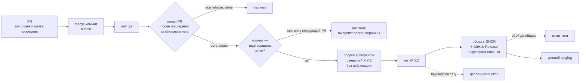

# CI/CD

Отправная точка сложности: одна кодовая база (`core-game`) собирается в
**минимум 4 независимых билда** (Telegram, MAX, VK, веб — последние два ещё
и с несколькими локалями), плюс отдельно живёт бэкенд. Ошибка, которую легко
допустить на старте — не продумать это до того, как билдов станет 4, и потом
чинить процесс на живую, теряя время на этапах 3–6 роадмапа, когда цена
ошибки уже высокая.

Смежное: `15-engineering-standards.md` (что именно проверяется),
`16-tech-stack-decisions.md` §7-§8 (чем проверяется),
`17-testing-strategy.md` (какие тесты и где).

## 1. Матрица сборок

- Один pipeline, матрица по `platform × env`:
  - `platform`: `telegram`, `max`, `vk`, `web`
  - `env`: `staging`, `production`
- Каждая ячейка матрицы — свой `vite build --mode <platform>-<env>`,
  свой набор env-переменных, свой выходной артефакт
- Локаль **не** отдельное измерение матрицы — это флаг внутри сборки
  (`web`/`telegram` собирают все locale-файлы в один бандл с переключателем,
  `max`/`vk` — жёстко `ru`, см. `01-tech-stack.md` §7), плодить билды на
  каждый язык отдельно не нужно
- До лонча в Telegram матрица фактически вырождена в `telegram × {staging,
  production}` + `web` — но описана целиком с первого дня, чтобы добавление
  MAX на этапе 7 было строкой в конфиге, а не переделкой пайплайна

## 2. Гейт перед сборкой

Обязательно для всех платформ разом, до того как матрица вообще
запускается — нет смысла собирать 8 артефактов, если код не проходит
базовые проверки. Порядок — по возрастанию стоимости, чтобы падать быстро:

1. **Формат** — `prettier --check` (секунды)
2. **Типы** — `tsc -b --noEmit` по всем пакетам разом
3. **Линт** — ESLint в type-checked режиме, правила из
   `15-engineering-standards.md` §5 как `error`
4. **Границы слоёв** — `eslint-plugin-boundaries` + `dependency-cruiser`:
   запрещённые направления импортов и циклы (`15-engineering-standards.md` §2.2)
5. **Юнит-тесты и тесты контента** — логика волн/баланса
   платформонезависима, тестируется один раз, а не на каждую платформу
   (`17-testing-strategy.md` §3.1-§3.3)
6. **Контрактные тесты адаптеров** — один набор для всех трёх реализаций
   (`17-testing-strategy.md` §5)
7. **Бюджет бандла** — размер сборки не превышает объявленный порог
   (`16-tech-stack-decisions.md` §3.2)

**Интеграционные тесты** на реальных Postgres и Redis — сервисы джоба `gate`
с миграциями `prisma migrate deploy` (`17-testing-strategy.md` §4.2). Пока
они занимают секунды, идут в гейте PR; пропускать их нельзя — там живут
проверки атомарности и идемпотентности.

Эти же команды должны запускаться локально одной строкой — см. `CLAUDE.md`.
Разойтись CI и локальный прогон не должны никогда: расхождение означает, что
разработчик перестаёт доверять зелёному CI.

**Что из этого уже работает.** `.github/workflows/ci.yml` на текущий момент
прогоняет шаги 2, 3, 5 и сборку — то есть ровно те четыре команды, которые
названы в `CLAUDE.md`. Шаги 1, 4, 6 и 7 требуют инструментов, которых в
репозитории ещё нет (Prettier, `dependency-cruiser`, реализованные адаптеры,
объявленный бюджет бандла); они перечислены в шапке самого workflow, чтобы
разрыв между планом и реальностью был виден в том файле, на который
полагаются, а не только здесь.

## 3. Секреты — по платформе и по окружению отдельно

Ключи ботов, ad SDK, платёжные ключи, OAuth client ID — для каждой пары
`platform × env` свой набор, хранится в секретах CI, не в репозитории.
Отдельная категория, которую легко забыть: секреты **веб-версии** —
одновременно RU-набор (Яндекс ID, RU-платёжный рельс) и международный
(Google, Telegram) в рамках **одного и того же билда** веба — это
не platform-секрет в привычном смысле, а его собственная под-матрица внутри
одной сборки.

Правила:

- секреты продакшена доступны только джобам, привязанным к соответствующему
  окружению CI (`§9`), и требуют ручного подтверждения;
- ротация секретов — плановая процедура, а не реакция на утечку; список того,
  что и когда ротируется, ведётся вместе с окружениями;
- в билд фронтенда попадают **только** публичные значения. Любой ключ,
  оказавшийся в клиентском бандле, считается публичным — независимо от
  названия переменной.

## 4. Ревью-лаг на стороне площадок — учитывать в процессе, не игнорировать

MAX, VK и Telegram — все требуют модерации/публикации новой версии
мини-аппа, со своими сроками (см. `03-notes-and-risks.md` про верификацию
партнёра на MAX — до 48 часов только на этот шаг). Практическое следствие
для pipeline:

- Разделять шаг "собрать и задеплоить на staging" (автоматически, на каждый
  мердж в `main`) и шаг "промоутнуть в production" (вручную, только когда
  готовы отправлять на модерацию/публиковать)
- Бэкенд деплоится отдельно от фронтенд-билдов и должен быть
  обратно-совместим с предыдущей версией фронтенда некоторое время — потому
  что после деплоя API новая версия мини-аппа может неделю ждать модерации
  на MAX, а старая версия у пользователей продолжает её дёргать
- Версионировать API-контракт формально — правила совместимости и
  версионирования пути заданы в `15-engineering-standards.md` §3, а
  соответствующая дисциплина миграций БД (expand → migrate → contract) —
  там же, §10. Это не «соглашение команды», а требование, вытекающее прямо
  из ревью-лага площадок

## 5. Статика и кэш

- Vite по умолчанию версионирует хэши файлов в имени — деплой на Bunny.net
  CDN с этими хэшами в пути снимает большую часть проблем с кэшем на
  стороне клиента
- `index.html` — с коротким TTL и `must-revalidate`, ассеты с хэшами — с
  бесконечным. Иначе игрок неделю играет в старую версию и присылает
  баг-репорты на исправленные баги
- Откат: хранить N последних артефактов на каждую платформу отдельно,
  чтобы откатить конкретную платформу (например, только MAX) без
  необходимости трогать остальные — они на разных циклах модерации и не
  должны зависеть друг от друга по времени релиза

## 6. Что не нужно на этом масштабе

- Отдельный оркестратор (Kubernetes и т.п.) — Docker Compose на одном VPS,
  уже заложенный в `01-tech-stack.md` §10, полностью достаточен для команды
  из двух человек и объёма трафика на старте. Это не «навсегда»: этапы, на
  которых схема меняется, и метрики-пороги для каждого перехода — в
  `14-scalability.md` §3
- E2E-тесты на визуальный рендер игры (Playwright-скриншоты и т.п.) —
  избыточно для MVP; ручной плейтест на реальных устройствах (уже в
  чек-листе этапа 1 роадмапа) даёт больше сигнала на этом этапе, чем
  поддержка хрупких визуальных тестов. Замена, которая реально ловит
  регрессии, — детерминированные симуляции (`17-testing-strategy.md` §3)
- Собственный runner для CI — хватает облачных

---

## 7. Платформа и структура пайплайна

**GitHub Actions** — репозиторий уже там, CodeQL и Dependabot/Renovate
интегрированы бесплатно для публичного репозитория.

Раскладка по workflow-файлам:

| Workflow | Триггер | Что делает |
|---|---|---|
| `ci.yml` | PR, push в `main` и `dev` | Гейт §2 и сборка образа бэкенда без публикации; на push в `main` и `dev` — джоб релиза §8.1: версия (из `dev` — предрелиз), тег, образ в GHCR, GitHub Release с архивом статики. Сборка матрицы §1 — ещё не реализована |
| `pr-checks.yml` | открытие и правка PR, смена меток | Заголовок PR по правилам коммитов и метка типа релиза (§8.1); у служебных PR между `main` и `dev` — только заголовок. Сверка SHA сторонних actions с тегом из комментария (§12) |
| `sync-dev.yml` | push в `main` | Возврат `main` в `dev`: перемотка или PR (§8.1, «Ветка dev») |
| `team-summary.yml` | push в `main` и `dev` — то есть мердж | Сводка для команды — ботом в чат администраторов, черновик поста в канал — в отдельную тему; текст из описания влитого PR («Сводка в Telegram» ниже) |
| `integration.yml` | PR с меткой `backend`, push в `main` | Тесты с Testcontainers |
| `security.yml` | PR, плюс по расписанию раз в неделю | gitleaks, `pnpm audit`, CodeQL |
| `deploy-staging.yml` | вызывается джобом релиза (`workflow_call`), не событием тега | Автоматический деплой бэкенда и фронта на staging |
| `deploy-production.yml` | ручной запуск с выбором тега | Промоут в прод с подтверждением §9 |
| `load-test.yml` | ручной запуск | k6-сценарий (`17-testing-strategy.md` §7) |

#### Сводка в Telegram

Текст сводки пишется **один раз — в описании PR**, разделом
`## Сводка для команды`, и проходит ревью вместе с кодом. После мерджа
`team-summary.yml` отправляет его ботом в чат администраторов: составлять
сводку отдельно больше не нужно. Формат — скилл `pre-pr`, шаг 8. Заголовки
разделов бот сразу оборачивает в цитату — то, что раньше делали руками.
Раздел берётся до следующего заголовка `## `, без подсказок шаблона и без
подписи генератора в хвосте (`🤖 Generated with …` вместе с чертой `---`
перед ней): по шаблону сводка и пост — последние разделы, и подпись агента
иначе ушла бы в чат.

Необязательный раздел `## Пост в канал` уходит **черновиком в отдельную
тему** — чтобы не забивать ленту команды — с закрывашкой канала. Публикует
его человек: пересылкой в канал «без автора», оформление сохраняется
целиком. Запасного пути в ленту нет: тема для черновиков не задана — черновик
не отправляется, и прогон пишет предупреждение. Автопоста в публичный канал
нет сознательно: опечатка или лишняя подробность ушли бы сразу всем
подписчикам, а удалённый пост успевают прочитать.

**Почему запуск на push, а не на событие PR.** Правило веток окружения GitHub
сверяет для события `pull_request` не с базовой веткой, а с
`refs/pull/N/merge`. Окружение, открытое только `main` и `dev`, такой джоб не
пустило бы вовсе, а открыть его PR-ссылкам значит отдать секрет любому PR,
даже невлитому, — вместе с правкой самого workflow в этом PR. Поэтому джоб
бежит на push в `main` и `dev`, то есть на уже влитом коде, и находит PR по
коммиту мерджа — так же, как расчёт версии (§8.1).

Настройка — один раз, в **Settings → Environments** репозитория:

1. окружение `telegram`;
2. **Deployment branches and tags** → «Selected branches and tags» → два
   правила, тип Branch: `main` и `dev`. Это и есть защита секрета: его увидит
   только джоб на этих ветках;
3. **Required reviewers — выключить.** Иначе каждая сводка ждала бы ручного
   одобрения, и автоматика превратилась бы в лишнее нажатие;
4. секрет `TEAM_TELEGRAM_BOT_TOKEN` — токен бота, который состоит в чате
   администраторов. Годится и бот закрытого теста: отправка сообщений не
   мешает бэкенду читать обновления того же бота;
5. переменная `TEAM_TELEGRAM_CHAT` — адрес ленты команды: `id` или `id:тема`
   (та же запись, что у `ADMIN_CHAT_*` бэкенда, `20-env-and-ports.md` §3);
6. переменная `TEAM_TELEGRAM_DRAFTS_CHAT` — тема для черновиков постов, в
   том же виде. Номер темы — в ссылке на любое её сообщение:
   `https://t.me/c/<чат без -100>/<тема>/<сообщение>`;
7. секреты `TEAM_TELEGRAM_MEMBER_1`, `_2`, `_3` — юзернеймы участников 1–3
   (§«Упоминания» ниже), с `@` или без. Необязательны: без них в сводке
   вместо упоминания стоит имя роли.

**Упоминания.** Где от человека что-то нужно, в сводке пишется заглушка
`@участник1`, `@участник2`, `@участник3` или `@команда` — все, у кого задан
юзернейм. Бот подставит юзернейм, и Telegram пришлёт человеку уведомление.
Юзернеймы хранятся **секретами, а не переменными**: репозиторий публичный,
переменные окружения печатаются в логе прогона открытым текстом, а светить
свой юзернейм хотят не все. По той же причине в черновике поста заглушка
становится именем роли, а не юзернеймом — пост уйдёт в публичный канал.
Просто «участник 1» в тексте упоминанием не становится: уведомление будит
человека, и нужно оно там, где от него ждут действия, а не везде, где он
назван.

Без секрета джоб не падает, а пишет предупреждение в сводку прогона.
Разделов в описании нет или влитого PR у коммита нет (перемотка синка) —
отправлять нечего, это тоже не ошибка.

Общие принципы:

- **джобы параллельны, зависимости явные** — линт и тесты не ждут друг друга;
- **кеш**: store pnpm, `node_modules`, кеш сборки Vite и `tsc -b` (`.tsbuildinfo`).
  Ключ кеша — по lock-файлу;
- **фиксированные версии окружения**: версия Node берётся из `.nvmrc`, версия
  pnpm — из `packageManager` в `package.json`. Никаких `node-version: latest`;
- **`concurrency`** по ветке с отменой предыдущего прогона — незачем гонять CI
  на устаревшем коммите;
- **артефакты сборки** сохраняются с retention и переиспользуются джобом
  деплоя: то, что задеплоено, — **бит в бит** то, что прошло тесты. Пересборка
  перед деплоем запрещена.

## 8. Ветвление, коммиты, релизы

- **Короткоживущие ветки от `dev`**, PR в `dev`, merge-коммит. Долгие ветки
  фич при трёх участниках и высокой скорости изменений создают конфликты
  дороже, чем дают пользы (`06-team-and-workflow.md` — риск двух людей и двух
  ИИ-агентов в одном репозитории). В `main` приходят только релизный PR из
  `dev` и срочные исправления (§8.1, «Ветка dev»).
- **Merge-коммит, а не squash.** Коммиты в PR дробные, по одной правке
  (`CLAUDE.md`, «Коммиты»), и squash схлопнул бы их в один — разбирать, какая
  правка что сломала, стало бы не по чему. Граница PR не теряется: история по
  PR — `git log --first-parent main`, откат PR целиком — `git revert -m 1`.
  Rebase-merge не выбран по той же причине: он сохраняет коммиты, но стирает
  границу PR.
- **Защита веток — rulesets `main` и `dev`** в настройках репозитория:
  - `main`: только через PR и только merge-коммитом, обязательны проверки
    `gate`, `docker` и `check`, удаление и force push запрещены. Обязательных
    одобрений пока ноль: автор не может одобрить свой PR, а PR агентов
    открываются от аккаунта того, кто с ними работает. Когда ревью станет
    регулярным — одно одобрение;
  - `dev`: запрещены удаление и force push, но **не прямой push**. Его делает
    workflow синка, перематывая `dev` после релиза (§8.1), а токен workflow
    нельзя внести в обход защиты — для этого нужен отдельный GitHub App или
    deploy key. Требование PR на `dev` роняло бы синк после каждого релиза.
- **Коммиты** — формат из `CLAUDE.md`, проверяется commitlint'ом
  (`16-tech-stack-decisions.md` §7).
- **Версионирование** — SemVer на игру целиком: мажор — ломающее изменение
  API-контракта, минор — новый контент/фичи, патч — исправления. Версия
  попадает в бандл и в каждый лог/крэш-репорт: без этого невозможно понять, с
  какой версии пришёл баг-репорт, а при ревью-лаге площадок одновременно
  живут три версии клиента.
- **Тег** = релиз-кандидат. Промоут в прод делается **из тега**, не из ветки.
- **Changelog** генерируется из conventional commits — это единственная
  причина, по которой формат коммитов вообще стоит соблюдать машинно.

### 8.1 Версия проекта: тип изменения объявляется в PR, номер — при мердже

**Статус: реализовано**, кроме деплоя staging из джоба релиза — он появится
вместе с `deploy-staging.yml` в WP10 (`26-stage2-plan.md`).

Требование этапа 2 (`26-stage2-plan.md`, WP9): **автор PR объявляет, какой
это релиз — мажорный, минорный, патч или без релиза, — а номер версии
назначается автоматически при мердже** в `main` и в `dev`. Ручное назначение номеров при трёх участниках и нескольких
мерджах в день забывается, а без версии не работает ничего из §8: ни
баг-репорты, ни откат, ни разбор диагностики тестеров (`28-diagnostics.md`).

**Почему масштаб объявляет человек, а не выводит скрипт из коммитов.** Тип
коммита говорит, *что* это за изменение (`feat`, `fix`), но не *насколько
оно серьёзно* для тех, кто от продукта зависит. Исправление, меняющее форму
ответа API, — это `fix`, но для клиентов, неделю ждущих модерации (§4), это
ломающее изменение. Масштаб знает автор; ревьюер видит его объявленным в PR
до мерджа, а не узнаёт по номеру тега после.

#### Метка релиза на PR

Ровно одна:

| Метка | Когда | От `0.4.2` | От `1.4.2` |
|---|---|---|---|
| `release: major` | Ломающее изменение: API без обратной совместимости (`15-engineering-standards.md` §3), схема конфигурации (`19-content-admin.md` §5), формат сохранений | **запрещена до `1.0.0`** | `2.0.0` |
| `release: minor` | Новая возможность, новый контент | `0.5.0` | `1.5.0` |
| `release: patch` | Исправление, оптимизация, рефакторинг рабочего кода, обновление рантайм-зависимостей | `0.4.3` | `1.4.3` |
| `release: none` | Документация, тесты, CI, инструменты разработки | — | — |

`refactor` выпускает патч, хотя поведение не меняется: это изменённый код,
который должен пройти через staging, как любой другой. Renovate ставит на
обновления рантайм-зависимостей `release: patch` по той же причине.

**До `1.0.0`** ломающее изменение идёт меткой `release: minor` и `!` в
заголовке (`feat(api)!: ...`). Переход на `1.0.0` не вычисляется, а
объявляется отдельным ручным запуском workflow при публичном запуске
(этап 6 `02-roadmap.md`): ломающее изменение API не должно случайно
объявить продукт стабильным.

#### Проверка PR

`pr-checks.yml` — на открытие, правку заголовка и смену меток:

1. **Заголовок** по правилам `CLAUDE.md`: тип из списка, необязательный
   `scope`, текст с заглавной буквы без точки в конце, не длиннее 72 символов.
   Заголовок PR становится заголовком merge-коммита в `main`.
2. **Ровно одна метка** `release: *`.
3. **Метка не ниже, чем следует из заголовка**: `feat` — не ниже `minor`;
   `fix`, `perf`, `refactor`, `revert` — не ниже `patch`; `!` — `minor` до
   `1.0.0`, `major` после; `docs`, `style`, `test`, `chore`, `ci` — любая.
   Выше — можно: `fix`, ломающий контракт, объявляется `major`. Ниже — нет:
   `feat`, выпущенный патчем, — это новая возможность, о которой номер версии
   промолчал.
   **Исключение — `feat` в областях `dev`, `ci` и `infra`: не ниже `patch`.**
   Инструменты разработчика, пайплайн и обвязка развёртывания до игрока не
   доходят, а версия у монорепо одна: без исключения правка dev-сервера или
   workflow двигала бы минорный номер наравне с новой механикой в игре, и он
   перестал бы что-либо значить. Список областей — `TOOLING_SCOPES` в
   `scripts/release/pr-check.mjs`; ломающее изменение послаблением не
   пользуется.
4. **Метки нет** — workflow ставит минимальную по заголовку и пишет
   комментарий: автор подтверждает или повышает.
5. **`release: major` или `!` в заголовке** — раздел «Что ломается и как
   мигрировать» в описании PR обязателен; пустой раздел — проверка падает.
   Такому PR автоматически добавляется метка `breaking` для заметок к релизу.

Там же, отдельным шагом того же джоба, — сверка SHA сторонних actions с
тегом из комментария (§12).

Проверки — короткий скрипт в самом workflow, без стороннего action:
регулярное выражение и сравнение меток не стоят внешней зависимости с правами
на репозиторий.

Шаблон `.github/pull_request_template.md`: что и почему, тип релиза с
обоснованием, что ломается (для `major` и `!`), отмеченные пункты чек-листов
`15-engineering-standards.md` §7–§8, раздел «Перенос» для перенесённого кода.

#### Вычисление номера



- **База** — стабильный тег `vX.Y.Z` с максимальным номером. Не ближайший
  достижимый из коммита: тег релиза стоит на merge-коммите в `main`, из `dev`
  он недостижим, и «достижимая» база откатилась бы к прошлому релизу —
  предрелиз получил бы номер уже вышедшей версии. Диапазон `база..HEAD` сам
  отсекает выпущенное: эти коммиты достижимы из тега через второго родителя
  merge-коммита. Проверено на настоящем git
  (`scripts/test/release-branches.test.ts`).
- **Берутся все PR, влитые после базы**, а не только текущий: для каждого
  коммита в диапазоне `база..HEAD` через API GitHub находится PR и его метка.
- **Номер** = база + максимальная метка среди них. Все `none` — тега нет.

Почему по всем PR с базы, а не по текущему. Джоб релиза стоит в группе
`concurrency`, и если за время одного релиза в очередь встали два мерджа,
GitHub оставляет только последний прогон. Считай скрипт по текущему PR —
минорный PR из отменённого прогона потерял бы свой минор, если следом влили
патч. При подсчёте максимума с базы его метка всё равно попадает в
следующий номер.

**Коммит без PR** (прямой push в `main` запрещён защитой ветки, но если
случится) — **джоб релиза падает** с понятной ошибкой, тег не создаётся.
Молча считать такой коммит патчем — ровно тот молчаливый fallback, которого
у нас нет (`15-engineering-standards.md` §1, принцип 3). Исправление —
поставить метку задним числом и перезапустить джоб.

Скрипт — `scripts/release/next-version.mjs`, свой, с тестами на Vitest:
разбор SemVer, максимум меток, запрет `major` до `1.0.0`, пустой диапазон,
коммит без PR, предрелизы для `dev` (ниже).

**Заметки к релизу** — встроенная генерация GitHub Release с конфигурацией
`.github/release.yml`: разделы «Ломающие изменения» (`breaking`,
`release: major`), «Новое» (`release: minor`), «Исправления»
(`release: patch`); `release: none` в заметки не попадает. Строка — заголовок
PR, ссылка и автор.

| Альтернатива | Почему не она |
|---|---|
| git-cliff, semantic-release | Выводят масштаб из типа коммита — а объявлять его должен автор. Заметки по меткам GitHub строит сам, отдельный генератор не нужен |
| Changesets | Сделан под публикацию нескольких npm-пакетов с независимыми версиями и коммитит версии и changelog обратно в репозиторий через отдельный PR. У нас одна версия продукта и ничего не публикуется в npm |
| release-please | Назначает номер при мердже отдельного релизного PR, а не при каждом мердже |
| Руками | См. начало раздела |

#### Версия не коммитится обратно в репозиторий

Ни `package.json`, ни `CHANGELOG.md` джоб релиза не меняет. Запись в `main`
из CI требует обхода защиты ветки, порождает коммит, который запускает CI
снова, и конфликтует со всеми открытыми PR. Источник истины — **тег**,
заметки — **GitHub Release**. Поля `version` в `package.json` пакетов монорепо
не используются (пакеты приватные) и выставляются в `0.0.0`, чтобы не вводить
в заблуждение.

**Где видна версия:**

| Сборка | Строка версии |
|---|---|
| Релиз из `main` | `0.5.0` |
| Предрелиз из `dev` | `0.5.0-rc.3` |
| Сборка PR | `0.0.0-pr.<номер>+<sha>` |
| Локальная | `0.0.0-dev` |

Версия попадает в `VITE_APP_VERSION` при сборке, в тег
Docker-образа (вместе с `sha`), в конверт каждого события
(`22-analytics-and-metrics.md` §3.1), в каждый отчёт диагностики и на экран
настроек.

#### Ветка `dev`

Включена с конца этапа 2: работа копится в `dev` пачкой, а в `main` уходит
релизом. Своя версия у `dev` есть — предрелиз `v0.5.0-rc.3` попадает в бандл,
события, отчёты и на экран настроек, так что по баг-репорту сразу видно, что
это не стабильная сборка.

| Слияние | Окружение | Что выпускается |
|---|---|---|
| PR фичи → `dev` | staging (когда появится сервер) | Предрелиз `vX.Y.Z-rc.N`: `X.Y.Z` — стабильная база + максимум меток PR, влитых после неё; `N` — счётчик предрелизов этого номера |
| Релизный PR `dev` → `main` | production | Стабильный `vX.Y.Z` — номер последнего предрелиза без суффикса |
| Срочное исправление → `main` | production | Патч от стабильной базы; затем `main` возвращается в `dev` |

Счётчик `N` берётся от максимального существующего `rc` этого номера, а не от
числа тегов: удалённый руками `rc.2` не должен заставить следующий прогон
выпустить `rc.3` повторно. Заметки предрелиза строятся от предыдущего
предрелиза того же номера — видно, что нового с прошлого, — а стабильного
релиза от прошлого стабильного, то есть всё, что вошло в релиз.

**Как выпустить релиз.** Открыть PR из `dev` в `main` с заголовком по общим
правилам, например `chore(release): Выпустить v0.5.0`. Метку ставить не нужно.

Правила:

- PR фичи в `dev` — merge-коммит, как в `main`. **Релизный PR `dev` → `main` —
  тоже merge-коммит**: при squash история PR схлопнулась бы в один коммит,
  скрипт не нашёл бы метки, а обратные слияния `main` → `dev` начали бы
  конфликтовать. Допустимые способы слияния задаются правилами веток.
- **Служебные PR метки не несут**: релизный `dev` → `main` выпускает номер,
  уже вычисленный предрелизами, а синк `main` → `dev` возвращает уже
  выпущенное. `pr-checks` у них проверяет только заголовок
  (`scripts/release/branches.mjs`).
- **Уровень коммита — по его собственному PR.** GitHub связывает коммит со
  всеми PR, где он есть: с его PR фичи, с релизным, со стековым поверх него.
  Учитываются только смерженные — открытый стековый PR не влияет на версию
  того, что под ним — и только не служебные; из нескольких берётся максимум.
  Коммит, у которого есть лишь служебный PR, — сам merge-коммит этого PR.
- **Возврат `main` в `dev` — после каждого push в `main`** (`sync-dev.yml`).
  Сразу после релиза `dev` за это время обычно вперёд не ушёл и просто
  перематывается на `main`, без PR. Если ушёл — открывается PR `main` → `dev`:
  слияние двух веток с разным кодом должен увидеть человек. **Такой PR открыт
  токеном workflow, а они по правилам GitHub не запускают CI** — гейт на нём
  запускается вручную, закрытием и повторным открытием PR. Убрать это можно
  токеном бота, когда он понадобится и для чего-то ещё.
- **Артефакт для production пока пересобирается.** Продвижение без пересборки —
  когда дерево файлов мердж-коммита совпадает с деревом последнего предрелиза,
  в прод едет именно то, что проверено на staging (§7), — имеет смысл только
  при живом staging. Появится вместе с деплоем в пакете выпуска
  (`26-stage2-plan.md` §6).

#### Выпускается вершина ветки

Тег ставится, только если коммит прогона — всё ещё вершина своей ветки.
Если, пока прогон ждал в очереди `concurrency` или собирал артефакты, в
ветку влили следующий PR, этот коммит своего предрелиза не получает: прогон
оставляет заметку «Предрелиз не нужен» и завершается зелёным, ничего не
опубликовав. Изменения при этом не теряются. Их выпустит прогон новой
вершины, а его номер считается по меткам всех PR с базы (выше, «Вычисление
номера»), так что метка обогнанного PR в него войдёт. Предрелиз
промежуточного коммита и так никому не достался бы: staging (когда
появится) и тестеры получают вершину.

Проверка идёт дважды (`scripts/release/release-tag.mjs`): командой `check`
до сборки, чтобы не собирать то, что не выйдет, и командой `create` перед
самим тегом. Если ветка ушла в промежутке, GitHub может отказать в теге
(ниже, «Ловушки»); отказ при ушедшей ветке — тот же обгон, а не ошибка.
Отказ, когда ветка не ушла, — ошибка, джоб падает.

Почему не «свой предрелиз каждому мерджу» — там же, в «Ловушках»: для этого
джобу нужен токен, которому разрешено править workflow.

#### Порядок публикации

Номер версии джоб выставляет наружу трижды: git-тег, образ в GHCR и GitHub
Release с архивом клиента. Атомарно в трёх системах их не выложить, поэтому
порядок выбран так, чтобы сбой на любом шаге не оставлял номер, за которым
ничего нет:

1. клиент и образ собираются на раннере — наружу не уходит ничего;
2. **тег** — первым из видимого снаружи: из всех шагов публикации отказать
   может именно он (ниже, «Ловушки»), и отказ не должен оставить в реестре
   образ под номером, которого нет в git;
3. черновик релиза с архивом клиента — снаружи не виден и уведомлений не
   рассылает;
4. образ — сначала под `sha-…`, последним под номером версии: оборвись push
   посередине, в реестре останется только образ, версию не объявляющий;
5. черновик публикуется.

Сбой после тега подбирает шаг «Откатить тег»
(`scripts/release/release-tag.mjs rollback`). Пока образа под номером нет,
тег и черновик удаляются, и следующий прогон посчитает тот же номер заново.
Образ уже в реестре — тег остаётся при нём, а в сводке прогона лежит
команда, которой выложить черновик: образ под номером без тега хуже
неопубликованного релиза. Перезапуск джоба здесь не поможет: тег занят, и
прогон посчитает уже следующий номер.

Раньше порядок был обратный — образ, потом тег, — чтобы не было тега без
образа. Он же дал обратную ошибку: 23.09.2026 GitHub дважды отказал в теге
`v0.5.0-rc.6`, а образ `ghcr.io/jjsgxkd/rubezh-api:v0.5.0-rc.6` к тому
времени уже лежал в реестре — сначала собранный из `f1d5f44`, потом из
`44bb3f6`. На коммит, которому тег в итоге достался, `235f3ff`, он стал
указывать только после третьего прогона.

#### Ловушки, которые закладываются сразу

- **Тег, созданный `GITHUB_TOKEN`, не запускает другие workflow** — так
  GitHub защищается от рекурсии. Если повесить деплой staging на событие
  `push: tags`, он молча не будет срабатывать. Поэтому деплой staging —
  следующий джоб того же прогона (через `workflow_call`).
- **Тег от `GITHUB_TOKEN` на коммит, чьих `.github/workflows` нет ни на
  одной вершине ветки, GitHub отклоняет** — с ответом `refusing to allow a
  GitHub App to create or update workflow … without workflows permission`,
  хотя тег ничего не правит. У `GITHUB_TOKEN` права `workflows` не бывает
  вовсе. Сравнивается не коммит, а содержимое `.github/workflows`: старый
  коммит проходит, если такие же workflow лежат на вершине любой ветки, и не
  проходит, если их уже нигде нет. На этом 23.09.2026 споткнулись два
  предрелиза подряд. PR #52 и #53 влили с разницей в 38 секунд, #54 — через
  пять минут, и все три правили `ci.yml`. К тегу на `f1d5f44` (#52)
  вершиной `dev` уже был `44bb3f6` (#53) с другим `ci.yml`, а ветку самого
  #52 с теми же workflow GitHub удалил при мердже, — отказ. С `44bb3f6`
  после мерджа #54 — то же. `235f3ff` и `feaecb5` к своему тегу оставались
  вершинами — тег встал.

  В документации GitHub правила нет, есть в обсуждении сообщества
  ([community #151442](https://github.com/orgs/community/discussions/151442)).
  Проверено в самом репозитории временным workflow с `contents: write`
  (прогоны 35890213434, 35890402439, 35890931479):

  | Чем ставился тег | На вершину ветки | На старый коммит, workflow — как у вершины `dev` | На `f1d5f44`, таких workflow нет ни на одной вершине |
  |---|---|---|---|
  | `git push` | ставится | ставится | отказ |
  | REST `POST /git/refs` | ставится | ставится | 403 |
  | GraphQL `createRef` | — | — | отказ |
  | API релизов, `gh release create --target` | — | — | 403 |

  Удаление ветки действует так же, как её уход: как только ветку с
  уникальными workflow удалили, тег на её бывшую вершину уже не ставится.
  Удалить тег и создать черновик релиза на уже стоящий тег получается и
  после ухода ветки — на этом держится откат (выше, «Порядок публикации»).
  Публикацию черновика после ухода ветки не проверяли: для этого пришлось бы
  выложить настоящий релиз. Новый ref она не создаёт — тег к тому моменту
  уже стоит; если GitHub всё же откажет, тег и образ останутся парой, а
  черновик выкладывается командой из сводки прогона.

  Как обойти и почему мы не обходим:

  | Вариант | Работает | Безопасность |
  |---|---|---|
  | Тег через API: REST, GraphQL, релизы | Нет — та же проверка (таблица выше) | — |
  | PAT с правом `workflow` в секрете | Да | Долгоживущий токен человека: ушёл человек — встали релизы. Правом `workflow` он переписывает любой workflow, в том числе прямым push в `dev`, где push не запрещён (§8), — то есть достаёт секреты окружений `main` и `dev`. Тег от него запускает другие workflow |
  | GitHub App с `contents: write` и `workflows: write`, токен через `actions/create-github-app-token` | Да | Лучше PAT: токен живёт час, выдан на один репозиторий и не привязан к человеку. Но `workflows: write` — та же власть над CI. Джоб релиза ставит сотни пакетов и запускает их сборку, поэтому тег пришлось бы вынести в отдельный джоб без стороннего кода, ключ приложения — в окружение, открытое только `main` и `dev`, а образ передавать между джобами артефактом |
  | Deploy key с записью | Не проверялся | Ключ без срока, пишет в любую ветку и тег и не сужается до тегов |
  | **Выпускать вершину ветки** — выбрано | Да: отказ бывает только на обогнанном коммите | Нового секрета нет, права джоба не растут (§3, §12). Цена — у обогнанного коммита нет своего `rc`, его изменения выходят в следующем |

  Если своего предрелиза потребует каждый мердж — путь через GitHub App.
  Настройки и секреты заводит владелец репозитория: приложение без webhook,
  права репозитория Contents и Workflows на запись, установлено только на
  этот репозиторий; окружение `release` в Settings → Environments с правилом
  веток `main` и `dev`; в нём секреты `RELEASE_APP_ID` и
  `RELEASE_APP_PRIVATE_KEY`. Код — отдельный джоб тега с
  `environment: release`, токеном с `permission-contents: write` и
  `permission-workflows: write` и без установки зависимостей.

  Тот же отказ возможен у перемотки `dev` в `sync-dev.yml`: она пушит
  вершину `main`, какой та была при запуске. Если `main` успел уйти с правкой
  workflow, перемотка откажет, а следующий push в `main` перемотает `dev` уже
  на новую вершину.
- **Параллельные мерджи** — джоб релиза в группе `concurrency` без отмены
  выполняющегося прогона; потерянные метки закрыты подсчётом с базы (выше).
  Коммит, который обогнал следующий мердж, выпускается вместе с ним (выше,
  «Выпускается вершина ветки»).
- **Сборка до тега, публикация — после.** Артефакт собирается уже с
  вычисленной версией, но наружу уходит только после тега на тот же коммит
  (выше, «Порядок публикации»). Пересборка при деплое запрещена (§7).

**Права.** `contents: write` — только у джоба релиза, `pull-requests: write` —
только у проверки PR (ставит метки и комментарий), остальным —
`contents: read` (§12). Артефакт клиента прикладывается к GitHub Release: у
артефактов workflow срок хранения ограничен, а откат на версию месячной
давности должен работать (§5, §11).

**Разово при включении:** создать метки; тег `v0.1.0` вручную на текущем
`main` — точка отсчёта; в настройках репозитория — только merge-коммит для PR
в `main`. PR #11–#16 влиты squash, до решения о дробных коммитах; с #17 —
merge-коммитом.

**Срочное исправление прода**, пока `dev` нет, а в `main` уже есть
невыпускаемые изменения, — через `main` и новый тег, как любое другое.
Рискованное прячется за флагом (§11), а не держится вне `main`.

## 9. Окружения

| Окружение | Где | Назначение |
|---|---|---|
| `local` | Docker Compose на машине разработчика | Разработка. Postgres и Redis из compose репозитория |
| `staging` | Отдельный compose-проект на том же VPS | Автодеплой из `main`. Свои БД, свой бот, свои тестовые ключи провайдеров |
| `production` | Отдельный compose-проект | Промоут вручную из тега |

Staging на том же хосте — сознательный компромисс для трёх человек: отдельный
сервер удваивает расходы, а изоляция на уровне compose-проекта и отдельных
томов достаточна. Ограничение честное: нагрузочные прогоны на staging
искажают картину прода — их делаем в окно низкой нагрузки или на временном
хосте.

**Отдельный тестовый бот и тестовые ключи для staging обязательны.** Общий бот
между окружениями означает, что тестовая рассылка уходит реальным игрокам.

## 10. Деплой бэкенда и миграции

1. CI собирает Docker-образ (`backend/api/Dockerfile`), тегирует `sha` и
   семантической версией и пушит в **GHCR** — после git-тега: из шагов
   публикации отказать может именно тег, а образ под номером, которого нет
   в git, выдаёт себя за релиз. Сорвалась публикация образа — тег
   откатывается: тег, по которому нечего деплоить, хуже отсутствующего
   (§8.1, «Порядок публикации»). Образ собирается и на каждом PR — без
   публикации, чтобы поломка Dockerfile не всплывала в момент релиза.
2. Выкат — `.github/workflows/deploy.yml`: вручную с номером версии или job
   `deploy` в `ci.yml` сразу после релиза. Стабильный релиз из `main`
   выкатывается всегда, предрелиз из `dev` — пока включена переменная
   репозитория `DEPLOY_DEV_RELEASES` (на закрытом тесте включена: тестеры
   получают сборку после каждого мерджа). Workflow кладёт на сервер
   конфигурацию стека из того же тега (`infra/prod`) и запускает
   `deploy.sh <версия>` пользователем `deploy`. Секреты сервера — `.env` и
   `api.env` — в репозитории не живут и выкатом не трогаются.
3. `deploy.sh`: статика клиента и панели скачивается из GitHub Release в
   каталог версии; API новой версии поднимается и ждёт healthcheck, а
   `entrypoint.sh` применяет `prisma migrate deploy` **до** старта
   приложения (`13-reuse-from-vpnsibcom.md` §3). Не поднялся — API
   возвращается на прежний тег, статика не трогается (§11).
4. Поднялся — регистрируется вебхук бота (или снимается в режиме polling),
   переключаются ссылки `current` статики, Caddy перечитывает конфигурацию
   без разрыва соединений. Откат статики — переключение ссылки на прежний
   каталог: последние пять версий лежат рядом.

Секреты workflow выката: `DEPLOY_SSH_KEY` — отдельный ключ выката,
`DEPLOY_HOST`, `DEPLOY_KNOWN_HOSTS` — закреплённый отпечаток сервера, а не
принятый при первом входе. Переменная `TELEGRAM_BOT_USERNAME` — имя бота в
сборку клиента.

**Заголовки на краю** — работа Caddy (`infra/prod/Caddyfile`). Две вещи,
которые приложение за него сделать не может:

- **политика источников клиента** — строго та, что возвращает
  `contentSecurityPolicy({ mode: "build" })` из
  `scripts/vite/content-security-policy.ts`. Её же отдаёт `vite preview`, и
  под ней проверен забег; своя политика в Caddyfile — это вторая копия,
  которая однажды разойдётся с проверенной. Там же объяснено, почему в ней
  `frame-ancestors` пускает Telegram Web. Поэтому сборка кладёт политику
  файлом `csp.txt` (`scripts/vite/edge-policy.ts`), а `deploy.sh` делает из
  него сниппет Caddy `edge/<приложение>.caddy`;
- **HSTS** — только на краю: TLS завершается на Caddy, и API не знает, по
  какому протоколу пришёл запрос.

Заголовки ответов самого API ставит бэкенд
(`backend/api/src/common/security-headers.ts`).

Правила миграций (следствие §4 и `15-engineering-standards.md` §10):

- **expand → migrate → contract**, в три релиза. Удаление колонки в том же
  релизе, где прекратилась запись, запрещено — старые клиенты живут неделями;
- миграции, блокирующие таблицу, выполняются отдельным шагом в окно низкой
  нагрузки, индексы на больших таблицах — `CONCURRENTLY`;
- перед миграцией прода — свежий бэкап и проверка, что он читается.

## 11. Откат

Откат должен быть **процедурой, а не импровизацией в 2 часа ночи**.

| Что | Как откатывается | Время |
|---|---|---|
| Бэкенд | `docker compose` на предыдущий тег образа | минуты |
| Статика игры | Переключение CDN на предыдущий артефакт (§5) | минуты |
| Миграция БД | Только вперёд — «фиксирующей» миграцией. Схема expand/contract гарантирует, что откат кода не требует отката схемы | — |
| Версия в сторе площадки | Не откатывается быстро — только через новую модерацию (§4) | дни |

Последняя строка — причина, по которой **feature flag важнее отката**: если
фича спрятана за флагом на бэкенде, её можно выключить мгновенно, не трогая
клиент, ждущий модерации. Для всего рискового (новая монетизация, новый
рекламный провайдер, изменение баланса) флаг обязателен.

Флаги заводятся в панели, раздел «Флаги» (право `flags.edit`): включён ли,
на каких площадках и какой доле игроков. Доля устойчивая — игрок не прыгает
между «есть» и «нет» при каждом входе, а расширение доли не выключает уже
попавших. Выключенный флаг доходит до всех реплик за 30 секунд — срок кеша
правил (`35-stage4-plan.md`, WP17, «флаги и выкат»).

## 12. Безопасность в пайплайне

- **gitleaks** на каждый PR — в репозитории уже есть `.env`, риск реальный;
- **`pnpm audit`** — high/critical блокируют мердж, остальное — задача в
  бэклог;
- **CodeQL** — по расписанию и на PR;
- **Renovate** — политика обновлений в `16-tech-stack-decisions.md` §9;
- **джобы с минимальными правами**: `permissions: contents: read` по
  умолчанию, повышение — точечно;
- **Docker-образы пинуются точной версией и digest** —
  `image: postgres:17.11-alpine3.24@sha256:…` в `ci.yml` и
  `docker-compose.yml`, так же `FROM` в Dockerfile. Тег `17-alpine`
  перевешивают на каждый патч Postgres и Alpine, и CI, машина разработчика и
  прод работали бы на разных образах, не зная об этом. При digest Docker
  берёт образ по нему, а тег остаётся подписью для ревью. Digest — индекса
  всех платформ, поэтому один и тот же образ идёт на amd64 в CI и в проде и
  на arm64 у Mac. Тест `scripts/image-pins.mjs` в `pnpm test` роняет гейт на
  образе без digest, с плавающим тегом и на разных версиях одного образа в
  разных файлах. Как обновить образ — `16-tech-stack-decisions.md` §9.4;
- **сторонние actions пинуются по SHA**, не по тегу: тег перемещаемый, а это
  вектор атаки на цепочку поставки. Полный SHA коммита и версия комментарием
  в той же строке —
  `uses: actions/checkout@3d3c42e5aac5ba805825da76410c181273ba90b1 # v7.0.1`:
  без комментария сорок знаков на ревью не прочитать. Проверяет
  `scripts/action-pins.mjs`, дважды:
  - тестом в `pnpm test` — `uses:` по тегу, по ветке, без версии или в виде,
    которого проверка не разобрала, роняет гейт;
  - в `pr-checks.yml` с `--verify` — тег из комментария есть в репозитории
    action и указывает ровно на закреплённый SHA. Сорок знаков глазами не
    сверить, и без этой сверки ревьюер верит комментарию на слово. Она же
    отсекает коммит из форка: GitHub исполнит его и по пути исходного
    репозитория, а тег исходного репозитория на него не укажет;
- **секреты не логируются**; вывод деплой-джоба проверяется на утечки.

**Как обновить action.** SHA берётся у тега в самом репозитории action:

```bash
git ls-remote --tags https://github.com/actions/checkout "refs/tags/v7.0.1" "refs/tags/v7.0.1^{}"
```

Если строк две, нужна та, что с `^{}`: тег аннотированный, и SHA в первой
строке — объект тега, а не коммит. SHA и версия в комментарии меняются
вместе и во всех workflow сразу; сверить до PR —
`node scripts/action-pins.mjs --verify`. Новый мажор — отдельным PR с
заметкой о ломающих изменениях, как у любой зависимости
(`16-tech-stack-decisions.md` §9).

## 13. Скорость пайплайна

Целевые значения: гейт PR — **под 5 минут**, полный прогон с интеграционными
тестами — **под 10**. Это не эстетика: медленный CI разработчики начинают
обходить, и гейт перестаёт работать.

Рычаги в порядке применения: кеш зависимостей и сборки → параллельные джобы →
запуск тестов только затронутых пакетов → Turborepo с удалённым кешем
(`16-tech-stack-decisions.md` §2). Последний вводится, когда первых трёх
перестанет хватать, — не раньше.
