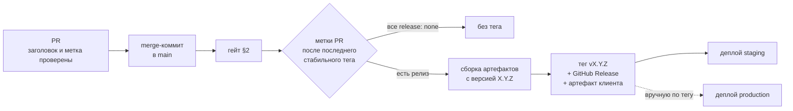

# CI/CD

Отправная точка сложности: одна кодовая база (`core-game`) собирается в
**минимум 4 независимых билда** (Telegram, MAX, VK, веб — последние два ещё
и с несколькими локалями), плюс отдельно живёт бэкенд. Ошибка, которую легко
допустить на старте — не продумать это до того, как билдов станет 4, и потом
чинить процесс на живую, теряя время на неделях 3-6 роадмапа, когда цена
ошибки уже высокая.

Смежное: `15-engineering-standards.md` (что именно проверяется),
`16-tech-stack-decisions.md` §7-§8 (чем проверяется),
`17-testing-strategy.md` (какие тесты и где).

## 1. Матрица сборок

- Один pipeline, матрица по `platform × env`:
  - `platform`: `telegram`, `max`, `vk`, `web`
  - `env`: `staging`, `production`
- Каждая ячейка матрицы — свой `vite build --mode <platform>-<env>`,
  свой набор env-переменных, свой выходной артефакт
- Локаль **не** отдельное измерение матрицы — это флаг внутри сборки
  (`web`/`telegram` собирают все locale-файлы в один бандл с переключателем,
  `max`/`vk` — жёстко `ru`, см. `01-tech-stack.md` §7), плодить билды на
  каждый язык отдельно не нужно
- До лонча в Telegram матрица фактически вырождена в `telegram × {staging,
  production}` + `web` — но описана целиком с первого дня, чтобы добавление
  MAX на неделе 7 было строкой в конфиге, а не переделкой пайплайна

## 2. Гейт перед сборкой

Обязательно для всех платформ разом, до того как матрица вообще
запускается — нет смысла собирать 8 артефактов, если код не проходит
базовые проверки. Порядок — по возрастанию стоимости, чтобы падать быстро:

1. **Формат** — `prettier --check` (секунды)
2. **Типы** — `tsc -b --noEmit` по всем пакетам разом
3. **Линт** — ESLint в type-checked режиме, правила из
   `15-engineering-standards.md` §5 как `error`
4. **Границы слоёв** — `eslint-plugin-boundaries` + `dependency-cruiser`:
   запрещённые направления импортов и циклы (`15-engineering-standards.md` §2.2)
5. **Юнит-тесты и тесты контента** — логика волн/баланса
   платформонезависима, тестируется один раз, а не на каждую платформу
   (`17-testing-strategy.md` §3.1-§3.3)
6. **Контрактные тесты адаптеров** — один набор для всех трёх реализаций
   (`17-testing-strategy.md` §5)
7. **Бюджет бандла** — размер сборки не превышает объявленный порог
   (`16-tech-stack-decisions.md` §3.2)

**Интеграционные тесты** (Testcontainers: реальные Postgres и Redis) — не в
гейте PR, а перед мерджем в `main`: они дороже по времени, но пропускать их
нельзя, там живут проверки атомарности и идемпотентности
(`17-testing-strategy.md` §4.2).

Эти же команды должны запускаться локально одной строкой — см. `CLAUDE.md`.
Разойтись CI и локальный прогон не должны никогда: расхождение означает, что
разработчик перестаёт доверять зелёному CI.

**Что из этого уже работает.** `.github/workflows/ci.yml` на текущий момент
прогоняет шаги 2, 3, 5 и сборку — то есть ровно те четыре команды, которые
названы в `CLAUDE.md`. Шаги 1, 4, 6 и 7 требуют инструментов, которых в
репозитории ещё нет (Prettier, `dependency-cruiser`, реализованные адаптеры,
объявленный бюджет бандла); они перечислены в шапке самого workflow, чтобы
разрыв между планом и реальностью был виден в том файле, на который
полагаются, а не только здесь.

## 3. Секреты — по платформе и по окружению отдельно

Ключи ботов, ad SDK, платёжные ключи, OAuth client ID — для каждой пары
`platform × env` свой набор, хранится в секретах CI, не в репозитории.
Отдельная категория, которую легко забыть: секреты **веб-версии** —
одновременно RU-набор (Яндекс ID, RU-платёжный рельс) и международный
(Google, Telegram) в рамках **одного и того же билда** веба — это
не platform-секрет в привычном смысле, а его собственная под-матрица внутри
одной сборки.

Правила:

- секреты продакшена доступны только джобам, привязанным к соответствующему
  окружению CI (`§9`), и требуют ручного подтверждения;
- ротация секретов — плановая процедура, а не реакция на утечку; список того,
  что и когда ротируется, ведётся вместе с окружениями;
- в билд фронтенда попадают **только** публичные значения. Любой ключ,
  оказавшийся в клиентском бандле, считается публичным — независимо от
  названия переменной.

## 4. Ревью-лаг на стороне площадок — учитывать в процессе, не игнорировать

MAX, VK и Telegram — все требуют модерации/публикации новой версии
мини-аппа, со своими сроками (см. `03-notes-and-risks.md` про верификацию
партнёра на MAX — до 48 часов только на этот шаг). Практическое следствие
для pipeline:

- Разделять шаг "собрать и задеплоить на staging" (автоматически, на каждый
  мердж в `main`) и шаг "промоутнуть в production" (вручную, только когда
  готовы отправлять на модерацию/публиковать)
- Бэкенд деплоится отдельно от фронтенд-билдов и должен быть
  обратно-совместим с предыдущей версией фронтенда некоторое время — потому
  что после деплоя API новая версия мини-аппа может неделю ждать модерации
  на MAX, а старая версия у пользователей продолжает её дёргать
- Версионировать API-контракт формально — правила совместимости и
  версионирования пути заданы в `15-engineering-standards.md` §3, а
  соответствующая дисциплина миграций БД (expand → migrate → contract) —
  там же, §10. Это не «соглашение команды», а требование, вытекающее прямо
  из ревью-лага площадок

## 5. Статика и кэш

- Vite по умолчанию версионирует хэши файлов в имени — деплой на Bunny.net
  CDN с этими хэшами в пути снимает большую часть проблем с кэшем на
  стороне клиента
- `index.html` — с коротким TTL и `must-revalidate`, ассеты с хэшами — с
  бесконечным. Иначе игрок неделю играет в старую версию и присылает
  баг-репорты на исправленные баги
- Откат: хранить N последних артефактов на каждую платформу отдельно,
  чтобы откатить конкретную платформу (например, только MAX) без
  необходимости трогать остальные — они на разных циклах модерации и не
  должны зависеть друг от друга по времени релиза

## 6. Что не нужно на этом масштабе

- Отдельный оркестратор (Kubernetes и т.п.) — Docker Compose на одном VPS,
  уже заложенный в `01-tech-stack.md` §10, полностью достаточен для команды
  из двух человек и объёма трафика на старте. Это не «навсегда»: этапы, на
  которых схема меняется, и метрики-пороги для каждого перехода — в
  `14-scalability.md` §3
- E2E-тесты на визуальный рендер игры (Playwright-скриншоты и т.п.) —
  избыточно для MVP; ручной плейтест на реальных устройствах (уже в
  чек-листе недели 1 роадмапа) даёт больше сигнала на этом этапе, чем
  поддержка хрупких визуальных тестов. Замена, которая реально ловит
  регрессии, — детерминированные симуляции (`17-testing-strategy.md` §3)
- Собственный runner для CI — хватает облачных

---

## 7. Платформа и структура пайплайна

**GitHub Actions** — репозиторий уже там, CodeQL и Dependabot/Renovate
интегрированы бесплатно для публичного репозитория.

Раскладка по workflow-файлам:

| Workflow | Триггер | Что делает |
|---|---|---|
| `ci.yml` | PR, push в `main` | Гейт §2, параллельно — сборка матрицы §1; на push в `main` — джоб релиза §8.1 |
| `pr-checks.yml` | открытие и правка PR, смена меток | Заголовок PR по правилам коммитов и метка типа релиза (§8.1) |
| `integration.yml` | PR с меткой `backend`, push в `main` | Тесты с Testcontainers |
| `security.yml` | PR, плюс по расписанию раз в неделю | gitleaks, `pnpm audit`, CodeQL |
| `deploy-staging.yml` | вызывается джобом релиза (`workflow_call`), не событием тега | Автоматический деплой бэкенда и фронта на staging |
| `deploy-production.yml` | ручной запуск с выбором тега | Промоут в прод с подтверждением §9 |
| `load-test.yml` | ручной запуск | k6-сценарий (`17-testing-strategy.md` §7) |

Общие принципы:

- **джобы параллельны, зависимости явные** — линт и тесты не ждут друг друга;
- **кеш**: store pnpm, `node_modules`, кеш сборки Vite и `tsc -b` (`.tsbuildinfo`).
  Ключ кеша — по lock-файлу;
- **фиксированные версии окружения**: версия Node берётся из `.nvmrc`, версия
  pnpm — из `packageManager` в `package.json`. Никаких `node-version: latest`;
- **`concurrency`** по ветке с отменой предыдущего прогона — незачем гонять CI
  на устаревшем коммите;
- **артефакты сборки** сохраняются с retention и переиспользуются джобом
  деплоя: то, что задеплоено, — **бит в бит** то, что прошло тесты. Пересборка
  перед деплоем запрещена.

## 8. Ветвление, коммиты, релизы

- **Trunk-based**: короткоживущие ветки от `main`, PR, merge-коммит. Долгие
  ветки при трёх участниках и высокой скорости изменений создают конфликты
  дороже, чем дают пользы (`06-team-and-workflow.md` — риск двух людей и двух
  ИИ-агентов в одном репозитории).
- **Merge-коммит, а не squash.** Коммиты в PR дробные, по одной правке
  (`CLAUDE.md`, «Коммиты»), и squash схлопнул бы их в один — разбирать, какая
  правка что сломала, стало бы не по чему. Граница PR не теряется: история по
  PR — `git log --first-parent main`, откат PR целиком — `git revert -m 1`.
  Rebase-merge не выбран по той же причине: он сохраняет коммиты, но стирает
  границу PR.
- **Защита `main`**: прямой push запрещён, обязательны зелёный CI и одно
  ревью.
- **Коммиты** — формат из `CLAUDE.md`, проверяется commitlint'ом
  (`16-tech-stack-decisions.md` §7).
- **Версионирование** — SemVer на игру целиком: мажор — ломающее изменение
  API-контракта, минор — новый контент/фичи, патч — исправления. Версия
  попадает в бандл и в каждый лог/крэш-репорт: без этого невозможно понять, с
  какой версии пришёл баг-репорт, а при ревью-лаге площадок одновременно
  живут три версии клиента.
- **Тег** = релиз-кандидат. Промоут в прод делается **из тега**, не из ветки.
- **Changelog** генерируется из conventional commits — это единственная
  причина, по которой формат коммитов вообще стоит соблюдать машинно.

### 8.1 Версия проекта: тип изменения объявляется в PR, номер — при мердже

**Статус: спроектировано, не реализовано.**

Требование этапа 2 (`26-stage2-plan.md`, WP9): **автор PR объявляет, какой
это релиз — мажорный, минорный, патч или без релиза, — а номер версии
назначается автоматически при мердже** в `main`, а когда появится ветка
`dev` — и в неё. Ручное назначение номеров при трёх участниках и нескольких
мерджах в день забывается, а без версии не работает ничего из §8: ни
баг-репорты, ни откат, ни разбор диагностики тестеров (`28-diagnostics.md`).

**Почему масштаб объявляет человек, а не выводит скрипт из коммитов.** Тип
коммита говорит, *что* это за изменение (`feat`, `fix`), но не *насколько
оно серьёзно* для тех, кто от продукта зависит. Исправление, меняющее форму
ответа API, — это `fix`, но для клиентов, неделю ждущих модерации (§4), это
ломающее изменение. Масштаб знает автор; ревьюер видит его объявленным в PR
до мерджа, а не узнаёт по номеру тега после.

#### Метка релиза на PR

Ровно одна:

| Метка | Когда | От `0.4.2` | От `1.4.2` |
|---|---|---|---|
| `release: major` | Ломающее изменение: API без обратной совместимости (`15-engineering-standards.md` §3), схема конфигурации (`19-content-admin.md` §5), формат сохранений | **запрещена до `1.0.0`** | `2.0.0` |
| `release: minor` | Новая возможность, новый контент | `0.5.0` | `1.5.0` |
| `release: patch` | Исправление, оптимизация, рефакторинг рабочего кода, обновление рантайм-зависимостей | `0.4.3` | `1.4.3` |
| `release: none` | Документация, тесты, CI, инструменты разработки | — | — |

`refactor` выпускает патч, хотя поведение не меняется: это изменённый код,
который должен пройти через staging, как любой другой. Renovate ставит на
обновления рантайм-зависимостей `release: patch` по той же причине.

**До `1.0.0`** ломающее изменение идёт меткой `release: minor` и `!` в
заголовке (`feat(api)!: ...`). Переход на `1.0.0` не вычисляется, а
объявляется отдельным ручным запуском workflow при публичном запуске
(этап 6 `02-roadmap.md`): ломающее изменение API не должно случайно
объявить продукт стабильным.

#### Проверка PR

`pr-checks.yml` — на открытие, правку заголовка и смену меток:

1. **Заголовок** по правилам `CLAUDE.md`: тип из списка, необязательный
   `scope`, текст с заглавной буквы без точки в конце, не длиннее 72 символов.
   Заголовок PR становится заголовком merge-коммита в `main`.
2. **Ровно одна метка** `release: *`.
3. **Метка не ниже, чем следует из заголовка**: `feat` — не ниже `minor`;
   `fix`, `perf`, `refactor`, `revert` — не ниже `patch`; `!` — `minor` до
   `1.0.0`, `major` после; `docs`, `style`, `test`, `chore`, `ci` — любая.
   Выше — можно: `fix`, ломающий контракт, объявляется `major`. Ниже — нет:
   `feat`, выпущенный патчем, — это новая возможность, о которой номер версии
   промолчал.
4. **Метки нет** — workflow ставит минимальную по заголовку и пишет
   комментарий: автор подтверждает или повышает.
5. **`release: major` или `!` в заголовке** — раздел «Что ломается и как
   мигрировать» в описании PR обязателен; пустой раздел — проверка падает.
   Такому PR автоматически добавляется метка `breaking` для заметок к релизу.

Проверки — короткий скрипт в самом workflow, без стороннего action:
регулярное выражение и сравнение меток не стоят внешней зависимости с правами
на репозиторий.

Шаблон `.github/pull_request_template.md`: что и почему, тип релиза с
обоснованием, что ломается (для `major` и `!`), отмеченные пункты чек-листов
`15-engineering-standards.md` §7–§8, раздел «Перенос» для перенесённого кода.

#### Вычисление номера

- **База** — последний стабильный тег `vX.Y.Z`, достижимый из коммита.
- **Берутся все PR, влитые после базы**, а не только текущий: для каждого
  коммита в диапазоне `база..HEAD` через API GitHub находится PR и его метка.
- **Номер** = база + максимальная метка среди них. Все `none` — тега нет.

Почему по всем PR с базы, а не по текущему. Джоб релиза стоит в группе
`concurrency`, и если за время одного релиза в очередь встали два мерджа,
GitHub оставляет только последний прогон. Считай скрипт по текущему PR —
минорный PR из отменённого прогона потерял бы свой минор, если следом влили
патч. При подсчёте максимума с базы его метка всё равно попадает в
следующий номер.

**Коммит без PR** (прямой push в `main` запрещён защитой ветки, но если
случится) — **джоб релиза падает** с понятной ошибкой, тег не создаётся.
Молча считать такой коммит патчем — ровно тот молчаливый fallback, которого
у нас нет (`15-engineering-standards.md` §1, принцип 3). Исправление —
поставить метку задним числом и перезапустить джоб.

Скрипт — `scripts/release/next-version.mjs`, свой, с тестами на Vitest:
разбор SemVer, максимум меток, запрет `major` до `1.0.0`, пустой диапазон,
коммит без PR, предрелизы для `dev` (ниже).

**Заметки к релизу** — встроенная генерация GitHub Release с конфигурацией
`.github/release.yml`: разделы «Ломающие изменения» (`breaking`,
`release: major`), «Новое» (`release: minor`), «Исправления»
(`release: patch`); `release: none` в заметки не попадает. Строка — заголовок
PR, ссылка и автор.

| Альтернатива | Почему не она |
|---|---|
| git-cliff, semantic-release | Выводят масштаб из типа коммита — а объявлять его должен автор. Заметки по меткам GitHub строит сам, отдельный генератор не нужен |
| Changesets | Сделан под публикацию нескольких npm-пакетов с независимыми версиями и коммитит версии и changelog обратно в репозиторий через отдельный PR. У нас одна версия продукта и ничего не публикуется в npm |
| release-please | Назначает номер при мердже отдельного релизного PR, а не при каждом мердже |
| Руками | См. начало раздела |

#### Версия не коммитится обратно в репозиторий

Ни `package.json`, ни `CHANGELOG.md` джоб релиза не меняет. Запись в `main`
из CI требует обхода защиты ветки, порождает коммит, который запускает CI
снова, и конфликтует со всеми открытыми PR. Источник истины — **тег**,
заметки — **GitHub Release**. Поля `version` в `package.json` пакетов монорепо
не используются (пакеты приватные) и выставляются в `0.0.0`, чтобы не вводить
в заблуждение.

**Где видна версия:**

| Сборка | Строка версии |
|---|---|
| Релиз из `main` | `0.5.0` |
| Предрелиз из `dev` (когда появится) | `0.5.0-rc.3` |
| Сборка PR | `0.0.0-pr.<номер>+<sha>` |
| Локальная | `0.0.0-dev` |

Версия попадает в `APP_VERSION` и `VITE_APP_VERSION` при сборке, в тег
Docker-образа (вместе с `sha`), в конверт каждого события
(`22-analytics-and-metrics.md` §3.1), в каждый отчёт диагностики и на экран
настроек.

#### Когда появится ветка `dev`

Ветка `dev` вводится, когда тестовая среда и общая начнут расходиться по
содержимому, а не только по окружению. Схема заложена сейчас, чтобы её
включение было настройкой, а не переделкой:

| Слияние | Окружение | Что выпускается |
|---|---|---|
| PR фичи → `dev` | staging | Предрелиз `vX.Y.Z-rc.N`: `X.Y.Z` — последний стабильный тег + максимум меток PR, влитых в `dev` после него; `N` — счётчик предрелизов этого номера |
| Релизный PR `dev` → `main` | production | Стабильный `vX.Y.Z` — номер последнего предрелиза, вошедшего в мердж |
| Срочное исправление → `main` | production | Патч от последнего стабильного тега; затем автоматический PR `main` → `dev` |

Правила:

- PR фичи в `dev` — merge-коммит, как в `main`. **Релизный PR `dev` → `main` —
  тоже merge-коммит**: при squash история PR схлопнулась бы в один коммит,
  скрипт не нашёл бы метки, а обратные слияния `main` → `dev` начали бы
  конфликтовать. Допустимые способы слияния задаются правилами веток.
- Релизный PR своей метки не несёт — номер уже вычислен предрелизами; проверка
  метки для PR из `dev` в `main` не применяется.
- **Артефакт для production не пересобирается**, если дерево файлов
  мердж-коммита совпадает с деревом последнего предрелиза: продвигается
  именно то, что проверено на staging (§7). Не совпадает — значит, в `main`
  был hotfix, и сборка проходит staging заново.

#### Ловушки, которые закладываются сразу

- **Тег, созданный `GITHUB_TOKEN`, не запускает другие workflow** — так
  GitHub защищается от рекурсии. Если повесить деплой staging на событие
  `push: tags`, он молча не будет срабатывать. Поэтому деплой staging —
  следующий джоб того же прогона (через `workflow_call`).
- **Параллельные мерджи** — джоб релиза в группе `concurrency` без отмены
  выполняющегося прогона; потерянные метки закрыты подсчётом с базы (выше).
- **Сборка до тега, а не после.** Артефакт собирается уже с вычисленной
  версией, тег ставится на тот же коммит после успешной сборки — иначе
  появляются теги без артефакта. Пересборка при деплое запрещена (§7).

**Права.** `contents: write` — только у джоба релиза, `pull-requests: write` —
только у проверки PR (ставит метки и комментарий), остальным —
`contents: read` (§12). Артефакт клиента прикладывается к GitHub Release: у
артефактов workflow срок хранения ограничен, а откат на версию месячной
давности должен работать (§5, §11).

**Разово при включении:** создать метки; тег `v0.1.0` вручную на текущем
`main` — точка отсчёта; в настройках репозитория — только merge-коммит для PR
в `main`. PR #11–#16 влиты squash, до решения о дробных коммитах; с #17 —
merge-коммитом.

**Срочное исправление прода**, пока `dev` нет, а в `main` уже есть
невыпускаемые изменения, — через `main` и новый тег, как любое другое.
Рискованное прячется за флагом (§11), а не держится вне `main`.

## 9. Окружения

| Окружение | Где | Назначение |
|---|---|---|
| `local` | Docker Compose на машине разработчика | Разработка. Postgres и Redis из compose репозитория |
| `staging` | Отдельный compose-проект на том же VPS | Автодеплой из `main`. Свои БД, свой бот, свои тестовые ключи провайдеров |
| `production` | Отдельный compose-проект | Промоут вручную из тега |

Staging на том же хосте — сознательный компромисс для трёх человек: отдельный
сервер удваивает расходы, а изоляция на уровне compose-проекта и отдельных
томов достаточна. Ограничение честное: нагрузочные прогоны на staging
искажают картину прода — их делаем в окно низкой нагрузки или на временном
хосте.

**Отдельный тестовый бот и тестовые ключи для staging обязательны.** Общий бот
между окружениями означает, что тестовая рассылка уходит реальным игрокам.

## 10. Деплой бэкенда и миграции

1. CI собирает Docker-образ, тегирует `sha` и семантической версией, пушит в
   **GHCR**.
2. Деплой-джоб подключается к VPS и выполняет `docker compose pull` +
   `up -d` для нужного compose-проекта.
3. `entrypoint.sh` применяет `prisma migrate deploy` **до** старта приложения
   (`13-reuse-from-vpnsibcom.md` §3).
4. Healthcheck подтверждает готовность; при провале — автоматический откат к
   предыдущему тегу (§11).

Правила миграций (следствие §4 и `15-engineering-standards.md` §10):

- **expand → migrate → contract**, в три релиза. Удаление колонки в том же
  релизе, где прекратилась запись, запрещено — старые клиенты живут неделями;
- миграции, блокирующие таблицу, выполняются отдельным шагом в окно низкой
  нагрузки, индексы на больших таблицах — `CONCURRENTLY`;
- перед миграцией прода — свежий бэкап и проверка, что он читается.

## 11. Откат

Откат должен быть **процедурой, а не импровизацией в 2 часа ночи**.

| Что | Как откатывается | Время |
|---|---|---|
| Бэкенд | `docker compose` на предыдущий тег образа | минуты |
| Статика игры | Переключение CDN на предыдущий артефакт (§5) | минуты |
| Миграция БД | Только вперёд — «фиксирующей» миграцией. Схема expand/contract гарантирует, что откат кода не требует отката схемы | — |
| Версия в сторе площадки | Не откатывается быстро — только через новую модерацию (§4) | дни |

Последняя строка — причина, по которой **feature flag важнее отката**: если
фича спрятана за флагом на бэкенде, её можно выключить мгновенно, не трогая
клиент, ждущий модерации. Для всего рискового (новая монетизация, новый
рекламный провайдер, изменение баланса) флаг обязателен.

## 12. Безопасность в пайплайне

- **gitleaks** на каждый PR — в репозитории уже есть `.env`, риск реальный;
- **`pnpm audit`** — high/critical блокируют мердж, остальное — задача в
  бэклог;
- **CodeQL** — по расписанию и на PR;
- **Renovate** — политика обновлений в `16-tech-stack-decisions.md` §9;
- **джобы с минимальными правами**: `permissions: contents: read` по
  умолчанию, повышение — точечно;
- **сторонние actions пинуются по SHA**, не по тегу: тег перемещаемый, а это
  вектор атаки на цепочку поставки;
- **секреты не логируются**; вывод деплой-джоба проверяется на утечки.

## 13. Скорость пайплайна

Целевые значения: гейт PR — **под 5 минут**, полный прогон с интеграционными
тестами — **под 10**. Это не эстетика: медленный CI разработчики начинают
обходить, и гейт перестаёт работать.

Рычаги в порядке применения: кеш зависимостей и сборки → параллельные джобы →
запуск тестов только затронутых пакетов → Turborepo с удалённым кешем
(`16-tech-stack-decisions.md` §2). Последний вводится, когда первых трёх
перестанет хватать, — не раньше.
