# Схемы: база данных и архитектурные связи

Единственное место, где живут диаграммы проекта. Формат — Mermaid: он
рендерится прямо в GitHub и в редакторах, лежит в git текстом, поэтому
изменения видны в диффе, а не скрыты внутри картинки.

## Правило поддержки

**Схема, отставшая от кода, хуже отсутствующей** — ей верят, а она врёт.
Отсюда требование:

1. Меняется схема БД — **в том же PR** обновляется §1.
2. Меняются связи между пакетами, модулями или сервисами — обновляется §2-§3.
3. Появляется новый значимый поток (новый способ оплаты, новая интеграция) —
   добавляется диаграмма в §4.
4. Проверка входит в подготовку PR (скилл `pre-pr`, шаг 5).

Пока схема БД маленькая, диаграммы ведутся руками. Когда таблиц станет
больше полутора десятков — подключаем генерацию ER-диаграммы из
`schema.prisma` и проверку в CI, что закоммиченная диаграмма совпадает со
сгенерированной. До этого автоматика дороже пользы.

Диаграммы отвечают на вопрос «как связано», а не «как устроено внутри» —
подробности живут в профильных документах, ссылки под каждой схемой.

---

## 1. База данных

### 1.1 Текущая схема (что есть в базе сегодня)

Соответствует `backend/api/prisma/schema.prisma`. Таблицы появляются вместе с
кодом, который в них пишет, а не лежат пустыми заранее.

```mermaid
erDiagram
    ACCOUNT {
        uuid account_id PK
        enum platform "telegram|max|vk|web"
        string platform_user_id "id на стороне площадки"
        string display_name
        string username "nullable"
        string photo_url "nullable"
        datetime created_at
        datetime last_seen_at
        datetime banned_at "nullable"
        string ban_reason "nullable"
    }

    ACCOUNT ||--o{ ACCOUNT_ROLE : "имеет"
    ACCOUNT ||--o{ RUN : "играет"
    ACCOUNT ||--o{ PURCHASE : "оплачивает"
    RUN ||--o{ PURCHASE : "продолжен за"
    ACCOUNT ||--o{ ACCOUNT_SESSION : "запускает игру"
    ACCOUNT ||--o| ACQUISITION : "пришёл через"

    RUN {
        string run_id PK "ключ идемпотентности от клиента"
        uuid account_id FK
        enum status "started|finished"
        enum difficulty "easy|normal|hard"
        string starting_weapon_id
        string content_hash
        datetime started_at "nullable: по часам сервера; старт не дошёл — пусто"
        datetime finished_at "nullable"
        enum outcome "nullable: died|abandoned"
        float survival_sec "nullable"
        int level "nullable"
        int enemies_killed "nullable"
        json weapons "nullable"
        boolean cheats
        float[] continues "секунда каждого второго шанса"
        boolean ranked "в рейтинге: вердикт ok и без читов"
        enum verdict "nullable: ok|suspicious|rejected"
        string[] verdict_reasons
    }

    ACCOUNT_SESSION {
        uuid session_id PK
        uuid account_id FK
        enum platform
        enum place "miniapp|web"
        enum start_kind "organic|click|invite|telegram_affiliate|unknown"
        string start_param "nullable: из подписанного initData"
        string start_ref "nullable: код клика, id партнёра Telegram"
        string client_platform "nullable: подсказка клиента"
        string client_version "nullable"
        enum device_class "mobile|desktop|web|unknown"
        string os
        string ip_prefix "nullable: /24 или /48, не адрес"
        datetime started_at
    }

    ACQUISITION {
        uuid account_id PK,FK
        datetime first_at "самая ранняя сессия"
        enum first_start_kind
        string first_start_param "nullable"
        string first_start_ref "nullable"
        string first_client_platform "nullable"
        enum first_device_class
        datetime last_seen_at
        datetime last_touch_at "nullable: последняя сессия по ссылке"
        enum last_start_kind "nullable"
        string last_start_param "nullable"
        string last_start_ref "nullable"
    }

    PURCHASE {
        uuid purchase_id PK "он же payload счёта"
        uuid account_id FK "Restrict: деньги не уходят вместе с аккаунтом"
        enum product "continue_run"
        string run_id FK "UK вместе с continue_no"
        int continue_no "какое продолжение забега, с единицы"
        float elapsed_sec "секунда забега, по которой посчитана цена"
        int price_stars "цена по правилу Р5.1 — её видит игрок"
        int charged_stars "сколько списано: в тестовом режиме — одна звезда"
        enum mode "live|test"
        enum status "pending|paid|refunded"
        string telegram_charge_id UK "nullable: id оплаты в Telegram"
        datetime invoiced_at "когда выставлен последний счёт"
        datetime paid_at "nullable: продолжение выдано"
        enum refund_reason "nullable: test_mode|unused|external"
        datetime refund_requested_at "nullable"
        datetime refunded_at "nullable"
    }

    ACCOUNT_ROLE {
        uuid account_id PK,FK
        enum role PK "owner|admin|game_designer|moderator|marketer|finance|analyst|stakeholder"
        uuid granted_by "nullable: выдано на старте по списку в окружении"
        datetime granted_at
    }

    AUDIT_ENTRY {
        uuid entry_id PK
        uuid actor_account_id "nullable: действие системы, а не человека"
        string action "roles.assign, roles.revoke, …"
        string target "nullable"
        json before "nullable"
        json after "nullable"
        datetime created_at
    }

    ANALYTICS_EVENT {
        uuid event_id PK
        string event_type
        int schema_version
        string install_id "устройство"
        string platform_user_id "nullable, только при проверенной подписи"
        string session_id
        enum platform
        string app_version
        json payload
        datetime occurred_at
        datetime received_at
    }

    DIAGNOSTIC_REPORT {
        uuid report_id PK
        enum kind "bench|run"
        string install_id
        string platform_user_id "nullable"
        enum platform
        json device
        json summary
        json payload
        datetime occurred_at
        datetime received_at
    }

    FEEDBACK {
        uuid feedback_id PK
        string install_id
        string platform_user_id "nullable"
        json answers "ответы опроса"
        string text
        int runs "забегов к моменту отзыва"
        datetime created_at
    }

    DATA_EXPORT {
        uuid export_id PK
        enum source "bot|cli"
        string requested_by "Telegram ID администратора"
        enum status
        datetime period_to
        datetime created_at
    }
```

Что важно понимать по этой схеме:

- **Связей внешними ключами здесь нет, и это осознанно.** Телеметрия
  закрытого теста писалась до аккаунтов: событие и отчёт опознают
  **устройство** (`install_id`), а Telegram ID кладут только при проверенной
  подписи запуска. Связать историю с аккаунтом можно запросом по
  `platform_user_id`, но внешнего ключа между ними нет: событие не должно
  пропадать оттого, что аккаунт завели позже или не завели вовсе.
- **Аккаунты не связываются между платформами.** Один человек в Telegram и в
  MAX — две разные строки `ACCOUNT`, уникальность по паре
  `(platform, platform_user_id)`. Обоснование — `08-web-and-identity.md` §3.
- **Сессии игрока в Postgres не хранятся.** Токены продления живут в Redis:
  им нужен срок жизни, атомарное гашение и мгновенный отзыв, а не история
  (`34-stage3-plan.md`, WP1).
- **Роль — данные, состав роли — код.** В базе лежит только «у кого какая
  роль»; какие права даёт роль, меняется через ревью
  (`29-admin-panel.md` §3.2).
- **`RUN` — источник истины по результатам.** Лидерборд живёт в Redis
  ZSET как проекция отсюда и пересобирается одной командой
  (`pnpm --filter backend-api runs:rebuild-leaderboard`,
  `14-scalability.md` §4.3). Строка появляется на **старте** забега — сервер
  ставит своё время начала, и по нему потом проверяет, что заявленное время
  выживания вообще могло пройти (`34-stage3-plan.md`, Р5.2). Отклонённые и
  подозрительные забеги не выбрасываются: они лежат здесь с вердиктом и ждут
  разбора.
- **`ACCOUNT_SESSION` — запуск игры, `ACQUISITION` — откуда игрок пришёл**
  (`34-stage3-plan.md`, WP6). Сессия пишется из очереди, мимо ответа на
  вход, а повтор запуска в течение 30 секунд отсекает ключ в Redis — не
  блокировка строки, как в источнике переноса (`13-reuse-from-vpnsibcom.md`
  §6). Первое касание — самая ранняя сессия, органическая тоже; последнее —
  последняя сессия по ссылке. Обе строки считает одна вставка с
  `ON CONFLICT`. Персональных данных — минимум: подсеть вместо адреса и
  класс устройства вместо строки User-Agent (`24-attribution-and-sharing.md`
  §6). Уходят вместе с аккаунтом.
- **`PURCHASE` — запись бухгалтерии, а не состояние игры.** Внешние ключи
  на аккаунт и забег запрещают удаление (`Restrict`): удалить игрока, за
  которым числятся звёзды, база не даст — деньги не исчезают вместе с ним.
  Ключей идемпотентности два: `(run_id, continue_no)` — повторный счёт на то
  же продолжение возвращает ту же покупку, `telegram_charge_id` — повтор
  подтверждения оплаты ничего не удваивает. Цены две, показанная и
  списанная, и режим оплаты: тестовые звёзды не попадают в отчёт о выручке
  (`34-stage3-plan.md`, Р14). Звёзды — `int`, а не `decimal`: по протоколу
  Telegram они целые, и точность здесь не теряется.
- **Журнал аудита не связан внешним ключом с аккаунтом** и переживает его
  удаление: «кто это сделал» не должно пропадать вместе с человеком. Роли,
  наоборот, уходят вместе с аккаунтом — держать их без владельца незачем.

### 1.2 Планируемое расширение (этап 4 и дальше, ещё не реализовано)

Модель, к которой идём при переносе рекламы и рефералки
(`13-reuse-from-vpnsibcom.md` §3, §7). Приведена, чтобы решения принимались с
оглядкой на целевую картину, а не только на сегодняшнюю. Аккаунт, сессии,
касания, роли и покупки отсюда ушли: на этапе 3 они легли в базу — §1.1.

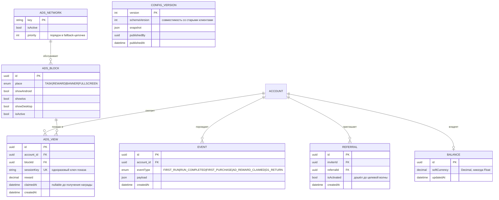
```mermaid
erDiagram
    ACCOUNT ||--o{ EVENT : "порождает"
    ACCOUNT ||--o{ ADS_VIEW : "смотрит"
    ACCOUNT ||--o{ REFERRAL : "приглашает"
    ACCOUNT ||--o| BALANCE : "владеет"
    ADS_BLOCK ||--o{ ADS_VIEW : "показан в"
    ADS_NETWORK ||--o{ ADS_BLOCK : "обслуживает"

    EVENT {
        uuid id PK
        uuid account_id FK
        enum eventType "FIRST_RUN|RUN_COMPLETED|FIRST_PURCHASE|AD_REWARD_CLAIMED|D1_RETURN"
        json payload
        datetime createdAt
    }

    ADS_VIEW {
        uuid id PK
        uuid account_id FK
        uuid blockId FK
        string sessionKey UK "одноразовый ключ показа"
        decimal reward
        datetime claimedAt "nullable до получения награды"
        datetime createdAt
    }

    ADS_BLOCK {
        uuid id PK
        enum place "TASK|REWARD|BANNER|FULLSCREEN"
        bool showAndroid
        bool showIos
        bool showDesktop
        bool isActive
    }

    ADS_NETWORK {
        string key PK
        bool isActive
        int priority "порядок в fallback-цепочке"
    }

    REFERRAL {
        uuid id PK
        uuid inviterId FK
        uuid referralId FK
        bool isActivated "дошёл до целевой волны"
        datetime createdAt
    }

    BALANCE {
        uuid id PK
        decimal softCurrency "Decimal, никогда Float"
        datetime updatedAt
    }

    CONFIG_VERSION {
        int version PK
        int schemaVersion "совместимость со старыми клиентами"
        json snapshot
        uuid publishedBy
        datetime publishedAt
    }
```

`CONFIG_VERSION` намеренно не связана с `ACCOUNT` внешним ключом: это
неизменяемый снапшот правил игры, а не пользовательские данные
(`19-content-admin.md` §3). `BALANCE` ждёт второго товара: пока за звёзды
продаётся один второй шанс, валюта не нужна (`34-stage3-plan.md`, Р5).
`EVENT` — вехи воронки игрока, которые знает только сервер: первый забег,
первая покупка, возврат на второй день (`13-reuse-from-vpnsibcom.md` §6).
Это не клиентская аналитика — та в `ANALYTICS_EVENT` (§1.1). На этапе 3
таблица не заведена: вехи пока выводятся запросом из `run`, `purchase` и
`account_session`, а понадобится она партнёрским начислениям.

### 1.3 Привлечение, партнёры и аналитика (проектируется)

Вынесено отдельной диаграммой намеренно: это другой домен со своим циклом
жизни, и смешивать его с игровыми сущностями в одной схеме — путь к
нечитаемой картинке.

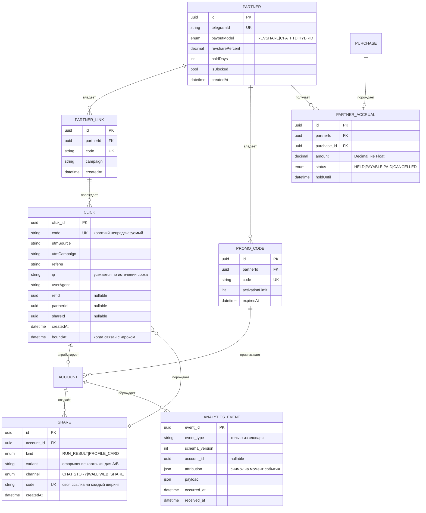
```mermaid
erDiagram
    CLICK ||--o| ACCOUNT : "атрибутирует"
    PARTNER ||--o{ PARTNER_LINK : "владеет"
    PARTNER ||--o{ PROMO_CODE : "владеет"
    PARTNER_LINK ||--o{ CLICK : "порождает"
    PROMO_CODE ||--o{ ACCOUNT : "привязывает"
    PARTNER ||--o{ PARTNER_ACCRUAL : "получает"
    PURCHASE ||--o| PARTNER_ACCRUAL : "порождает"
    ACCOUNT ||--o{ SHARE : "создаёт"
    SHARE ||--o{ CLICK : "порождает"
    ACCOUNT ||--o{ ANALYTICS_EVENT : "порождает"

    CLICK {
        uuid click_id PK
        string code UK "короткий непредсказуемый"
        string utmSource
        string utmCampaign
        string referer
        string ip "усекается по истечении срока"
        string userAgent
        uuid refId "nullable"
        uuid partnerId "nullable"
        uuid shareId "nullable"
        datetime createdAt
        datetime boundAt "когда связан с игроком"
    }

    PARTNER {
        uuid id PK
        string telegramId UK
        enum payoutModel "REVSHARE|CPA_FTD|HYBRID"
        decimal revsharePercent
        int holdDays
        bool isBlocked
        datetime createdAt
    }

    PARTNER_LINK {
        uuid id PK
        uuid partnerId FK
        string code UK
        string campaign
        datetime createdAt
    }

    PROMO_CODE {
        uuid id PK
        uuid partnerId FK
        string code UK
        int activationLimit
        datetime expiresAt
    }

    PARTNER_ACCRUAL {
        uuid id PK
        uuid partnerId FK
        uuid purchase_id FK
        decimal amount "Decimal, не Float"
        enum status "HELD|PAYABLE|PAID|CANCELLED"
        datetime holdUntil
    }

    SHARE {
        uuid id PK
        uuid account_id FK
        enum kind "RUN_RESULT|PROFILE_CARD"
        string variant "оформление карточки, для A/B"
        enum channel "CHAT|STORY|WALL|WEB_SHARE"
        string code UK "своя ссылка на каждый шеринг"
        datetime createdAt
    }

    ANALYTICS_EVENT {
        uuid event_id PK
        string event_type "только из словаря"
        int schema_version
        uuid account_id "nullable"
        json attribution "снимок на момент события"
        json payload
        datetime occurred_at
        datetime received_at
    }
```

Три решения, которые из схемы не очевидны:

- **`CLICK` существует до игрока.** Строка создаётся в момент клика,
  когда аккаунта ещё нет; `boundAt` заполняется при первом запуске. Код
  клика (`c-<код>` в параметре запуска) уже сейчас пишется в
  `account_session.start_ref` и в касания `acquisition` (§1.1) — строка клика
  свяжется с ними по нему, задним числом тоже.
- **`ANALYTICS_EVENT.attribution` — снимок, а не ссылка.** Иначе
  перепривязка задним числом переписывает историю и отчёт за прошлый месяц
  перестаёт воспроизводиться (`22-analytics-and-metrics.md` §3.1).
- **У каждого шеринга своя ссылка.** `SHARE.code` — отдельный код на каждый
  шеринг, а не общая реферальная ссылка игрока: только так измеряется, что
  конвертит лучше (`24-attribution-and-sharing.md` §7.3).

### 1.4 Телеметрия закрытого теста (этап 2, реализовано)

Первые таблицы в проде: до авторизации, поэтому без внешнего ключа на
`USER`. Схема — `backend/api/prisma/schema.prisma`, миграции — рядом.
Подробности — `28-diagnostics.md` §5.4 и `22-analytics-and-metrics.md` §3.1.

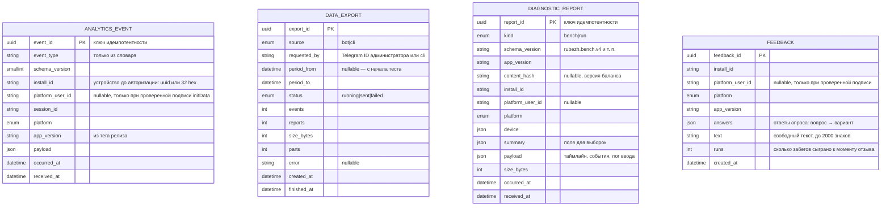
```mermaid
erDiagram
    ANALYTICS_EVENT {
        uuid event_id PK "ключ идемпотентности"
        string event_type "только из словаря"
        smallint schema_version
        string install_id "устройство до авторизации: uuid или 32 hex"
        string platform_user_id "nullable, только при проверенной подписи initData"
        string session_id
        enum platform
        string app_version "из тега релиза"
        json payload
        datetime occurred_at
        datetime received_at
    }

    DATA_EXPORT {
        uuid export_id PK
        enum source "bot|cli"
        string requested_by "Telegram ID администратора или cli"
        datetime period_from "nullable — с начала теста"
        datetime period_to
        enum status "running|sent|failed"
        int events
        int reports
        int size_bytes
        int parts
        string error "nullable"
        datetime created_at
        datetime finished_at
    }

    DIAGNOSTIC_REPORT {
        uuid report_id PK "ключ идемпотентности"
        enum kind "bench|run"
        string schema_version "rubezh.bench.v4 и т. п."
        string app_version
        string content_hash "nullable, версия баланса"
        string install_id
        string platform_user_id "nullable"
        enum platform
        json device
        json summary "поля для выборок"
        json payload "таймлайн, события, лог ввода"
        int size_bytes
        datetime occurred_at
        datetime received_at
    }

    FEEDBACK {
        uuid feedback_id PK
        string install_id
        string platform_user_id "nullable, только при проверенной подписи"
        enum platform
        string app_version
        json answers "ответы опроса: вопрос → вариант"
        string text "свободный текст, до 2000 знаков"
        int runs "сколько забегов сыграно к моменту отзыва"
        datetime created_at
    }
```

Что важно:

- **Связи с `USER` нет намеренно.** Пользователей до этапа 3 не существует;
  на этапе 3 история закрытого теста привязывается к аккаунтам по
  `platform_user_id`, а не переписывается. Колонка `user_id` и атрибуция
  появятся миграцией вместе с кодом, который их заполняет.
- **`DATA_EXPORT` — журнал доступа к данным, а не данные тестеров**: в нём
  Telegram ID администратора, который выгружал, — это аудит (`28-diagnostics.md`
  §6.1.4), по нему же считается «с последней выгрузки».
- **`FEEDBACK` — слова игрока, а не телеметрия** (`29-admin-panel.md` §5.7).
  Живёт отдельной таблицей: в события отзыв не кладётся, там остаётся только
  факт `feedback_sent`. Уходит и в чат администраторов — база нужна, чтобы
  собрать сводку и пережить недоступный Telegram.
- **Индексы** — по времени приёма (выгрузка и очистка), по установке и по
  `(event_type, received_at)` у событий, по `(app_version, kind)` у отчётов, по
  времени создания и установке у отзывов.
- **IP не хранится ни в одной из таблиц** — он нужен только лимиту частоты
  на приёме.
- Отчёты стенда этапа 1 лежали файлами в `var/bench-reports/`; в прод они
  не переносятся — это другой формат и другие условия замера.

---

## 2. Пакеты монорепо и направления зависимостей

Стрелка означает «импортирует». Красных стрелок здесь быть не может — правила
проверяются линтом и строгой раскладкой `node_modules`
(`15-engineering-standards.md` §2.2, `16-tech-stack-decisions.md` §2.2).

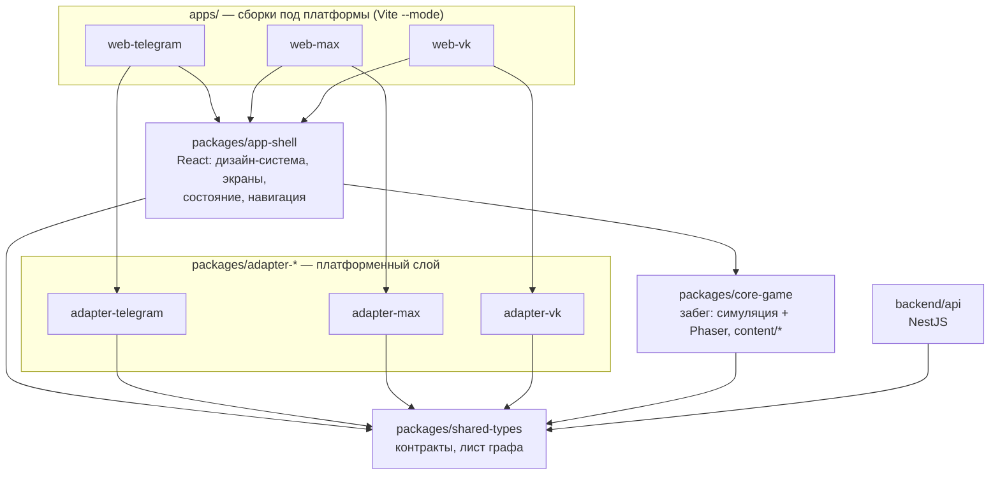
```mermaid
flowchart TD
    subgraph apps["apps/ — сборки под платформы (Vite --mode)"]
        WT["web-telegram"]
        WM["web-max"]
        WV["web-vk"]
    end

    subgraph adapters["packages/adapter-* — платформенный слой"]
        AT["adapter-telegram"]
        AM["adapter-max"]
        AV["adapter-vk"]
    end

    SH["packages/app-shell<br/>React: дизайн-система, экраны,<br/>состояние, навигация"]
    CG["packages/core-game<br/>забег: симуляция + Phaser, content/*"]
    ST["packages/shared-types<br/>контракты, лист графа"]
    API["backend/api<br/>NestJS"]

    WT --> SH
    WT --> AT
    WM --> SH
    WM --> AM
    WV --> SH
    WV --> AV

    SH --> CG
    SH --> ST
    AT --> ST
    AM --> ST
    AV --> ST
    CG --> ST
    API --> ST
```

Стрелка из `apps/web-*` в `core-game` осталась одна и узкая: приложение берёт
оттуда отпечаток контента для сведений о сборке, а в Telegram-сборке ещё и
стенд FPS-испытаний. Забег запускает оболочка, и напрямую в движок приложение
не ходит (`27-design-system-and-app-shell.md` §2–§3).

Правила проверяются тестом по исходникам — `scripts/test/layer-boundaries.test.ts`.
Линт границ (`eslint-plugin-boundaries`) остаётся возможной заменой, но правил
пока восемь, и тест с человеческим сообщением «оболочка не знает о площадках»
полезнее настройки плагина.

Чего на схеме **нет** и не должно появиться:

- стрелки из `core-game` в любой `adapter-*` — иначе движок становится
  платформозависимым и порт на MAX превращается в переписывание;
- стрелки из `app-shell` в любой `adapter-*` или в Phaser — адаптер
  приходит объектом, Phaser — отдельным чанком;
- стрелки из `core-game` в `app-shell` — движок не знает, кто рисует меню;
- стрелки между адаптерами — общее выносится в `shared-types`;
- стрелки из `core-game` в `backend/api` — игровой цикл работает офлайн;
- любых стрелок **из** `shared-types` — это лист графа.

### 2.1 Внутреннее устройство core-game

Ключевая граница внутри пакета — между симуляцией и отрисовкой. Симуляция
обязана запускаться headless: без этого невозможны ни golden-прогоны баланса,
ни воспроизведение бага по seed'у, ни серверная перепроверка забега
(`17-testing-strategy.md` §3). Проверяется тестом по исходникам, а не только
на ревью.

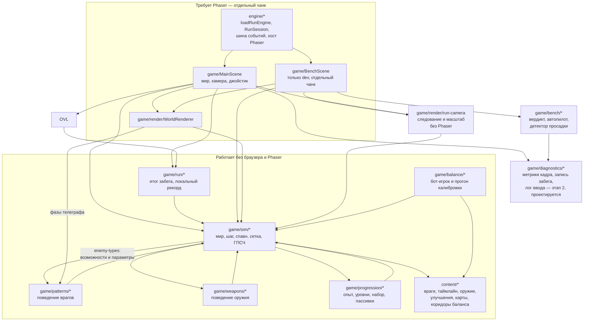
```mermaid
flowchart TD
    subgraph headless["Работает без браузера и Phaser"]
        SIM["game/sim/*<br/>мир, шаг, спавн, сетка, ГПСЧ"]
        PAT["game/patterns/*<br/>поведение врагов"]
        WPN["game/weapons/*<br/>поведение оружия"]
        PRG["game/progression/*<br/>опыт, уровни, набор, пассивки"]
        RUN["game/run/*<br/>итог забега, локальный рекорд"]
        BAL["game/balance/*<br/>бот-игрок и прогон калибровки"]
        CNT["content/*<br/>враги, таймлайн, оружие,<br/>улучшения, карты, коридоры баланса"]
    end

    subgraph rendered["Требует Phaser — отдельный чанк"]
        ENG["engine/*<br/>loadRunEngine, RunSession,<br/>шина событий, хост Phaser"]
        MS["game/MainScene<br/>мир, камера, джойстик"]
        BS["game/BenchScene<br/>только dev, отдельный чанк"]
        WR["game/render/WorldRenderer"]
    end

    RC["game/render/run-camera<br/>следование и масштаб<br/>без Phaser"]

    BM["game/bench/*<br/>вердикт, автопилот,<br/>детектор просадки"]
    DG["game/diagnostics/*<br/>метрики кадра, запись забега,<br/>лог ввода — этап 2, проектируется"]

    PAT --> SIM
    SIM -- "enemy-types:<br/>возможности и параметры" --> PAT
    WPN --> SIM
    PRG --> SIM
    SIM --> WPN
    SIM --> PRG
    SIM --> CNT
    WR -- "фазы телеграфа" --> PAT
    MS --> SIM
    MS --> WR
    MS --> DG
    MS --> RUN
    MS --> OVL
    RUN --> SIM
    OVL --> RUN
    BS --> SIM
    BS --> WR
    BS --> BM
    BS --> RC
    BM --> DG
    WR --> SIM
    MS --> RC
    RC --> SIM
    BAL --> SIM
    BAL --> CNT
    ENG --> MS
    ENG --> BS
```

Связь симуляции и паттернов двусторонняя, но без цикла модулей: шаг
симуляции вызывает поведение из реестра `game/patterns/index.ts`, а мир при
создании берёт у `game/patterns/enemy-types.ts` только возможности и
параметры паттернов — этот модуль ничего из `game/sim/*` не импортирует.
Рендер читает у паттернов номера фаз, чтобы показать телеграф; сама
симуляция о рендере по-прежнему не знает — эффекты она пишет в буфер событий
(`game/sim/events.ts`).

На этапе 2 сбор метрик кадра переезжает из `game/bench/*` в общий
`game/diagnostics/*`: им пользуются и стенд, и обычный забег, а отправка
отчётов уходит из движка в оболочку (`28-diagnostics.md` §3.1).

`game/render/run-camera` лежит в подграфе рендера по смыслу, а не по
зависимостям: Phaser он не импортирует и потому проверяется обычным тестом.
Камера **только рендер** — симуляция о масштабе не знает (`26-stage2-plan.md`,
WP4.3). Единственное, что мир берёт из параметров камеры, — радиус кольца
спавна, и берёт его от максимально возможной видимой области, одинаковой на
всех устройствах. Поэтому в камере разрешён `Math.exp`, запрещённый в
симуляции: на исход забега он не влияет.

`game/balance/*` — бот-игрок и прогон калибровки (`pnpm balance:sim`,
WP4.6). Он единственный в headless-подграфе намеренно импортирует `content/*`:
смысл прогона в том, чтобы померить текущие числа, а не поведение движка. На
него распространяются те же запреты приближённой математики — иначе таблица
калибровки меняется от запуска к запуску.

`game/run/*` считает итог забега и ведёт локальный рекорд, но Phaser и DOM не
знает: его гоняет тест статистики, а позже — серверная перепроверка забега
(§3.5 там же). Хранилище он получает портом снаружи, поэтому стрелки в
адаптеры у него нет.

`engine/*` — единственная дверь, за которой начинается Phaser: публичный
`index.ts` пакета его не импортирует, а `loadRunEngine()` подгружает этот
подграф динамически. Экраны на канве (`game/overlays/*`) вместе с WP5 удалены:
пауза, выбор улучшения и смерть — React-оверлеи оболочки, `RunResult` уходит
наружу событием шины.

Чего на схеме нет и не должно появиться:

- стрелок из `game/sim/*` и `game/patterns/*` в Phaser, DOM или `bench/*` —
  симуляция ничего не знает о том, что её рисуют и замеряют;
- стрелок из `content/*` куда бы то ни было в `game/*` — контент это данные;
- `BenchScene` в основном бандле: сцена подключается динамическим импортом,
  иначе стенд испытаний уезжает игрокам.

---

## 3. Бэкенд: модули и инфраструктура

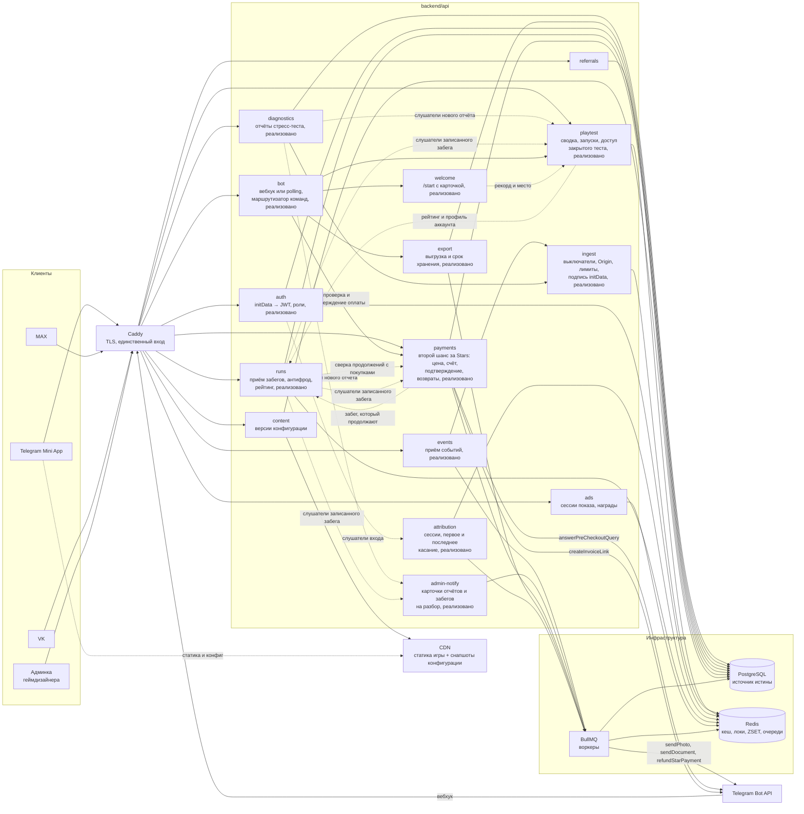
```mermaid
flowchart LR
    subgraph clients["Клиенты"]
        TG["Telegram Mini App"]
        MAX["MAX"]
        VK["VK"]
        ADMIN["Админка<br/>геймдизайнера"]
    end

    CADDY["Caddy<br/>TLS, единственный вход"]

    subgraph api["backend/api"]
        AUTH["auth<br/>initData → JWT, роли, реализовано"]
        ATTR["attribution<br/>сессии, первое и последнее<br/>касание, реализовано"]
        RUNS["runs<br/>приём забегов, антифрод,<br/>рейтинг, реализовано"]
        PAY["payments<br/>второй шанс за Stars: цена, счёт,<br/>подтверждение, возвраты, реализовано"]
        ADS["ads<br/>сессии показа, награды"]
        REF["referrals"]
        CONTENT["content<br/>версии конфигурации"]
        INGEST["ingest<br/>выключатели, Origin, лимиты,<br/>подпись initData, реализовано"]
        EVENTS["events<br/>приём событий, реализовано"]
        DIAG["diagnostics<br/>отчёты стресс-теста, реализовано"]
        PT["playtest<br/>сводка, запуски, доступ<br/>закрытого теста, реализовано"]
        BOT["bot<br/>вебхук или polling,<br/>маршрутизатор команд, реализовано"]
        WELCOME["welcome<br/>/start с карточкой, реализовано"]
        NOTIFY["admin-notify<br/>карточки отчётов и забегов<br/>на разбор, реализовано"]
        EXPORT["export<br/>выгрузка и срок хранения, реализовано"]
    end

    TGAPI["Telegram Bot API"]

    subgraph infra["Инфраструктура"]
        PG[("PostgreSQL<br/>источник истины")]
        REDIS[("Redis<br/>кеш, локи, ZSET, очереди")]
        QUEUE["BullMQ<br/>воркеры"]
    end

    CDN["CDN<br/>статика игры + снапшоты конфигурации"]

    TG --> CADDY
    MAX --> CADDY
    VK --> CADDY
    ADMIN --> CADDY

    CADDY --> AUTH
    CADDY --> RUNS
    CADDY --> PAY
    CADDY --> ADS
    CADDY --> REF
    CADDY --> CONTENT
    CADDY --> EVENTS
    CADDY --> DIAG
    CADDY --> PT

    PT --> REDIS
    EVENTS --> INGEST
    DIAG --> INGEST
    INGEST --> REDIS
    EVENTS --> QUEUE
    DIAG --> PG
    DIAG -. слушатели нового отчёта .-> PT
    DIAG -. слушатели нового отчёта .-> NOTIFY
    RUNS -. слушатели записанного забега .-> PT
    RUNS -. слушатели записанного забега .-> NOTIFY
    PT -. рейтинг и профиль аккаунта .-> RUNS
    NOTIFY --> QUEUE
    PAY -- answerPreCheckoutQuery --> TGAPI
    TGAPI -- вебхук --> CADDY
    CADDY --> BOT
    BOT --> WELCOME
    BOT --> PT
    BOT --> EXPORT
    BOT -- проверка и подтверждение оплаты --> PAY
    PAY --> QUEUE
    WELCOME -. рекорд и место .-> PT
    EXPORT --> QUEUE
    EXPORT --> PG
    QUEUE -- sendPhoto, sendDocument, refundStarPayment --> TGAPI

    AUTH --> PG
    AUTH --> REDIS
    AUTH -. слушатели входа .-> ATTR
    ATTR --> REDIS
    ATTR --> QUEUE
    RUNS --> PG
    RUNS --> REDIS
    PAY --> PG
    PAY -. забег, который продолжают .-> RUNS
    RUNS -. сверка продолжений с покупками .-> PAY
    RUNS -. слушатели записанного забега .-> PAY
    PAY -- createInvoiceLink --> TGAPI
    ADS --> REDIS
    REF --> PG
    CONTENT --> PG
    CONTENT --> CDN

    QUEUE --> PG
    QUEUE --> REDIS

    TG -.статика и конфиг.-> CDN
```

Читается так: **Postgres — источник истины, Redis — проекция.** Приём забега
пишет его в базу одной строкой по первичному ключу и только потом — место в
рейтинг Redis: упавший Redis забег не теряет, рейтинг догонит повтор итога
или пересборка (`34-stage3-plan.md`, Р4). Запись синхронная сознательно: на
нынешнем объёме это одна вставка, а очередь перед ней — первый шаг
`14-scalability.md` §4.1, когда запись станет узким местом. Уведомления и
сводка работают после ответа игроку — слушателями записанного забега.

---

## 4. Ключевые потоки

### 4.1 Авторизация

Реализовано на этапе 3 (`34-stage3-plan.md`, WP1, WP6).

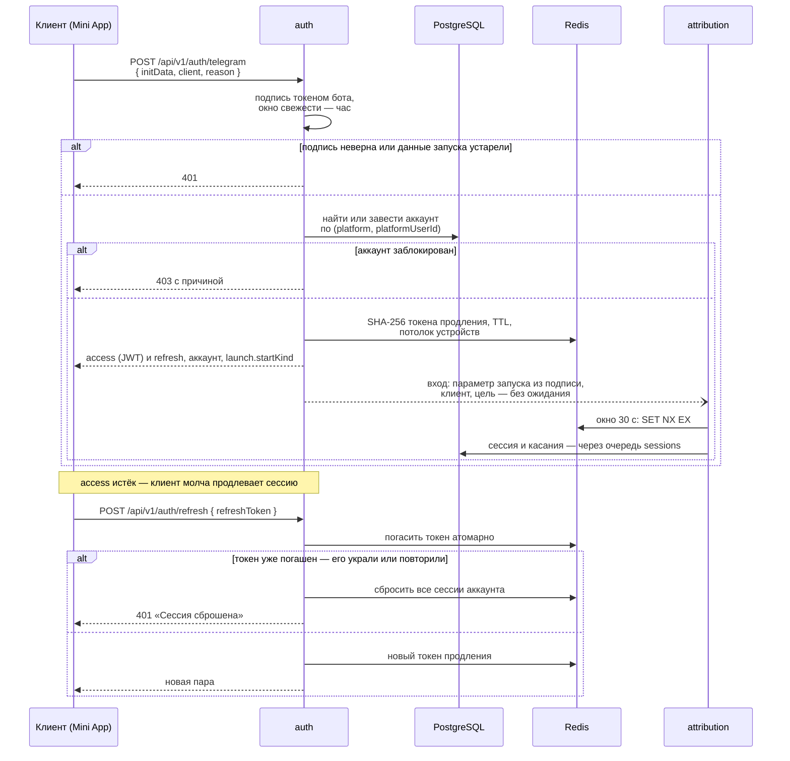
```mermaid
sequenceDiagram
    participant C as Клиент (Mini App)
    participant A as auth
    participant DB as PostgreSQL
    participant R as Redis
    participant S as attribution

    C->>A: POST /api/v1/auth/telegram<br/>{ initData, client, reason }
    A->>A: подпись токеном бота,<br/>окно свежести — час
    alt подпись неверна или данные запуска устарели
        A-->>C: 401
    else
        A->>DB: найти или завести аккаунт<br/>по (platform, platformUserId)
        alt аккаунт заблокирован
            A-->>C: 403 с причиной
        else
            A->>R: SHA-256 токена продления, TTL,<br/>потолок устройств
            A-->>C: access (JWT) и refresh, аккаунт, launch.startKind
            A--)S: вход: параметр запуска из подписи,<br/>клиент, цель — без ожидания
            S->>R: окно 30 с: SET NX EX
            S->>DB: сессия и касания — через очередь sessions
        end
    end

    Note over C,A: access истёк — клиент молча продлевает сессию
    C->>A: POST /api/v1/auth/refresh { refreshToken }
    A->>R: погасить токен атомарно
    alt токен уже погашен — его украли или повторили
        A->>R: сбросить все сессии аккаунта
        A-->>C: 401 «Сессия сброшена»
    else
        A->>R: новый токен продления
        A-->>C: новая пара
    end
```

Валидация подписи — **только на сервере**. Роли в токен не входят и
проверяются по базе на каждом запросе с правом: отзыв действует сразу, а не
через четверть часа (`34-stage3-plan.md`, Р1). Сессию и касания вход не
ждёт: упавшая запись атрибуции не отменяет вход. Сессией считается только
запуск (`reason: "launch"`), а не повторный вход посреди работы. Детали и
краевые случаи — `13-reuse-from-vpnsibcom.md` §4 и §6.

### 4.2 Сдача результата забега

Реализовано на этапе 3 (`34-stage3-plan.md`, WP4).

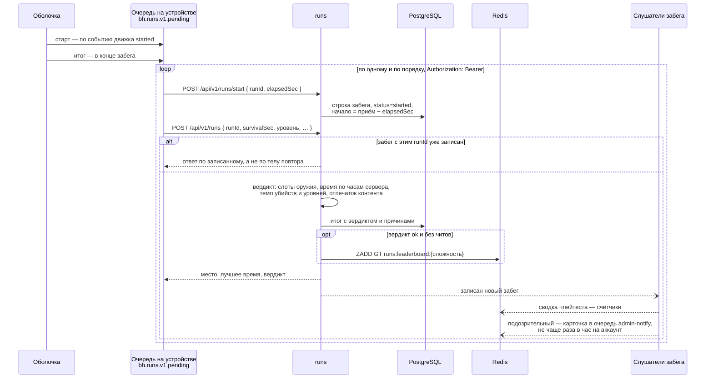
```mermaid
sequenceDiagram
    participant C as Оболочка
    participant Q as Очередь на устройстве<br/>bh.runs.v1.pending
    participant RU as runs
    participant DB as PostgreSQL
    participant R as Redis
    participant H as Слушатели забега

    C->>Q: старт — по событию движка started
    C->>Q: итог — в конце забега
    loop по одному и по порядку, Authorization: Bearer
        Q->>RU: POST /api/v1/runs/start { runId, elapsedSec }
        RU->>DB: строка забега, status=started,<br/>начало = приём − elapsedSec
        Q->>RU: POST /api/v1/runs { runId, survivalSec, уровень, … }
        alt забег с этим runId уже записан
            RU-->>Q: ответ по записанному, а не по телу повтора
        else
            RU->>RU: вердикт: слоты оружия, время по часам сервера,<br/>темп убийств и уровней, отпечаток контента
            RU->>DB: итог с вердиктом и причинами
            opt вердикт ok и без читов
                RU->>R: ZADD GT runs:leaderboard:{сложность}
            end
            RU-->>Q: место, лучшее время, вердикт
            RU--)H: записан новый забег
            H--)R: сводка плейтеста — счётчики
            H--)R: подозрительный — карточка в очередь admin-notify,<br/>не чаще раза в час на аккаунт
        end
    end
```

Три свойства, ради которых схема такая:

- **время забега проверяет сервер своими часами.** Старт уходит в начале
  забега и ставит серверное время начала; итог длиннее прошедшего получает
  отказ. Старт, пролежавший без сети дольше `RUNS_START_MAX_DELAY_SEC`, время
  не проверяет — такой забег помечается `unverified_time` (О5);
- **повтор отвечает по записанному.** Идемпотентность — по клиентскому
  `runId`, **не** по хэшу тела: два честных забега с одинаковым счётом дали
  бы одинаковый хэш (`15-engineering-standards.md` §4.1). А ответ на повтор
  строится из базы, иначе забег сдавали бы дважды: с малым временем, чтобы
  пройти проверки, и тем же ключом — с огромным;
- **игрок не ждёт ни сводки, ни чата.** Слушатели зовутся после ответа и
  только на первую запись: повтор из очереди не посчитает забег дважды и не
  пришлёт вторую карточку.

### 4.3 Награда за просмотр рекламы

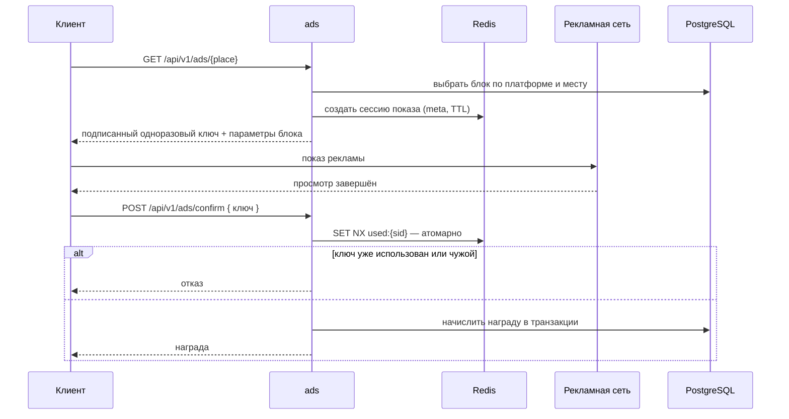
```mermaid
sequenceDiagram
    participant C as Клиент
    participant AD as ads
    participant R as Redis
    participant N as Рекламная сеть
    participant DB as PostgreSQL

    C->>AD: GET /api/v1/ads/{place}
    AD->>DB: выбрать блок по платформе и месту
    AD->>R: создать сессию показа (meta, TTL)
    AD-->>C: подписанный одноразовый ключ + параметры блока
    C->>N: показ рекламы
    N-->>C: просмотр завершён
    C->>AD: POST /api/v1/ads/confirm { ключ }
    AD->>R: SET NX used:{sid} — атомарно
    alt ключ уже использован или чужой
        AD-->>C: отказ
    else
        AD->>DB: начислить награду в транзакции
        AD-->>C: награда
    end
```

Проверка «использована ли сессия» и начисление — **одна атомарная операция**.
Иначе два параллельных `confirm` оба проходят проверку и награда начисляется
дважды (`13-reuse-from-vpnsibcom.md` §5).

### 4.4 Публикация конфигурации из админки

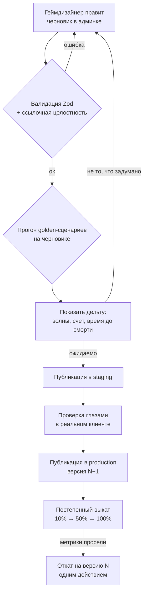
```mermaid
flowchart TD
    D["Геймдизайнер правит<br/>черновик в админке"]
    V{"Валидация Zod<br/>+ ссылочная целостность"}
    S{"Прогон golden-сценариев<br/>на черновике"}
    DELTA["Показать дельту:<br/>волны, счёт, время до смерти"]
    STG["Публикация в staging"]
    CHECK["Проверка глазами<br/>в реальном клиенте"]
    PROD["Публикация в production<br/>версия N+1"]
    ROLL["Постепенный выкат<br/>10% → 50% → 100%"]
    BACK["Откат на версию N<br/>одним действием"]

    D --> V
    V -- "ошибка" --> D
    V -- "ок" --> S
    S --> DELTA
    DELTA -- "не то, что задумано" --> D
    DELTA -- "ожидаемо" --> STG
    STG --> CHECK
    CHECK --> PROD
    PROD --> ROLL
    ROLL -- "метрики просели" --> BACK
```

Подробности и рамки — `19-content-admin.md`.

### 4.5 Путь атрибуции: от клика до игрока

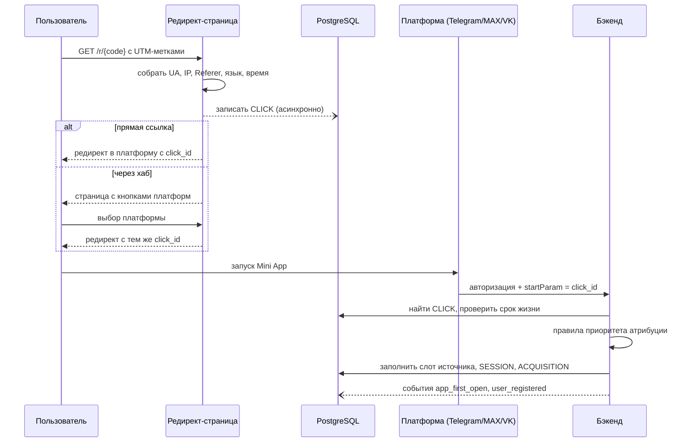
```mermaid
sequenceDiagram
    participant U as Пользователь
    participant R as Редирект-страница
    participant DB as PostgreSQL
    participant P as Платформа (Telegram/MAX/VK)
    participant API as Бэкенд

    U->>R: GET /r/{code} с UTM-метками
    R->>R: собрать UA, IP, Referer, язык, время
    R--)DB: записать CLICK (асинхронно)
    alt прямая ссылка
        R-->>U: редирект в платформу с click_id
    else через хаб
        R-->>U: страница с кнопками платформ
        U->>R: выбор платформы
        R-->>U: редирект с тем же click_id
    end
    U->>P: запуск Mini App
    P->>API: авторизация + startParam = click_id
    API->>DB: найти CLICK, проверить срок жизни
    API->>API: правила приоритета атрибуции
    API->>DB: заполнить слот источника, SESSION, ACQUISITION
    API--)DB: события app_first_open, user_registered
```

Краулер мессенджера, запрашивающий превью ссылки, кликом **не считается** —
иначе одна отправка в чат порождает фантомный клик и занижает конверсию
(`24-attribution-and-sharing.md` §3.3).

### 4.6 Аналитический конвейер

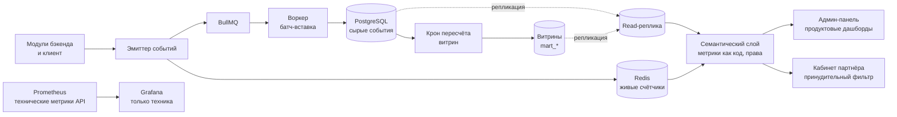
```mermaid
flowchart LR
    MOD["Модули бэкенда<br/>и клиент"]
    EMIT["Эмиттер событий"]
    Q["BullMQ"]
    RD[("Redis<br/>живые счётчики")]
    W["Воркер<br/>батч-вставка"]
    PG[("PostgreSQL<br/>сырые события")]
    ROLL["Крон пересчёта<br/>витрин"]
    MART[("Витрины<br/>mart_*")]
    REPL[("Read-реплика")]
    SEM["Семантический слой<br/>метрики как код, права"]
    ADM["Админ-панель<br/>продуктовые дашборды"]
    PC["Кабинет партнёра<br/>принудительный фильтр"]
    PROM["Prometheus<br/>технические метрики API"]
    GRAF["Grafana<br/>только техника"]

    MOD --> EMIT
    EMIT --> Q
    EMIT --> RD
    Q --> W
    W --> PG
    PG --> ROLL
    ROLL --> MART
    PG -.репликация.-> REPL
    MART -.репликация.-> REPL
    REPL --> SEM
    RD --> SEM
    SEM --> ADM
    SEM --> PC
    PROM --> GRAF
```

Существенное: **продуктовая аналитика не ходит в горячие таблицы.**
Админ-панель и кабинет партнёра читают витрины на реплике через
семантический слой, живые счётчики — из Redis; Grafana смотрит только
технические метрики Prometheus (`29-admin-panel.md` §5). Иначе открытый на стене
дашборд с автообновлением становится постоянной паразитной нагрузкой на ту
же БД, которая принимает забеги (`22-analytics-and-metrics.md` §1).

### 4.7 Забег внутри оболочки (этап 2, проектируется)

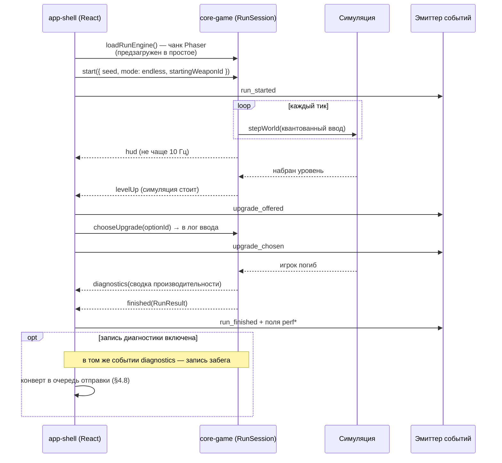
```mermaid
sequenceDiagram
    participant UI as app-shell (React)
    participant E as core-game (RunSession)
    participant S as Симуляция
    participant T as Эмиттер событий

    UI->>E: loadRunEngine() — чанк Phaser<br/>(предзагружен в простое)
    UI->>E: start({ seed, mode: endless, startingWeaponId })
    UI->>T: run_started
    loop каждый тик
        E->>S: stepWorld(квантованный ввод)
    end
    E-->>UI: hud (не чаще 10 Гц)
    S-->>E: набран уровень
    E-->>UI: levelUp (симуляция стоит)
    UI->>T: upgrade_offered
    UI->>E: chooseUpgrade(optionId) → в лог ввода
    UI->>T: upgrade_chosen
    S-->>E: игрок погиб
    E-->>UI: diagnostics(сводка производительности)
    E-->>UI: finished(RunResult)
    UI->>T: run_finished + поля perf*
    opt запись диагностики включена
        Note over E,UI: в том же событии diagnostics — запись забега
        UI->>UI: конверт в очередь отправки (§4.8)
    end
```

Движок не ходит в сеть и не знает про аналитику: он отдаёт результат, а
отправкой занимается оболочка (`27-design-system-and-app-shell.md` §3.1).

### 4.8 Доставка отчёта диагностики (этап 2, реализовано)

Очередь на устройстве — `app-shell/src/state/report-queue.ts`, приёмник —
`backend/api/src/modules/diagnostics`. Стресс-тест очередь не использует: он
шлёт отчёт сам и повторяет отправку кнопкой.

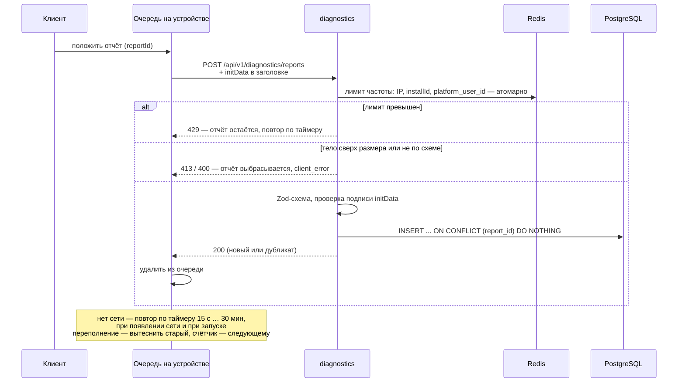
```mermaid
sequenceDiagram
    participant C as Клиент
    participant O as Очередь на устройстве
    participant D as diagnostics
    participant R as Redis
    participant DB as PostgreSQL

    C->>O: положить отчёт (reportId)
    O->>D: POST /api/v1/diagnostics/reports<br/>+ initData в заголовке
    D->>R: лимит частоты: IP, installId, platform_user_id — атомарно
    alt лимит превышен
        D-->>O: 429 — отчёт остаётся, повтор по таймеру
    else тело сверх размера или не по схеме
        D-->>O: 413 / 400 — отчёт выбрасывается, client_error
    else
        D->>D: Zod-схема, проверка подписи initData
        D->>DB: INSERT ... ON CONFLICT (report_id) DO NOTHING
        D-->>O: 200 (новый или дубликат)
        O->>O: удалить из очереди
    end
    Note over O: нет сети — повтор по таймеру 15 с … 30 мин,<br/>при появлении сети и при запуске<br/>переполнение — вытеснить старый, счётчик — следующему
```

Подпись `initData` здесь не авторизует, а только подтверждает Telegram ID
тестера; неверная подпись не отклоняет отчёт, а обнуляет ID
(`28-diagnostics.md` §5.2).

### 4.9 Выгрузка данных администратору через бота (этап 2, реализовано)

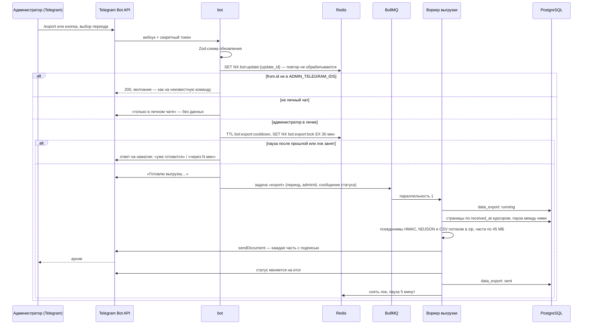
```mermaid
sequenceDiagram
    participant A as Администратор (Telegram)
    participant TG as Telegram Bot API
    participant B as bot
    participant R as Redis
    participant Q as BullMQ
    participant W as Воркер выгрузки
    participant DB as PostgreSQL

    A->>TG: /export или кнопка, выбор периода
    TG->>B: вебхук + секретный токен
    B->>B: Zod-схема обновления
    B->>R: SET NX bot:update:{update_id} — повтор не обрабатывается
    alt from.id не в ADMIN_TELEGRAM_IDS
        B-->>TG: 200, молчание — как на неизвестную команду
    else не личный чат
        B->>TG: «только в личном чате» — без данных
    else администратор в личке
        B->>R: TTL bot:export:cooldown, SET NX bot:export:lock EX 30 мин
        alt пауза после прошлой или лок занят
            B->>TG: ответ на нажатие: «уже готовится» / «через N мин»
        else
            B->>TG: «Готовлю выгрузку…»
            B->>Q: задача «export» (период, adminId, сообщение статуса)
            Q->>W: параллельность 1
            W->>DB: data_export: running
            W->>DB: страницы по received_at курсором, пауза между ними
            W->>W: псевдонимы HMAC, NDJSON и CSV потоком в zip, части по 45 МБ
            W->>TG: sendDocument — каждая часть с подписью
            TG-->>A: архив
            W->>TG: статус меняется на итог
            W->>DB: data_export: sent
            W->>R: снять лок, пауза 5 минут
        end
    end
```

Вебхук отвечает сразу, а архив собирает воркер: иначе Telegram посчитает
медленный ответ ошибкой и повторит обновление. Скрытая кнопка — не защита,
доступ проверяется на каждом обновлении (`28-diagnostics.md` §6.1).

### 4.10 Спавн в бесконечном мире (этап 2, реализовано)

Мир не кончается, поэтому у спавна нет «краёв экрана», от которых можно
отсчитывать. Вместо них — два радиуса вокруг игрока: кольцо спавна и радиус
удержания (`26-stage2-plan.md`, WP4.1–WP4.4).

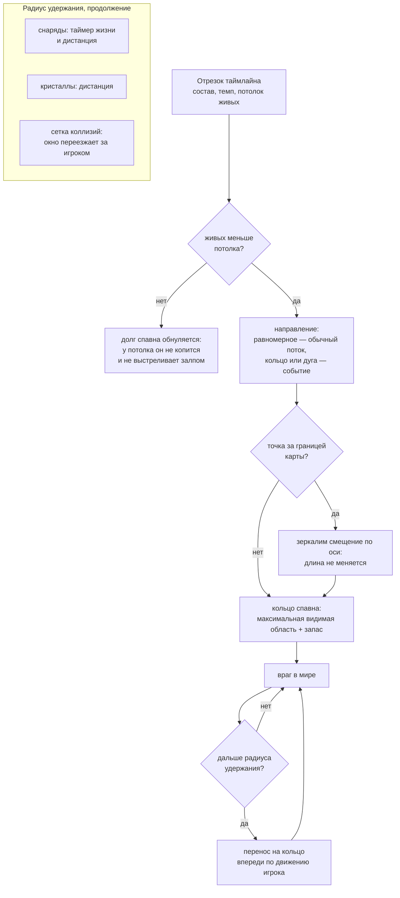
```mermaid
flowchart TD
    T["Отрезок таймлайна<br/>состав, темп, потолок живых"] --> B{"живых меньше<br/>потолка?"}
    B -- нет --> HOLD["долг спавна обнуляется:<br/>у потолка он не копится<br/>и не выстреливает залпом"]
    B -- да --> DIR["направление:<br/>равномерное — обычный поток,<br/>кольцо или дуга — событие"]
    DIR --> ARC{"точка за границей<br/>карты?"}
    ARC -- да --> MIR["зеркалим смещение по оси:<br/>длина не меняется"]
    ARC -- нет --> RING
    MIR --> RING["кольцо спавна:<br/>максимальная видимая область + запас"]
    RING --> LIVE["враг в мире"]

    LIVE --> FAR{"дальше радиуса<br/>удержания?"}
    FAR -- нет --> LIVE
    FAR -- да --> FWD["перенос на кольцо<br/>впереди по движению игрока"]
    FWD --> LIVE

    subgraph cleanup["Радиус удержания, продолжение"]
        PR["снаряды: таймер жизни<br/>и дистанция"]
        GEM["кристаллы: дистанция"]
        GRID["сетка коллизий:<br/>окно переезжает за игроком"]
    end
```

Три свойства, ради которых схема такая:

- **радиус кольца не зависит от устройства.** Он считается от максимальной
  видимой области карты — дальний масштаб на крайнем допустимом соотношении
  сторон плюс запас. Ни зум, ни поворот экрана, ни широкий монитор не
  показывают момент появления врага и не меняют спавн;
- **отставшие не копятся за спиной.** В бесконечном мире от кого угодно можно
  убежать; перенос вперёд сохраняет давление и не даёт пулу забиться теми,
  кого игрок никогда не встретит;
- **спавн никогда не попадает за границу карты.** Из кольца выбираются только
  допустимые дуги — смещение зеркалится по нарушенной оси, длина при этом не
  меняется, значит враг по-прежнему появляется за краем видимости.

### 4.11 Сохранения и лидерборд плейтеста (этап 2, заменено на этапе 3)

Временный путь закрытого теста (`26-stage2-plan.md`, Р19 и WP13) — подпись
`initData` на каждом запросе и Redis со сроком жизни — снят вместе с
переездом клиента на аккаунты (`34-stage3-plan.md`, WP4). Забеги, рейтинг и
профиль — §4.2; от плейтеста остались сводка, отчёты о запуске и доступ к
инструментам (§4.12), уже под сессией аккаунта. Неотправленные итоги из
прежней очереди `bh.playtest.v1.pending` клиент переносит в новую при первом
запуске.

### 4.12 Статистика плейтеста в чат администраторов (этап 2, реализовано)

Счётчики пишутся рядом с забегами и запусками, а сводку собирает бот по
команде или раз в сутки (`26-stage2-plan.md`, WP14). Забеги сводка получает
слушателем записанного забега из модуля `runs` (§4.2), рекорды — из его
рейтинга; игроков считает по аккаунту. Обновления читает модуль
бота (`backend/api/src/modules/bot`) long polling'ом — у машины разработчика
нет адреса для вебхука из §4.9 — и передаёт их обработчикам команд; `/stats`
регистрирует сводка плейтеста.

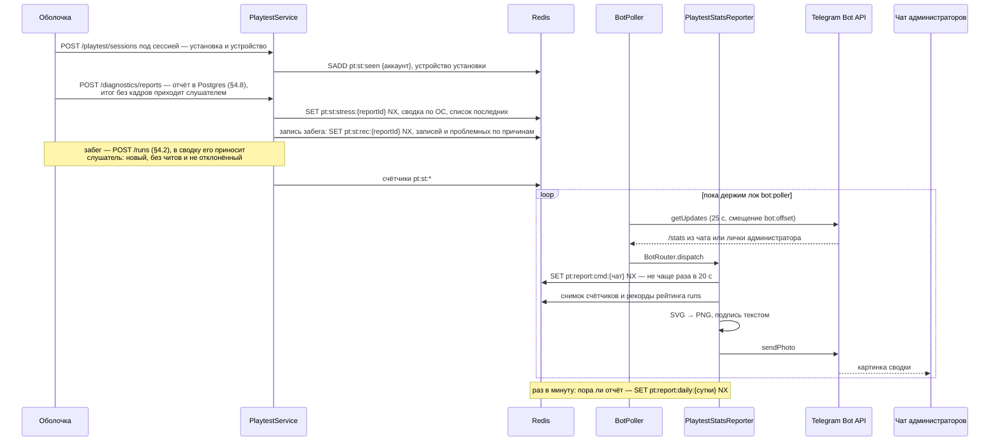
```mermaid
sequenceDiagram
    participant S as Оболочка
    participant P as PlaytestService
    participant R as Redis
    participant BP as BotPoller
    participant B as PlaytestStatsReporter
    participant TG as Telegram Bot API
    participant A as Чат администраторов

    S->>P: POST /playtest/sessions под сессией — установка и устройство
    P->>R: SADD pt:st:seen {аккаунт}, устройство установки
    S->>P: POST /diagnostics/reports — отчёт в Postgres (§4.8),<br/>итог без кадров приходит слушателем
    P->>R: SET pt:st:stress:{reportId} NX, сводка по ОС, список последних
    P->>R: запись забега: SET pt:st:rec:{reportId} NX, записей и проблемных по причинам
    Note over S,P: забег — POST /runs (§4.2), в сводку его приносит<br/>слушатель: новый, без читов и не отклонённый
    P->>R: счётчики pt:st:*

    loop пока держим лок bot:poller
        BP->>TG: getUpdates (25 с, смещение bot:offset)
        TG-->>BP: /stats из чата или лички администратора
        BP->>B: BotRouter.dispatch
        B->>R: SET pt:report:cmd:{чат} NX — не чаще раза в 20 с
        B->>R: снимок счётчиков и рекорды рейтинга runs
        B->>B: SVG → PNG, подпись текстом
        B->>TG: sendPhoto
        TG-->>A: картинка сводки
    end
    Note over B,R: раз в минуту: пора ли отчёт — SET pt:report:daily:{сутки} NX
```

- **в агрегатах нет имён и Telegram ID** — только множества игроков для
  подсчёта и счётчики; картинка уходит в групповой чат;
- **один читатель обновлений** на Redis — лок с продлением; второй процесс
  на том же токене без общего Redis получит от Telegram `409` и ждёт;
- **ежедневный отчёт один раз за сутки** в поясе команды: сетевой сбой
  отпускает отметку суток для повтора, отказ Telegram — нет.

### 4.13 Приём событий закрытого теста (этап 2, реализовано)

```mermaid
sequenceDiagram
    participant C as Клиент
    participant G as IngestGuard
    participant S as EventsService
    participant R as Redis
    participant Q as BullMQ «events»
    participant DB as PostgreSQL

    C->>G: POST /api/v1/events — до 100 событий<br/>+ initData в заголовке
    G->>G: выключатель (404), Origin (403), размер тела (413)
    G->>R: лимит по IP — INCRBY + EXPIRE одним скриптом
    G->>G: подпись initData → Telegram ID или null
    G->>S: пачка
    S->>S: конверт, словарь, версия, схема payload — по событию
    S->>R: лимит по установке и Telegram ID — в событиях
    alt очередь отвечает за 2 с
        S->>Q: add(batch)
        Q->>DB: воркер: createMany skipDuplicates
    else Redis недоступен
        S->>DB: createMany напрямую
    end
    S-->>C: 202 { accepted, rejected, rejectedBy }
    Note over C,DB: база недоступна — 503, пачка остаётся на устройстве;<br/>повтор отсекает первичный ключ event_id
```

- **Redis лёг — лимит в памяти процесса** с предупреждением в лог раз в
  минуту: терять события тестеров хуже, чем на время сбоя ослабить лимит;
- **Telegram ID — только из подписи**: поле в теле события игнорируется.

### 4.14 Приветствие по /start (этап 2, реализовано)

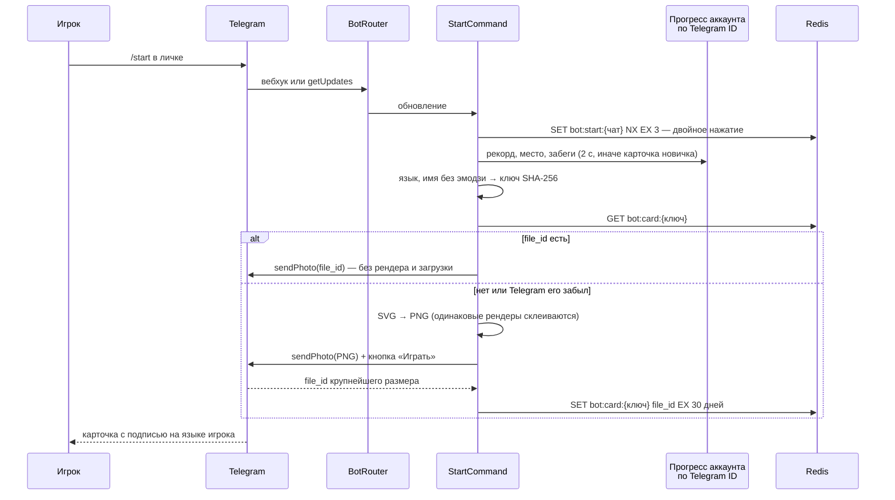
```mermaid
sequenceDiagram
    participant U as Игрок
    participant TG as Telegram
    participant B as BotRouter
    participant S as StartCommand
    participant P as Прогресс аккаунта<br/>по Telegram ID
    participant R as Redis

    U->>TG: /start в личке
    TG->>B: вебхук или getUpdates
    B->>S: обновление
    S->>R: SET bot:start:{чат} NX EX 3 — двойное нажатие
    S->>P: рекорд, место, забеги (2 с, иначе карточка новичка)
    S->>S: язык, имя без эмодзи → ключ SHA-256
    S->>R: GET bot:card:{ключ}
    alt file_id есть
        S->>TG: sendPhoto(file_id) — без рендера и загрузки
    else нет или Telegram его забыл
        S->>S: SVG → PNG (одинаковые рендеры склеиваются)
        S->>TG: sendPhoto(PNG) + кнопка «Играть»
        TG-->>S: file_id крупнейшего размера
        S->>R: SET bot:card:{ключ} file_id EX 30 дней
    end
    TG-->>U: карточка с подписью на языке игрока
```

### 4.15 Покупка второго шанса за Stars (этап 3, реализовано)

```mermaid
sequenceDiagram
    participant U as Игрок
    participant C as Клиент
    participant P as payments
    participant DB as Postgres
    participant TG as Telegram
    participant B as BotRouter
    participant Q as Очередь payments

    U->>C: смерть — забег ждёт решения
    C->>P: POST /payments/continue/quote { runId, continueNo, elapsedSec }
    P->>DB: забег: чей, начат ли по часам сервера, не закончен ли
    P-->>C: priceStars — клиент только показывает
    U->>C: «Продолжить за N ⭐»
    C->>P: POST /payments/continue/invoice
    P->>DB: purchase pending — или та же, если счёт уже выставляли
    P->>TG: createInvoiceLink(XTR, payload = purchaseId)
    P-->>C: invoiceUrl
    C->>TG: openInvoice(invoiceUrl)
    TG->>B: pre_checkout_query — первой в пачке обновлений
    B->>P: чей счёт, та ли сумма, свежий ли, жив ли забег
    P->>TG: answerPreCheckoutQuery — до 10 секунд
    TG->>B: successful_payment — сообщением в личке
    B->>Q: подтверждение, jobId от id оплаты
    Q->>DB: pending → paid, telegram_charge_id UK
    C->>P: GET /payments/{id} — пока не granted
    P-->>C: granted: true
    C->>C: continueRun — продолжение выдал сервер (Р13)
```

- **Право на продолжение — по `successful_payment`, а не по ответу
  `openInvoice`** (`34-stage3-plan.md`, Р13): ответ Mini App — подсказка,
  что можно перестать ждать.
- **Подтверждение идёт через очередь**, потому что смещение опроса
  сохраняется до обработки, а вебхук отвечает сразу: упавшая запись второй
  раз не придёт. Задание в Redis повторяется, пока запись не пройдёт; Redis
  недоступен — запись сразу, не прошла и так — ошибка в лог со всеми полями
  оплаты.
- **Отказаться от денег можно только на проверке.** После
  `successful_payment` звёзды уже у нас, и дальше остаётся только возврат.
  Его сервер делает сам — через ту же очередь, с повтором: тестовая оплата
  (Р14), продолжение, которое не взяли (оплата пришла к закрытому забегу
  или забег записан без него), вторая оплата того же продолжения и оплата
  без покупки. Заказ возврата пишется в базу раньше обращения к Telegram —
  после перезапуска очередь поднимает незавершённые оттуда.

---

## 5. Топология развёртывания

```mermaid
flowchart TB
    subgraph dev["Локальная разработка"]
        DV["Vite dev-серверы<br/>5173 / 5174 / 5175"]
        DA["API :4000"]
        DPG[("Postgres<br/>127.0.0.1:5432")]
        DR[("Redis<br/>127.0.0.1:6379")]
        DV --> DA
        DA --> DPG
        DA --> DR
    end

    subgraph vps["VPS — production и staging рядом"]
        CAD["Caddy :80 / :443<br/>единственный вход"]

        subgraph prod["compose-проект production"]
            PAPI["API<br/>порт не публикуется"]
            PPG[("Postgres")]
            PR[("Redis")]
            PW["Воркеры BullMQ"]
        end

        subgraph stg["compose-проект staging"]
            SAPI["API :4100 (127.0.0.1)"]
            SPG[("Postgres :5532")]
            SR[("Redis :6479")]
        end

        MON["Prometheus + Grafana"]
        BAK["pg-backup<br/>каждые 6 часов → Telegram"]

        CAD --> PAPI
        CAD --> SAPI
        PAPI --> PPG
        PAPI --> PR
        PW --> PPG
        PW --> PR
        SAPI --> SPG
        SAPI --> SR
        MON -.метрики.-> PAPI
        BAK -.дамп.-> PPG
    end

    CDNP["CDN: статика игры<br/>+ снапшоты конфигурации"]
    PLAYER(("Игрок"))

    PLAYER --> CDNP
    PLAYER --> CAD
```

Порты, смещения staging и правила публикации — `20-env-and-ports.md` §2.

**Закрытый тест этапа 2** разворачивается на VPS, где **уже работает
инстанс Caddy с другими сайтами**: своего Caddy в compose нет, наш конфиг
подключается отдельным файлом, наши сервисы — к его внешней Docker-сети без
публикации портов. Клиент на отдельных поддоменах отдаётся через Bunny.net,
origin — наш контейнер статики за этим Caddy (`26-stage2-plan.md`, WP10). Grafana и Prometheus на
схеме — техническая часть, появляется на этапе 5; продуктовая аналитика —
в админ-панели (`29-admin-panel.md`).
Этапы, на которых эта топология меняется при росте нагрузки, — 
`14-scalability.md` §3.
