# Схемы: база данных и архитектурные связи

Единственное место, где живут диаграммы проекта. Формат — Mermaid: он
рендерится прямо в GitHub и в редакторах, лежит в git текстом, поэтому
изменения видны в диффе, а не скрыты внутри картинки.

## Правило поддержки

**Схема, отставшая от кода, хуже отсутствующей** — ей верят, а она врёт.
Отсюда требование:

1. Меняется схема БД — **в том же PR** обновляется §1.
2. Меняются связи между пакетами, модулями или сервисами — обновляется §2-§3.
3. Появляется новый значимый поток (новый способ оплаты, новая интеграция) —
   добавляется диаграмма в §4.
4. Проверка входит в подготовку PR (скилл `pre-pr`, шаг 5).

Пока схема БД маленькая, диаграммы ведутся руками. Когда таблиц станет
больше полутора десятков — подключаем генерацию ER-диаграммы из
`schema.prisma` и проверку в CI, что закоммиченная диаграмма совпадает со
сгенерированной. До этого автоматика дороже пользы.

Диаграммы отвечают на вопрос «как связано», а не «как устроено внутри» —
подробности живут в профильных документах, ссылки под каждой схемой.

---

## 1. База данных

### 1.1 Текущая схема (MVP, реализовано)

Соответствует `backend/api/prisma/schema.prisma` на сегодня.

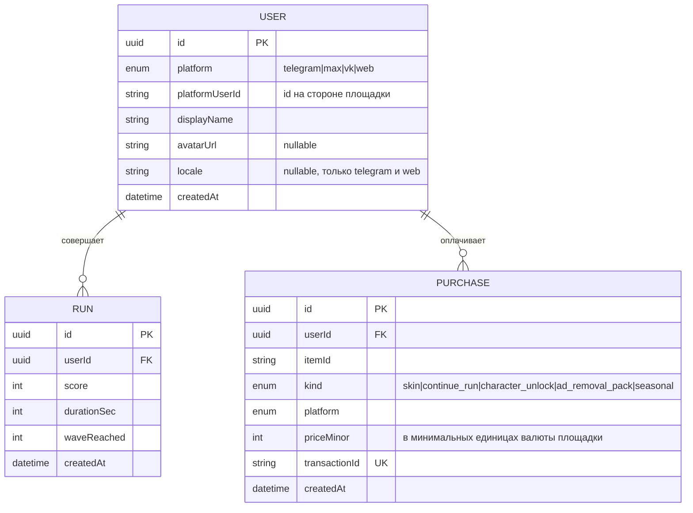

Что важно понимать по этой схеме:

- **Аккаунты не связываются между платформами.** Один человек в Telegram и в
  MAX — две разные строки `USER`, уникальность по паре
  `(platform, platformUserId)`. Обоснование — `08-web-and-identity.md` §3.
- **`RUN` — это сырая история** для антифрода и аналитики, а не источник
  чтения лидерборда: лидерборд отдаётся из Redis ZSET, а `RUN` остаётся
  источником истины, из которого ZSET можно перестроить
  (`14-scalability.md` §4.3).
- **`transactionId` уникален** — это ключ идемпотентности платежа
  (`15-engineering-standards.md` §4.1).

### 1.2 Планируемое расширение (недели 3-4, ещё не реализовано)

Модель, к которой идём при переносе авторизации, атрибуции, рекламы и
рефералки (`13-reuse-from-vpnsibcom.md` §4-§7). Приведена, чтобы решения
принимались с оглядкой на целевую картину, а не только на сегодняшнюю.

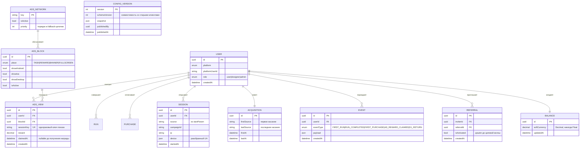

`CONFIG_VERSION` намеренно не связана с `USER` внешним ключом: это
неизменяемый снапшот правил игры, а не пользовательские данные
(`19-content-admin.md` §3).

### 1.3 Привлечение, партнёры и аналитика (проектируется)

Вынесено отдельной диаграммой намеренно: это другой домен со своим циклом
жизни, и смешивать его с игровыми сущностями в одной схеме — путь к
нечитаемой картинке.

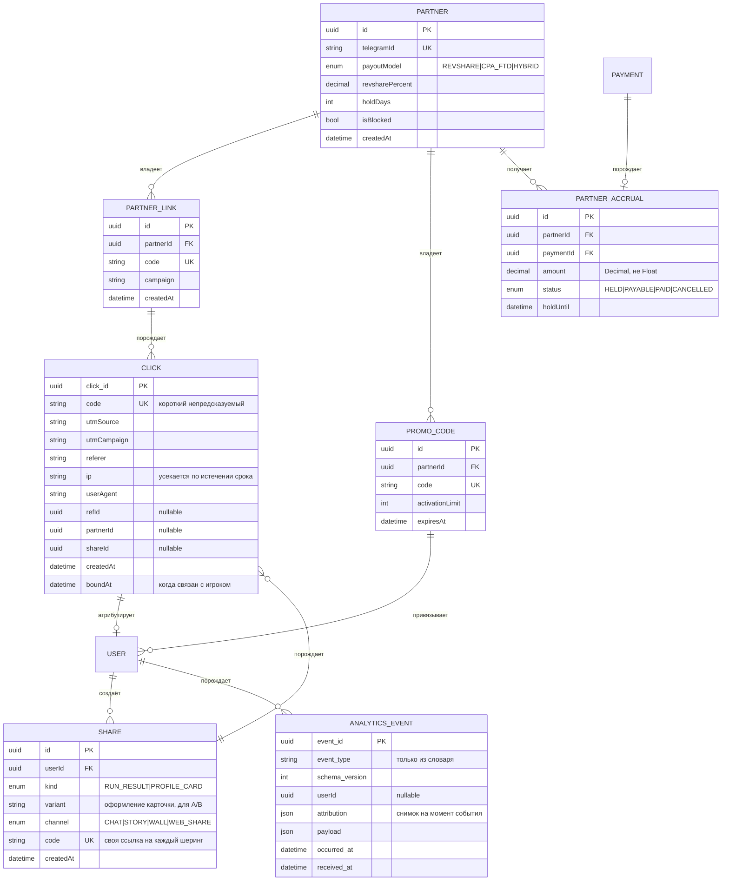

Три решения, которые из схемы не очевидны:

- **`CLICK` существует до пользователя.** Строка создаётся в момент клика,
  когда игрока ещё нет; `boundAt` заполняется при первом запуске.
- **`ANALYTICS_EVENT.attribution` — снимок, а не ссылка.** Иначе
  перепривязка задним числом переписывает историю и отчёт за прошлый месяц
  перестаёт воспроизводиться (`22-analytics-and-metrics.md` §3.1).
- **У каждого шеринга своя ссылка.** `SHARE.code` — отдельный код на каждый
  шеринг, а не общая реферальная ссылка игрока: только так измеряется, что
  конвертит лучше (`24-attribution-and-sharing.md` §7.3).

---

## 2. Пакеты монорепо и направления зависимостей

Стрелка означает «импортирует». Красных стрелок здесь быть не может — правила
проверяются линтом и строгой раскладкой `node_modules`
(`15-engineering-standards.md` §2.2, `16-tech-stack-decisions.md` §2.2).

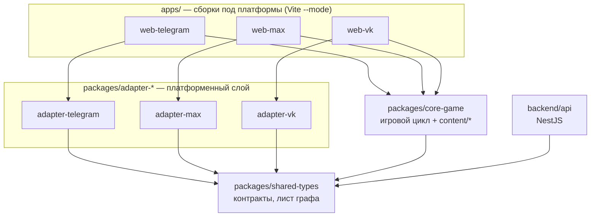

Чего на схеме **нет** и не должно появиться:

- стрелки из `core-game` в любой `adapter-*` — иначе движок становится
  платформозависимым и порт на MAX превращается в переписывание;
- стрелки между адаптерами — общее выносится в `shared-types`;
- стрелки из `core-game` в `backend/api` — игровой цикл работает офлайн;
- любых стрелок **из** `shared-types` — это лист графа.

### 2.1 Внутреннее устройство core-game

Ключевая граница внутри пакета — между симуляцией и отрисовкой. Симуляция
обязана запускаться headless: без этого невозможны ни golden-прогоны баланса,
ни воспроизведение бага по seed'у, ни серверная перепроверка забега
(`17-testing-strategy.md` §3). Проверяется тестом по исходникам, а не только
на ревью.

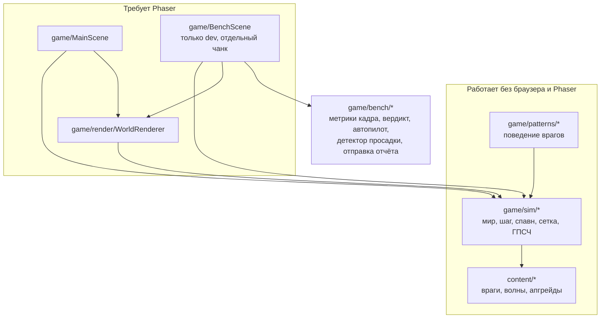

Чего на схеме нет и не должно появиться:

- стрелок из `game/sim/*` и `game/patterns/*` в Phaser, DOM или `bench/*` —
  симуляция ничего не знает о том, что её рисуют и замеряют;
- стрелок из `content/*` куда бы то ни было в `game/*` — контент это данные;
- `BenchScene` в основном бандле: сцена подключается динамическим импортом,
  иначе стенд испытаний уезжает игрокам.

---

## 3. Бэкенд: модули и инфраструктура

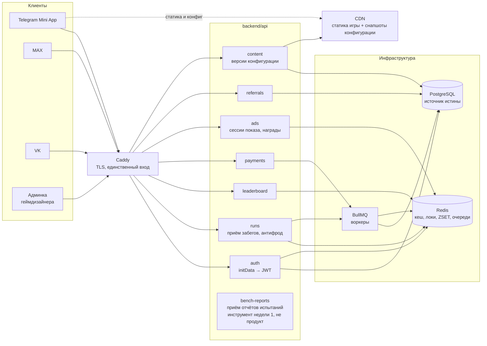

Читается так: **горячий путь не ходит в Postgres напрямую.** Приём забега
пишет в Redis и ставит задачу в очередь, а запись в БД делает воркер —
поэтому ответ игроку не ждёт диска (`14-scalability.md` §4.1).

---

## 4. Ключевые потоки

### 4.1 Авторизация

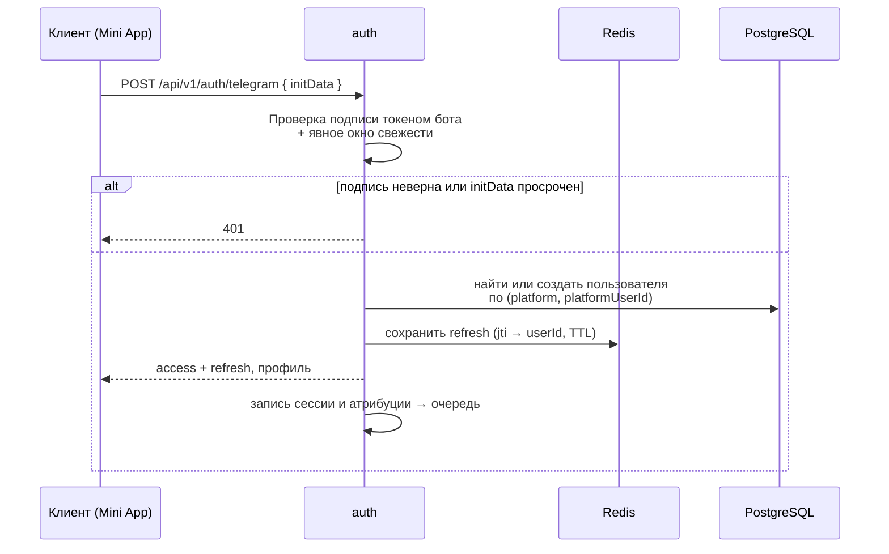

Валидация подписи — **только на сервере**. Детали и краевые случаи —
`13-reuse-from-vpnsibcom.md` §4.

### 4.2 Сдача результата забега

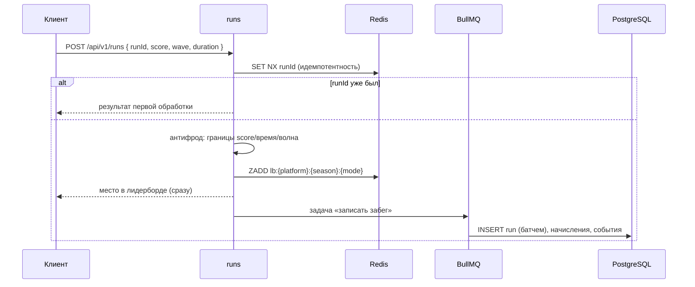

Игрок видит результат немедленно, БД догоняет. Идемпотентность — по
клиентскому `runId`, **не** по хэшу тела: два честных забега с одинаковым
счётом дали бы одинаковый хэш (`15-engineering-standards.md` §4.1).

### 4.3 Награда за просмотр рекламы

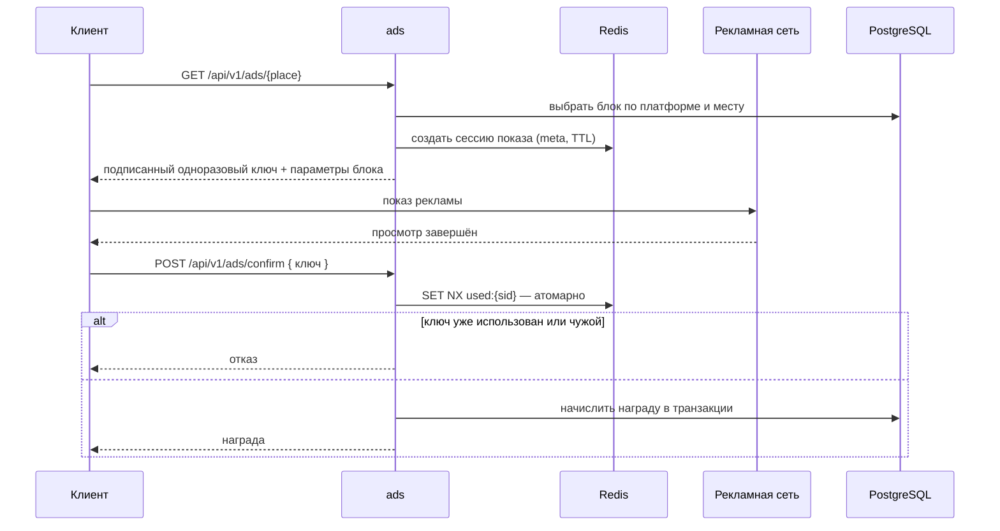

Проверка «использована ли сессия» и начисление — **одна атомарная операция**.
Иначе два параллельных `confirm` оба проходят проверку и награда начисляется
дважды (`13-reuse-from-vpnsibcom.md` §5).

### 4.4 Публикация конфигурации из админки

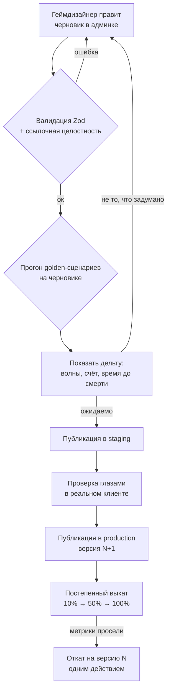

Подробности и рамки — `19-content-admin.md`.

### 4.5 Путь атрибуции: от клика до игрока

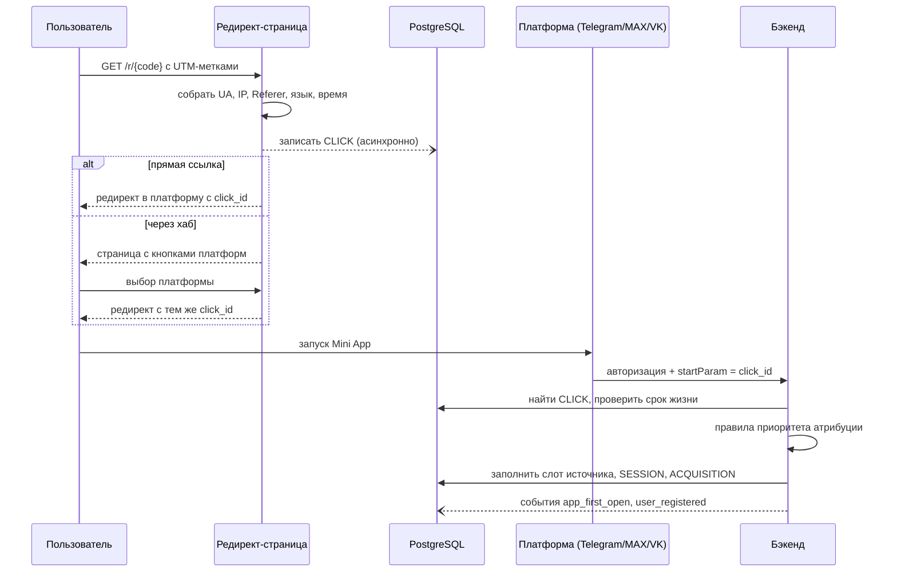

Краулер мессенджера, запрашивающий превью ссылки, кликом **не считается** —
иначе одна отправка в чат порождает фантомный клик и занижает конверсию
(`24-attribution-and-sharing.md` §3.3).

### 4.6 Аналитический конвейер

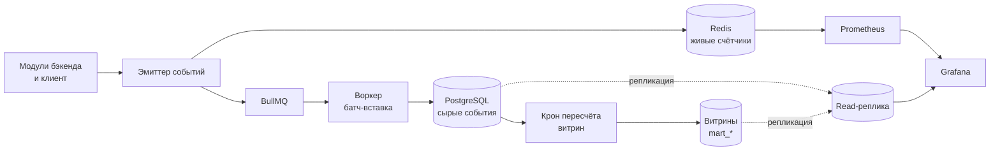

Существенное: **Grafana не ходит в горячие таблицы.** Живые панели читают
Prometheus, всё остальное — витрины на реплике. Иначе открытый на стене
дашборд с автообновлением становится постоянной паразитной нагрузкой на ту
же БД, которая принимает забеги (`22-analytics-and-metrics.md` §1).

---

## 5. Топология развёртывания

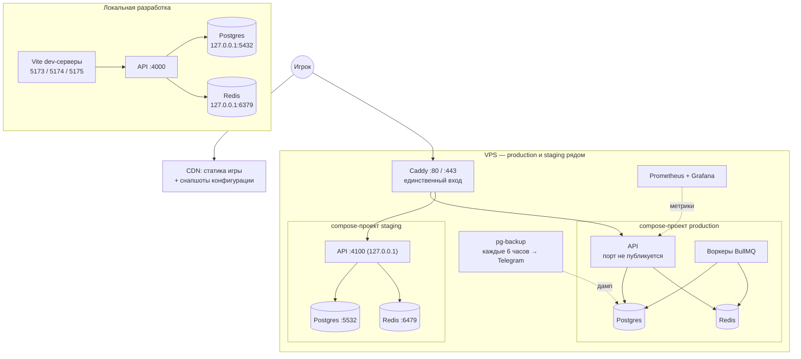

Порты, смещения staging и правила публикации — `20-env-and-ports.md` §2.
Этапы, на которых эта топология меняется при росте нагрузки, — 
`14-scalability.md` §3.
