# Схемы: база данных и архитектурные связи

Единственное место, где живут диаграммы проекта. Формат — Mermaid: он
рендерится прямо в GitHub и в редакторах, лежит в git текстом, поэтому
изменения видны в диффе, а не скрыты внутри картинки.

## Правило поддержки

**Схема, отставшая от кода, хуже отсутствующей** — ей верят, а она врёт.
Отсюда требование:

1. Меняется схема БД — **в том же PR** обновляется §1.
2. Меняются связи между пакетами, модулями или сервисами — обновляется §2-§3.
3. Появляется новый значимый поток (новый способ оплаты, новая интеграция) —
   добавляется диаграмма в §4.
4. Проверка входит в подготовку PR (скилл `pre-pr`, шаг 5).

Пока схема БД маленькая, диаграммы ведутся руками. Когда таблиц станет
больше полутора десятков — подключаем генерацию ER-диаграммы из
`schema.prisma` и проверку в CI, что закоммиченная диаграмма совпадает со
сгенерированной. До этого автоматика дороже пользы.

Диаграммы отвечают на вопрос «как связано», а не «как устроено внутри» —
подробности живут в профильных документах, ссылки под каждой схемой.

---

## 1. База данных

### 1.1 Текущая схема (что есть в базе сегодня)

Соответствует `backend/api/prisma/schema.prisma`. Таблицы появляются вместе с
кодом, который в них пишет, а не лежат пустыми заранее.

```mermaid
erDiagram
    ACCOUNT {
        uuid account_id PK
        enum platform "telegram|max|vk|web"
        string platform_user_id "id на стороне площадки"
        string display_name
        string username "nullable"
        string photo_url "nullable"
        datetime created_at
        datetime last_seen_at
        datetime banned_at "nullable"
        string ban_reason "nullable"
    }

    ACCOUNT ||--o{ ACCOUNT_ROLE : "имеет"
    ACCOUNT ||--o{ RUN : "играет"
    ACCOUNT ||--o{ PURCHASE : "оплачивает"
    RUN ||--o{ PURCHASE : "продолжен за"
    PURCHASE ||--o{ PURCHASE : "продлена"
    ACCOUNT ||--o{ ACCOUNT_SESSION : "запускает игру"
    ACCOUNT ||--o| ACQUISITION : "пришёл через"
    ACCOUNT ||--o| ACCOUNT_FUNNEL : "прошёл вехи"
    ACCOUNT ||--o| ACCOUNT_MESSAGING : "можно ли писать"
    ACCOUNT ||--o{ WALLET_ENTRY : "журнал кошелька"
    ACCOUNT ||--o{ WALLET_BALANCE : "баланс по ресурсу"
    ACCOUNT ||--o{ WALLET_DAILY : "начислено за сутки"
    ACCOUNT ||--o{ ITEM : "инвентарь"
    ITEM ||--o{ ITEM_EVENT : "журнал предмета"
    ACCOUNT ||--o{ RUN_BOOST : "бусты на забег"
    ACCOUNT ||--o| ACCOUNT_PROGRESS : "уровень и опыт"
    ACCOUNT ||--o| ACCOUNT_SETTINGS : "настройки для всех устройств"
    ACCOUNT ||--o{ NOTIFICATION : "лента уведомлений"
    ACCOUNT ||--o| DAILY_REWARD : "награда дня"
    ACCOUNT ||--o| CHANGELOG_SEEN : "открывал журнал обновлений"
    CHANGELOG_SOURCE |o--o| CHANGELOG_ENTRY : "строка пришла из PR"
    ACCOUNT ||--o{ RUN_REWARD : "награды за забеги"
    ACCOUNT ||--o| FRIEND_LINK : "ссылка дружбы"
    ACCOUNT ||--o{ FRIENDSHIP : "дружит (обе стороны пары)"
    ACCOUNT ||--o{ FRIEND_REQUEST : "заявки: от кого и кому"
    ACCOUNT ||--o{ FRIEND_GIFT : "подарки: от кого и кому"
    ACCOUNT ||--o| REFERRAL_BINDING : "кем приглашён — один раз"
    ACCOUNT ||--o{ REFERRAL_BINDING : "кого пригласил"
    ACCOUNT ||--o{ FRIEND_RETURN : "вернулся по ссылке друга / помог вернуть"
    ACCOUNT ||--o{ FRIEND_BONUS : "забранные ступени бонуса за друзей"
    LINK ||--o{ LINK_CLICK : "клики; краулеры превью не пишутся"
    LINK_CLICK ||--o{ ACCOUNT_SESSION : "start_ref = click_id"
    LINK ||--o{ AD_CONVERSION : "конверсии в сеть ссылки"
    LINK_CLICK ||--o{ AD_CONVERSION : "клик, который привёл новичка"
    ACCOUNT ||--o{ AD_CONVERSION : "новичок из рекламы"
    PURCHASE |o--o| AD_CONVERSION : "оплата — первая или повторная покупка"
    FEATURE_FLAG }o..o{ ACCOUNT : "доля — хэш ключа и аккаунта, без хранения"
    BROADCAST ||--o{ BROADCAST_DELIVERY : "доставка каждому получателю"
    ACCOUNT ||--o{ BROADCAST_DELIVERY : "получал рассылки"
    BROADCAST }o..o| LINK : "кнопка — ссылка кампании, без внешнего ключа"
    ACCOUNT ||--o{ WHEEL_SPIN : "крутки колеса"
    ACCOUNT ||--o{ TASK_PROGRESS : "прогресс заданий по срокам"
    TASK_DEF ||--o{ TASK_PROGRESS : "цель каталога"
    ACCOUNT ||--o{ TASK_RUN : "забеги, засчитанные заданиям"
    ACCOUNT ||--o| TEST_NOTICE : "принял предупреждение о тесте"
    AD_NETWORK ||--o{ AD_BLOCK : "блоки мест в кабинете сети"
    AD_BLOCK ||--o{ AD_SESSION : "выдан в показ"
    ACCOUNT ||--o{ AD_SESSION : "показы рекламы"
    RUN ||--o{ RUN_AD_CONTINUE : "продолжен за рекламу"
    ACCOUNT ||--o{ RUN_AD_CONTINUE : "рекламные продолжения за сутки"
    ACCOUNT ||--o{ VIP_SUBSCRIPTION : "подписки VIP"
    PURCHASE ||--o| VIP_SUBSCRIPTION : "первая покупка — id подписки"
    VIP_SUBSCRIPTION ||--o{ VIP_PERIOD : "оплаченные периоды"
    PURCHASE ||--o| VIP_PERIOD : "период за оплату"
    ACCOUNT ||--o| VIP_DAILY : "самоцветы VIP дня"
    ACCOUNT ||--o{ SHOWCASE_OFFER : "витрина снаряжения на сутки"
    PROMO_CAMPAIGN ||--|{ PROMO_CODE : "общий код или пачка"
    PROMO_CAMPAIGN ||--o{ PROMO_REDEMPTION : "активации"
    ACCOUNT ||--o{ PROMO_REDEMPTION : "активировал промокод"
    PARTNER ||--o{ PROMO_CAMPAIGN : "коды партнёра"
    PARTNER ||--o{ PARTNER_BINDING : "привёл игроков"
    ACCOUNT ||--o| PARTNER_BINDING : "приведён партнёром"
    PROMO_CAMPAIGN ||--o{ PARTNER_BINDING : "чем привязан"

    RUN {
        string run_id PK "ключ идемпотентности от клиента"
        uuid account_id FK
        enum status "started|finished"
        enum difficulty "easy|normal|hard"
        string starting_weapon_id
        string content_hash
        datetime started_at "nullable: по часам сервера; старт не дошёл — пусто"
        datetime finished_at "nullable"
        enum outcome "nullable: died|abandoned"
        float survival_sec "nullable"
        int level "nullable"
        int enemies_killed "nullable"
        json weapons "nullable: id, уровень и урон к концу"
        json details "nullable: навыки, получено урона, опыт, отрезок, пятёрка врагов — лист забега"
        boolean cheats
        float[] continues "секунда каждого второго шанса"
        boolean ranked "в рейтинге: вердикт ok и без читов"
        enum verdict "nullable: ok|suspicious|rejected"
        string[] verdict_reasons
    }

    ACCOUNT_SESSION {
        uuid session_id PK
        uuid account_id FK
        enum platform
        enum place "miniapp|web|channel: channel — /start бота"
        enum start_kind "organic|click|invite|telegram_affiliate|friend|notification|unknown"
        string start_param "nullable: из подписанного initData"
        string start_ref "nullable: код клика, id партнёра Telegram"
        string client_platform "nullable: подсказка клиента"
        string client_version "nullable"
        enum device_class "mobile|desktop|web|unknown"
        string os
        string ip_prefix "nullable: /24 или /48, не адрес"
        datetime started_at
    }

    ACQUISITION {
        uuid account_id PK,FK
        datetime first_at "самая ранняя сессия"
        enum first_start_kind
        string first_start_param "nullable"
        string first_start_ref "nullable"
        string first_client_platform "nullable"
        enum first_device_class
        datetime last_seen_at
        datetime last_touch_at "nullable: последняя сессия по ссылке"
        enum last_start_kind "nullable"
        string last_start_param "nullable"
        string last_start_ref "nullable"
    }

    ACCOUNT_FUNNEL {
        uuid account_id PK,FK
        datetime entered_at "nullable: вошёл в канал площадки"
        datetime app_opened_at "nullable: полная регистрация"
        datetime first_run_started_at "nullable"
        datetime first_run_finished_at "nullable"
        int runs_recorded "счётчик для вех второго и пятого"
        datetime runs_2_at "nullable"
        datetime runs_5_at "nullable"
        datetime returned_d1_at "nullable: по московским суткам"
        datetime returned_d7_at "nullable"
        datetime first_purchase_at "nullable: только настоящая оплата"
    }

    ACCOUNT_MESSAGING {
        uuid account_id PK,FK
        boolean can_message
        enum reason "entered|write_access|blocked|unblocked"
        datetime changed_at "побеждает более позднее событие"
    }

    WALLET_ENTRY {
        uuid entry_id PK
        uuid account_id FK
        enum resource "coins|gems|shard_common…shard_mythic"
        bigint amount "со знаком, 0 — упёрлось в потолок"
        string reason "run_reward, purchase, unlock, admin_adjust…"
        string source "nullable: забег, покупка, admin:<кто>"
        string idempotency_key UK "повтор упирается в индекс"
        datetime created_at
    }

    WALLET_BALANCE {
        uuid account_id PK,FK
        enum resource PK
        bigint balance "не меньше нуля, проекция журнала"
        datetime updated_at
    }

    ITEM {
        uuid item_id PK
        uuid account_id FK
        enum slot "weapon|amulet|gloves|armor|belt|boots"
        enum rarity "common…mythic"
        int level
        bigint seed "зерно броска, Р14"
        json rolls "броски свойств, не значения"
        boolean equipped "в слоте один — частичный уникальный индекс"
        string source "loot:<runId>, merge:<ключ>"
        datetime removed_at "nullable: разобран или объединён"
        datetime seen_at "nullable: лист не открывали — новый, знак арсенала"
    }

    RUN_BOOST {
        string run_id PK "одна покупка на забег"
        uuid account_id FK
        string_array boosts "id бустов контента движка"
        json cost "сколько списано: coins, gems"
        datetime created_at
        datetime refunded_at "nullable: забег так и не начался"
    }

    ITEM_EVENT {
        uuid event_id PK
        uuid item_id FK
        uuid account_id FK
        string kind "obtained|equipped|upgraded|rerolled|salvaged|merged…"
        json payload "цена, зерно, было и стало"
        string idempotency_key UK "повтор упирается в индекс"
        datetime created_at
    }

    FX_QUOTE {
        string source PK
        string currency PK "код ядра: RUB, GRAM, XTR…"
        decimal usd_per_unit "numeric(80,50): цена единицы в долларах"
        datetime observed_at "когда курс видели у источника"
        datetime saved_at
    }

    FX_RATE_CURRENT {
        string currency PK
        decimal usd_per_unit
        string_array sources "голоса медианы"
        datetime observed_at "по нему считается свежесть"
        datetime accepted_at
    }

    FX_RATE_HISTORY {
        uuid id PK
        string currency
        decimal usd_per_unit
        string_array sources
        datetime observed_at
        datetime accepted_at "неизменный курс — не чаще раза в час"
    }

    FX_MANUAL_RATE {
        uuid id PK
        string currency "только валюты площадок"
        string purpose "price — игроку, payout — нам"
        decimal price "цена единицы в валюте котировки"
        string quote "USD, EUR, RUB: звезда игроку — в рублях"
        string set_by "кто поставил — и в аудите"
        datetime set_at
        datetime expires_at "просрочен — алерт и вне снимка"
        string note
    }

    FX_SNAPSHOT {
        uuid id PK "на него ссылаются цена и платёж"
        datetime taken_at
        json rates "цены для игрока, десятичные строкой"
        json payout "курсы выплаты валют площадок"
    }

    FX_SOURCE_STATE {
        string source PK
        string month "ГГГГ-ММ по UTC"
        int used "запросов в этом месяце"
        datetime paused_until "nullable: после 429"
        datetime next_poll_at
    }

    ACCOUNT_PROGRESS {
        uuid account_id PK,FK
        bigint xp "только растёт"
        int level "по кривой из progress-rules.ts"
        datetime updated_at
    }

    ACCOUNT_SETTINGS {
        uuid account_id PK,FK
        int version "версия набора ключей у последнего писавшего"
        json values "ключ: значение и когда выбрано, мс UTC"
        datetime updated_at
    }

    NOTIFICATION {
        uuid notification_id PK
        uuid account_id FK
        string kind "вид: friend_request, friend_gift, rare_loot, boosts_refunded, team_message, app_update"
        json payload "данные вида, по его схеме"
        string dedupe_key "одно событие — одно уведомление: уникален у аккаунта"
        datetime created_at
        datetime read_at "nullable: не прочитано"
        enum bot_outcome "nullable: sent|blocked|failed — дубль в бота"
        datetime bot_at "nullable"
    }

    DAILY_REWARD {
        uuid account_id PK
        int claimed_days "сколько дней забрано всего: день недели и ступень — отсюда"
        date last_claim_day "игровые сутки по Москве последнего забора"
        datetime updated_at
    }

    CHANGELOG_ENTRY {
        uuid entry_id PK
        string version "X.Y.Z; рядом три числа для порядка — проверка базы не даёт им разойтись"
        enum platforms "массив Platform; пусто — все площадки"
        enum kind "added|changed|fixed"
        string text "одно изменение, до 500 символов"
        datetime published_at "nullable: черновик"
        datetime created_at
        datetime updated_at
        uuid updated_by "nullable, без FK"
    }

    CHANGELOG_RELEASE {
        string version PK
        enum platforms "кому раздавать: площадки опубликованных строк версии"
        datetime published_at "последняя публикация — поколение раздачи"
        uuid cursor "nullable: последний аккаунт, которому раздали"
        datetime done_at "nullable: раздача не закончена"
    }

    CHANGELOG_SEEN {
        uuid account_id PK
        datetime seen_at "когда открывал журнал; только растёт"
    }

    CHANGELOG_SOURCE {
        string source_key PK "pr-<номер>-<строка>: раздел «Для игроков» влитого PR"
        uuid entry_id FK "nullable, unique: строку удалили в панели — ключ остаётся"
        datetime imported_at
    }

    RUN_REWARD {
        string run_id PK "повтор задания упирается в ключ"
        uuid account_id FK
        int coins "по формуле забега"
        int coins_credited "nullable: пусто, пока монеты не в кошельке"
        int xp
        int level_before
        int level_after
        string skipped "nullable: too_short, cheats, rejected"
        datetime created_at
        string double_session_id UK "nullable: сессия показа удвоения за рекламу, одна на забег"
        datetime doubled_at "nullable: удвоение начислено; только с сессией"
    }

    WALLET_DAILY {
        uuid account_id PK,FK
        enum resource PK
        string reason PK
        date day PK "игровые сутки, по Москве"
        bigint granted "блокируется на время начисления"
    }

    PURCHASE {
        uuid purchase_id PK "он же payload счёта"
        uuid account_id FK "Restrict: деньги не уходят вместе с аккаунтом"
        enum product "continue_run|shop_item|vip"
        string run_id FK "nullable: только у второго шанса; UK вместе с continue_no"
        int continue_no "nullable: какое продолжение забега, с единицы"
        float elapsed_sec "nullable: секунда забега, по которой посчитана цена"
        string sku "nullable: товар каталога магазина или план VIP — пусто только у continue_run"
        string once_key UK "nullable: разовый товар — одна строка на товар и аккаунт"
        int price_stars "цена по правилу Р5.1 — её видит игрок"
        int charged_stars "сколько списано: в тестовом режиме — одна звезда"
        enum mode "live|test"
        enum status "pending|paid|refunded"
        string telegram_charge_id UK "nullable: id оплаты в Telegram"
        datetime invoiced_at "когда выставлен последний счёт"
        datetime paid_at "nullable: продолжение выдано"
        enum refund_reason "nullable: test_mode|unused|external"
        datetime refund_requested_at "nullable"
        datetime refunded_at "nullable"
        datetime fulfilled_at "nullable: товар магазина выдан журналом кошелька, период VIP — записан"
        uuid renewal_of FK "nullable: продление подписки — первая её покупка, по счёту которой площадка списывает периоды"
    }

    ACCOUNT_ROLE {
        uuid account_id PK,FK
        enum role PK "owner|admin|game_designer|moderator|marketer|finance|analyst|stakeholder"
        uuid granted_by "nullable: выдано на старте по списку в окружении"
        datetime granted_at
    }

    AUDIT_ENTRY {
        uuid entry_id PK
        uuid actor_account_id "nullable: действие системы, а не человека"
        string action "roles.assign, roles.revoke, …"
        string target "nullable"
        json before "nullable"
        json after "nullable"
        datetime created_at
    }

    FEATURE_FLAG {
        string key PK "shop.v2"
        boolean enabled
        enum platforms "пусто — все площадки"
        int percent "доля игроков, 0–100"
        string note "nullable"
        uuid updated_by "nullable, без внешнего ключа"
        datetime updated_at
    }

    APP_SETTING {
        string key PK "notify.chat.general — ключ из каталога в коде"
        json value "по схеме ключа, разбирается при чтении"
        uuid updated_by "nullable, без внешнего ключа"
        datetime updated_at
    }

    ANALYTICS_EVENT {
        uuid event_id PK
        string event_type
        int schema_version
        string install_id "устройство"
        string platform_user_id "nullable, только при проверенной подписи"
        string session_id
        enum platform
        string app_version
        json payload
        datetime occurred_at
        datetime received_at
    }

    DIAGNOSTIC_REPORT {
        uuid report_id PK
        enum kind "bench|run"
        string install_id
        string platform_user_id "nullable"
        enum platform
        json device
        json summary
        json payload
        datetime occurred_at
        datetime received_at
    }

    FEEDBACK {
        uuid feedback_id PK
        string install_id
        string platform_user_id "nullable"
        json answers "ответы опроса"
        string text
        int runs "забегов к моменту отзыва"
        datetime created_at
    }

    DATA_EXPORT {
        uuid export_id PK
        enum source "bot|cli"
        string requested_by "Telegram ID администратора"
        enum status
        datetime period_to
        datetime created_at
    }

    FRIEND_LINK {
        string code PK "случайный, ключ к строке — не данные"
        uuid account_id FK,UK "одна ссылка на аккаунт, постоянная"
        datetime created_at
    }

    FRIENDSHIP {
        uuid account_a PK,FK "меньший идентификатор пары, CHECK a < b"
        uuid account_b PK,FK
        enum source "link|request"
        datetime created_at
    }

    FRIEND_REQUEST {
        uuid from_account_id PK,FK
        uuid to_account_id PK,FK "CHECK: не самому себе"
        datetime created_at "принятая или отклонённая — удаляется"
    }

    FRIEND_GIFT {
        uuid from_account_id PK,FK
        uuid to_account_id PK,FK
        date day PK "игровые сутки по Москве: второй подарок дня — в ключ"
        datetime created_at
        datetime claimed_at "nullable: ещё не забран"
    }

    FRIEND_BONUS {
        uuid account_id PK,FK
        int friends PK "порог ступени: каждая один раз навсегда"
        int coins "сколько обещала ступень в момент забора"
        datetime claimed_at
    }

    REFERRAL_BINDING {
        uuid referred_account_id PK,FK "привязка одна и навсегда"
        uuid referrer_account_id FK "CHECK: не сам себе"
        enum status "bound|activated|rejected"
        datetime bound_at
        datetime activated_at "nullable"
        string reject_reason "nullable: same_network, moderator"
    }

    FRIEND_RETURN {
        uuid returned_account_id PK,FK "CHECK: не сам себе"
        uuid friend_account_id PK,FK
        int period PK "сутки эпохи / длина периода: пара — раз в период"
        datetime returned_at
        datetime rewarded_at "nullable: ещё не сыграл"
    }

    LINK {
        string code PK "случайный: /r/<код>"
        enum platform "куда ведёт прямой режим"
        string campaign
        string source "nullable"
        string medium "nullable"
        string network "nullable: adsgram — сеть, куда уходят конверсии; CHECK"
        string registration_on "first_run|launch: что сеть считает регистрацией"
        uuid created_by "nullable, без внешнего ключа"
        datetime created_at
    }

    LINK_CLICK {
        string click_id PK "уходит в параметр запуска c-<код>"
        string link_code FK
        datetime at
        string utm_source "nullable, и прочие utm_*"
        string referer_host "nullable: только хост"
        string device_class "nullable"
        string ip_prefix "nullable: подсеть, не адрес"
        string language "nullable"
        json network_params "nullable: подставленные сетью макросы; обнуляются через 31 сутки"
    }

    AD_CONVERSION {
        uuid conversion_id PK
        string network "adsgram"
        string link_code FK
        string click_id FK "уникален с целью 1 и 2: одна регистрация и первая покупка на клик"
        uuid account_id FK
        int goal "1 регистрация, 2 первая покупка, 3 повторная; CHECK"
        uuid purchase_id FK "nullable, уникален: у покупки — всегда, у регистрации — никогда"
        enum status "pending|sent|failed|skipped"
        string reason "nullable: no_token, team, no_macros"
        int attempts
        datetime next_attempt_at "очередь отправки"
        int http_status "nullable: последний ответ сети"
        string last_error "nullable: ответ сети, без токена"
        datetime created_at
        datetime sent_at "nullable: есть ровно у отправленной, CHECK"
    }

    FEATURE_FLAG {
        string key PK "shop.v2: читает игра"
        bool enabled
        enum_array platforms "пусто — все площадки"
        int percent "0–100, CHECK в базе"
        string note "nullable"
        uuid updated_by "nullable, без внешнего ключа"
        datetime updated_at
    }

    BROADCAST {
        uuid broadcast_id PK
        string title
        enum platform "бот какой площадки пишет"
        string text "до 4096, неизменен после старта"
        string button_text "nullable"
        string button_url "nullable: /r/<код> на домене клиента"
        string link_code "nullable: ссылка кампании рассылки"
        json segment "фильтры аудитории, разбираются схемой"
        enum status "draft|sending|paused|done|cancelled"
        int audience "nullable: набрано на старте"
        uuid created_by "без внешнего ключа, как и approved_by, started_by"
        datetime started_at "nullable"
        datetime finished_at "nullable"
    }

    BROADCAST_DELIVERY {
        uuid broadcast_id PK,FK
        uuid account_id PK,FK "пара — ключ: дважды не напишет"
        enum status "queued|sent|blocked|failed"
        int attempts "сколько раз площадка просила подождать"
        string error "nullable: код отказа"
        datetime sent_at "nullable"
        datetime claimed_until "nullable: срок захвата заданием очереди"
    }

    WHEEL_SPIN {
        uuid spin_id PK "ключ начисления в кошельке"
        uuid account_id FK
        enum source "free|ad; бесплатная — одна в сутки: частичный уникальный индекс"
        date game_day "игровые сутки по Москве"
        int sector "номер на экране, по часовой от стрелки"
        enum resource "coins|shard_common|shard_uncommon"
        int amount "сколько выпало, больше нуля"
        datetime created_at
        datetime granted_at "nullable: выпало, но кошелёк ещё не начислил"
        string ad_session_id UK "nullable: сессия показа крутки за рекламу, одна крутка на сессию"
    }

    TASK_DEF {
        string task_id PK "правится из панели; не удаляется, а выключается"
        enum period "daily|weekly|achievement"
        string kind "вид цели: runs, kills, survive_sec, best_survival_sec, run_level; партнёрские — channel, link, bot"
        json params "nullable: ровно у партнёрских — ссылка, площадка, у channel — канал"
        int target "больше нуля"
        string title "nullable: текст по виду цели у клиента"
        int coins
        int gems
        int shards "обычные осколки; награда не пустая"
        int pass_points "очки батл-пасса (WP26)"
        int sort
        boolean active
        datetime created_at
        datetime updated_at
        uuid updated_by "nullable, без FK: null — строка из миграции"
    }

    TASK_PROGRESS {
        uuid account_id PK,FK
        string task_id PK,FK
        date period_start PK "сутки или понедельник по Москве; у достижений — общий день"
        int value "не больше цели"
        int target "цель на момент последнего движения"
        datetime completed_at "nullable"
        datetime claimed_at "nullable: только у выполненного"
        datetime updated_at
    }

    TASK_RUN {
        string run_id PK "забег засчитан заданиям однажды"
        uuid account_id FK
        datetime applied_at
    }

    TEST_NOTICE {
        uuid account_id PK,FK
        int version "последняя принятая версия текста, с первой"
        datetime accepted_at "когда принята эта версия"
        datetime first_accepted_at "первое принятие — не переписывается"
    }

    AD_NETWORK {
        string network_key PK "adsgram, adsonar, richads, taddy"
        string name
        boolean active "из миграции — выключены"
        int priority "меньше — раньше в круге"
        json keys "публичные ключи по профилю сети: pubId, appId; объект"
        datetime updated_at
    }

    AD_BLOCK {
        uuid block_id PK
        string network_key FK
        enum place "second_chance|wheel_spin|run_double|task|interstitial"
        string external_id "nullable: блок в кабинете сети; нет — показ по ключам сети"
        enum success "view|click|cpa — условие успеха"
        boolean active
        enum_array platforms "пусто — все площадки"
        string_array devices "android, ios, desktop, web; пусто — все"
        datetime created_at
        datetime updated_at
        uuid updated_by "nullable, без FK"
    }

    AD_SESSION {
        string session_id PK "12 случайных байт, не токен"
        uuid account_id FK
        enum place
        uuid block_id FK "nullable: сессия пропуска рекламы (VIP) — без блока и ролика"
        string network_key "копией: круг сетей без соединения; у пропуска — его имя"
        enum success
        enum status "pending|shown|completed|claimed|failed|expired"
        datetime created_at
        datetime shown_at "nullable"
        datetime clicked_at "nullable"
        datetime completed_at "nullable: условие успеха выполнено"
        datetime claimed_at "nullable: только у выполненной"
        datetime failed_at "nullable"
        string fail_reason "nullable: код отказа SDK или сети с API"
        datetime expires_at "позже created_at"
        string creative_id "nullable: креатив сети с API — по нему сервер отмечает сети показ и досмотр"
        int view_sec "nullable: досмотр креатива — не раньше стольких секунд от выдачи"
    }

    RUN_AD_CONTINUE {
        string run_id PK "FK на run; вместе с continue_no"
        int continue_no PK "какое по счёту продолжение забега, от 1"
        uuid account_id FK "суточный потолок рекламных продолжений (Р4)"
        string session_id UK "сессия показа места second_chance; без FK — модуль рекламы"
        string network_key "сеть показа; у пропуска VIP — его имя"
        datetime granted_at
    }

    VIP_SUBSCRIPTION {
        uuid subscription_id PK,FK "первая покупка: по её счёту площадка списывает периоды"
        uuid account_id FK
        enum renewal "on|cancelled|failed"
        enum cancelled_by "nullable: player|game — ровно у cancelled"
        datetime created_at
        datetime updated_at "оплата продления старше отмены её не перебивает"
    }

    VIP_PERIOD {
        uuid purchase_id PK,FK "одна оплата — один период"
        uuid subscription_id FK
        uuid account_id FK
        datetime starts_at "конец прежнего периода, если он не кончился к оплате, иначе оплата"
        datetime ends_at "позже starts_at; конец VIP — самый поздний"
        datetime created_at
    }

    VIP_DAILY {
        uuid account_id PK,FK
        date last_day "московские сутки последнего забора"
        datetime updated_at
    }

    SHOWCASE_OFFER {
        uuid offer_id PK
        uuid account_id FK
        date game_day "московские сутки; UK вместе с account_id и position"
        int position "место на витрине"
        enum slot
        enum rarity
        int level "1..30"
        bigint seed "зерно бросков, как у предмета"
        json rolls "броски: купленное совпадает с показанным"
        int price_gems "больше нуля; цена на момент выставления"
        datetime created_at
        datetime sold_at "nullable"
        uuid item_id "nullable, без FK: купленный предмет; есть ровно у проданного"
    }

    SHOP_PROMO {
        uuid promo_id PK
        string sku "товар каталога в коде, без FK"
        int percent "5..80 — скидка от цены каталога"
        datetime starts_at
        datetime ends_at "позже начала; не дольше 14 дней"
        string title "nullable: подпись баннера"
        datetime created_at
        uuid created_by "без FK: кто завёл"
        datetime cancelled_at "nullable: снята раньше срока"
        uuid cancelled_by "nullable, есть ровно у снятой"
    }

    PROMO_CAMPAIGN {
        uuid campaign_id PK
        string title "для команды, игрок не видит"
        string kind "shared|batch"
        json reward "coins, gems, shard_common, shard_uncommon"
        string message "nullable: текст игроку после активации"
        int max_redemptions "nullable у shared; у batch — число кодов"
        int redeemed "не больше max_redemptions"
        datetime starts_at
        datetime ends_at "nullable: бессрочно; позже начала"
        int new_players_days "nullable: 1..90 — только аккаунтам не старше"
        string_array platforms "пусто — все площадки"
        datetime paused_at "nullable"
        string note "nullable: для команды"
        uuid partner_id FK "nullable: код партнёра; null — подарок команды"
        uuid created_by "без FK: кто завёл"
        datetime created_at
        datetime updated_at
    }

    PARTNER {
        uuid partner_id PK
        string name "как зовёт команда"
        string contact "nullable: @имя, ссылка"
        string note "nullable: договорённости"
        uuid created_by "без FK"
        datetime created_at
        datetime updated_at
    }

    PARTNER_BINDING {
        uuid account_id PK,FK "слот источника один: либо это, либо REFERRAL_BINDING"
        uuid partner_id FK "партнёра с игроками не удалить"
        uuid campaign_id FK "nullable: каким кодом"
        datetime bound_at
    }

    PROMO_CODE {
        string code PK "ключ: без регистра и разделителей, кириллица-двойник — латиницей"
        string display "как показывать: ZIMA-K7MP-3XTE"
        uuid campaign_id FK
        uuid redeemed_by "nullable, без FK: кто погасил код пачки"
        datetime redeemed_at "nullable, есть ровно у погашенного"
    }

    PROMO_REDEMPTION {
        uuid campaign_id PK,FK "кампанию с активациями не удалить"
        uuid account_id PK,FK
        string code "какой код ввёл"
        datetime redeemed_at
        datetime rewarded_at "nullable: награда ещё не легла"
        json credited "nullable: сколько легло — потолок кошелька мог срезать"
    }

    INTEGRATION_SECRET {
        string key PK "fx.coingecko-pro — ключ из каталога в коде"
        string key_id "отпечаток ключа шифрования, не сам ключ"
        bytes iv "12 байт, своё на каждую запись"
        bytes auth_tag "16 байт подписи GCM"
        bytes ciphertext "значение — только шифртекстом"
        uuid updated_by "nullable, без внешнего ключа"
        datetime updated_at
    }
```

Что важно понимать по этой схеме:

- **Связей внешними ключами здесь нет, и это осознанно.** Телеметрия
  закрытого теста писалась до аккаунтов: событие и отчёт опознают
  **устройство** (`install_id`), а Telegram ID кладут только при проверенной
  подписи запуска. Связать историю с аккаунтом можно запросом по
  `platform_user_id`, но внешнего ключа между ними нет: событие не должно
  пропадать оттого, что аккаунт завели позже или не завели вовсе.
- **Аккаунты не связываются между платформами.** Один человек в Telegram и в
  MAX — две разные строки `ACCOUNT`, уникальность по паре
  `(platform, platform_user_id)`. Обоснование — `08-web-and-identity.md` §3.
- **Сессии игрока в Postgres не хранятся.** Токены продления живут в Redis:
  им нужен срок жизни, атомарное гашение и мгновенный отзыв, а не история
  (`34-stage3-plan.md`, WP1).
- **Роль — данные, состав роли — код.** В базе лежит только «у кого какая
  роль»; какие права даёт роль, меняется через ревью
  (`29-admin-panel.md` §3.2).
- **`RUN` — источник истины по результатам.** Лидерборд живёт в Redis
  ZSET как проекция отсюда и пересобирается одной командой
  (`pnpm --filter backend-api runs:rebuild-leaderboard`,
  `14-scalability.md` §4.3). Строка появляется на **старте** забега — сервер
  ставит своё время начала, и по нему потом проверяет, что заявленное время
  выживания вообще могло пройти (`34-stage3-plan.md`, Р5.2). Отклонённые и
  подозрительные забеги не выбрасываются: они лежат здесь с вердиктом и ждут
  разбора.
- **`ACCOUNT_PROGRESS` — уровень аккаунта, `RUN_REWARD` — награда за забег**
  (`35-stage4-plan.md`, WP4). Опыт — счётчик аккаунта, а не валюта: его не
  тратят, и журнал ему не нужен. Повтор не удваивает опыт тем же приёмом,
  что кошелёк: строка награды с первичным ключом `run_id` вставляется в одной
  транзакции с прибавкой опыта. Монеты начисляет кошелёк по своему ключу;
  `coins_credited` показывает, сколько легло после суточного потолка.
  Удвоение за рекламу (WP12) привязывает к строке сессию показа условным
  `UPDATE`: забег удваивается одной сессией, одна сессия удваивает один
  забег, повтор той же дожимает начисление ключом `run_double:<run_id>`.
- **`NOTIFICATION` — лента уведомлений игрока** (`35-stage4-plan.md`, Р51,
  §3.17, WP28): заявка и подарок друга, редкая добыча, возврат бустов,
  сообщение команды из панели. Пишут доменные модули после своего действия и
  не ждут записи, панель — ждёт, чтобы показать команде исход; ключ события
  уникален у аккаунта, поэтому повтор задания или запроса второй строки не
  заводит. Имя другого игрока — копией на момент события. Хранится 90 дней:
  чистка — пачками под распределённым локом. `bot_outcome` — чем кончился
  дубль в бота: доставлено, игрок заблокировал бота, площадка отказала;
  пишется один раз, повтор задания его не перепишет. Пусто — в бота не
  уходило: вид не дублируется, игрок выключил его или писать нельзя.
- **`DAILY_REWARD` — награда дня** (`35-stage4-plan.md`, Р45, WP13): одна
  строка на аккаунт, появляется с первым забранным днём. Прогресс не
  сбрасывается: пропуск дня его останавливает. День недели и ступень
  выводятся из `claimed_days`, а не хранятся рядом, — им нечем разойтись.
  Отметка дня — условным `UPDATE` по числу дней и суткам, монеты и осколки
  кладёт кошелёк ключом дня, поэтому под гонкой день даёт награду однажды.
- **`CHANGELOG_ENTRY`, `CHANGELOG_RELEASE`, `CHANGELOG_SEEN` — журнал
  обновлений** (`35-stage4-plan.md`, Р61, WP31): строка — одно изменение с
  версией, видом и площадками; черновик игрок не видит. Опубликованные строки
  сервер держит в памяти и собирает по версиям площадки игрока. Публикация
  версии заводит строку раздачи: уведомление `app_update` в ленту каждому
  игроку площадок версии, пачками по курсору — перезапуск продолжает с
  места. Публикация новых строк раздаёт заново с новым поколением, а ключ
  события в ленте не даёт второго уведомления. `CHANGELOG_SEEN` — когда игрок
  открывал журнал: знак меню считает версии, вышедшие после; нет строки —
  считается от регистрации, новичку история игры не новость.
  `CHANGELOG_SOURCE` — откуда строка пришла при выкате: из раздела «Для
  игроков» влитого PR. Ключ занимается первым и остаётся после удаления
  строки, поэтому повтор выката не задваивает строки и не возвращает
  удалённое; черновик, который правил человек (`updated_by` задан), выкат не
  трогает.
- **`WHEEL_SPIN` — крутки колеса** (`35-stage4-plan.md`, Р45, WP13): сектор
  выбирает сервер и записывает строкой до начисления, поэтому повтор после
  обрыва дожимает тот же сектор, а не бросает заново. Бесплатная крутка —
  одна в игровые сутки: её держит частичный уникальный индекс по аккаунту и
  суткам, крутки за рекламу (WP12) под него не попадают — у них свой
  уникальный ключ, сессия показа `ad_session_id`: одна сессия — одна крутка,
  а кулдаун держит забор сессии в модуле рекламы. `granted_at` — кошелёк
  начислил ключом крутки; пусто — следующая крутка дожмёт.
- **`TASK_DEF`, `TASK_PROGRESS`, `TASK_RUN` — задания и достижения**
  (`35-stage4-plan.md`, Р52, WP13): каталог в базе правится из панели без
  релиза, вид цели — строкой, новый вид приходит кодом. Прогресс — строка на
  срок: сутки и неделя по Москве, у достижений — один общий день, поэтому
  сбрасывать ничего не нужно, новый срок — новая строка. Прогресс двигает
  записанный забег; `TASK_RUN` занимается в той же транзакции, и повтор
  события не удваивает прогресс. Забор — начисление кошельком ключом
  задания и срока, потом условная отметка `claimed_at`. Партнёрские цели
  забег не двигает: `params` (ссылка, площадка, у канала — канал; схема в
  коде, у остальных видов пусто, это держит `CHECK`). Подписку на канал
  читает бот площадки в момент забора, ссылку и бота засчитывает переход
  через сервер — и строка прогресса появляется сразу выполненной.
- **`TEST_NOTICE` — предупреждение об открытом тесте** (`35-stage4-plan.md`,
  Р59, WP33): строка на аккаунт, а не на устройство. Версия текста только
  растёт — новый текст показывается заново тем, кто принимал прежний; первое
  принятие не переписывается: по нему проверяется, что игрок видел
  предупреждение до первой покупки. Видно в карточке игрока в панели.
- **`AD_NETWORK`, `AD_BLOCK`, `AD_SESSION` — реклама** (`35-stage4-plan.md`,
  §3.7, WP12). Сеть и её блоки мест — данными: площадки и устройства блока
  списками, без ветвлений в коде. Что сеть умеет и что ей нужно — профиль в
  коде (`ads/ad-networks.ts`): публичные ключи сети лежат в `keys`, блок
  встаёт только в место формата сети и с идентификатором её вида, а у
  форматов, которые показываются по ключам сети, блока в кабинете нет —
  `external_id` пуст. Секреты подтверждений сети в базу не пишутся (Р53). Сессия показа — воронка с меткой каждого
  шага; выполненной её делает досмотр от клиента только там, где успех —
  показ, клик и целевое действие подтверждает сервер. Выбор сети и кулдаун
  места считаются по сессиям игрока в месте с начала вчерашних суток —
  одним запросом по индексу, без счётчиков рядом. Награду выдаёт хозяин
  места, забирая сессию: забор мест игрока идёт под транзакционной
  блокировкой на аккаунт и место, поэтому ни одна сессия, ни две разом не
  дают второй награды в кулдаун. Забор без выполнения база не примет.
  Креатив сети с API (Taddy, Р78) рисует наш блок: сессия помнит его
  `creative_id` и срок досмотра `view_sec` — раньше срока от выдачи
  досмотр не засчитывается, а показ сеть узнаёт однажды. Сеть с API, не
  давшая креатива, остаётся в истории сессией `failed` — и уходит на паузу
  места, как отказавшая на клиенте.
  Сессия без блока — пропуск рекламы (VIP, §3.6): выдана сразу выполненной,
  с именем пропуска вместо сети, и забирается хозяином места как обычная, в
  тот же кулдаун; иначе как выполненный досмотр база её не примет.
- **`RUN_AD_CONTINUE` — второй шанс за рекламу** (`35-stage4-plan.md` WP11,
  Р4): вторая книга продолжений забега рядом с `PURCHASE`. Хозяин места
  `second_chance` — модуль забегов: забирает сессию показа и записывает
  продолжение. Ключ `(run_id, continue_no)` и уникальная `session_id` не
  дают выдать одно продолжение дважды и потратить одну сессию на два.
  Итог забега сверяется с обеими книгами, а счёт за продолжение, уже взятое
  за рекламу, предварительная проверка оплаты не пропускает. Суточный
  потолок — счёт строк игрока с полуночи по Москве по индексу
  `(account_id, granted_at)`.
- **`VIP_SUBSCRIPTION`, `VIP_PERIOD`, `VIP_DAILY` — VIP** (`35-stage4-plan.md`,
  §3.6, Р20, Р44, WP10). Срок VIP — не поле, а журнал периодов: каждая
  оплата — ровно один период, начатый с конца прежнего, и конец VIP — самый
  поздний конец. Повтор выдачи ничего не продлевает дважды, выдачи разом
  идут под транзакционной блокировкой на аккаунт и не начинаются от одного
  конца. Подписка — одна на счёт площадки: её id — первая покупка, по
  которой площадка списывает периоды и отменяет продление. Отменённое
  продление — за тем, кто отменил первым: вернуть отменённое нами можем мы,
  отменённое игроком — только он на площадке. Самоцветы дня — строка на
  аккаунт с последними сутками забора, сутки сдвигаются только вперёд.
- **`SHOWCASE_OFFER` — витрина снаряжения** (`35-stage4-plan.md`, §3.6, Р11,
  WP10): предложение на игровые сутки выставляется при первом открытии и
  хранится с бросками — купленное совпадает с показанным, даже если правила
  бросков поменяются посреди суток. Выставляется целиком под блокировкой на
  аккаунт: два первых открытия разом не смешают два броска. Покупка —
  предмет и списание самоцветов одной транзакцией модуля предметов, ключом
  предложения, отметка `sold_at` — после: повтор найдёт купленное и не
  спишет второй раз.
- **`SHOP_PROMO` — акции магазина** (`35-stage4-plan.md`, WP10, часть 8):
  скидка от цены каталога на срок. Связей нет: товар — каталог в коде, кто
  завёл и снял — без внешнего ключа, запись переживает аккаунт. Строки не
  удаляются: по ним видно, когда и по какой цене продавали. Пределы скидки
  и порядок срока держит и база; пересечение и отдых между акциями товара —
  сервис, проверкой и вставкой под блокировкой товара.
- **`PROMO_*` — промокоды** (`35-stage4-plan.md`, WP41, Р74): кампания —
  то, что заводит команда; код — то, что вводит игрок; активация — один
  игрок в одной кампании, первичным ключом, поэтому второй код той же пачки
  тому же игроку ничего не даст. Ключ кода не зависит от регистра,
  разделителей и раскладки — его считает сервер, а показывается `display`.
  Активация — одна транзакция: запись, занятие кода пачки и счётчик под
  лимитом. Награда ложится после и отмечается `rewarded_at`: упавшая
  доначисляется повторным вводом теми же ключами кошелька. Кампания с
  активациями не удаляется — по ней выданы награды, это держит и внешний
  ключ; код занятой кампании не переиспользуется.
- **`PARTNER`, `PARTNER_BINDING` — партнёры и приведённые ими игроки**
  (`35-stage4-plan.md`, WP41, часть 2): код партнёра (`PROMO_CAMPAIGN.partner_id`)
  при активации привязывает новичка к партнёру — в той же транзакции, что
  и активация. Слот источника у игрока один на две таблицы двух модулей:
  `REFERRAL_BINDING` или `PARTNER_BINDING`, кто первый
  (`23-referral-and-partner-program.md` §5). Внешним ключом это не
  выразить, поэтому обе записи идут под одной блокировкой аккаунта
  (`attribution/source-slot.ts`). Выплат партнёрам нет — они после лонча
  (§1.3).
- **`ACCOUNT_SETTINGS` — настройки для всех устройств игрока**
  (`35-stage4-plan.md`, Р56, WP29): участие в помощи в тестировании,
  усвоенные подсказки, отображение боя. У каждого ключа — значение и когда
  его выбрали, по часам сервера: устройство присылает возраст выбора, а не
  своё время, поэтому часы телефона, ушедшие вперёд или назад, ничего не
  решают. Слияние ключ за ключом, побеждает выбранное позже; значение,
  сохранённое до настроек аккаунта, приходит засевом с отметкой 1 и
  занимает только пустой ключ; усвоенные подсказки складываются, сбрасывает
  их только пустой список. Запись — под блокировкой строки: два устройства
  одновременно не затирают друг друга. Графика, громкость и вибрация сюда
  не попадают — они у устройства.
- **`FX_*` — курсы валют** (`35-stage4-plan.md`, §3.12, WP9). Таблицы не
  связаны с аккаунтами и друг с другом ключами: курс — факт о мире, а не об
  игроке. Коды валют — строкой, а не перечислением базы: перечень живёт в
  ядре `packages/fx`, и новая валюта не требует миграции. Котировка — одна
  на источник и валюту, текущий курс — один на валюту, история и заданные
  курсы — только добавлением, снимок неизменяем.
- **`WALLET_ENTRY` — журнал кошелька, `WALLET_BALANCE` — его проекция**
  (`35-stage4-plan.md`, WP3). Любая ценность игрока — строка журнала с
  уникальным ключом идемпотентности; баланс меняется в той же транзакции и
  только если строка вставилась, поэтому повтор ничего не удваивает, а сумма
  журнала обязана совпасть с балансом — это проверяет
  `pnpm --filter backend-api wallet:reconcile`. `WALLET_DAILY` — сколько
  источник уже дал за игровые сутки: строка блокируется на время начисления,
  и параллельные начисления не пробивают потолок. Журнал пока не
  партиционирован — почему, в WP3 плана этапа.
- **`ITEM` — инвентарь, `ITEM_EVENT` — его журнал** (`35-stage4-plan.md`,
  §3.4, WP7, Р38). У предмета хранятся броски, а не значения: значение
  считается из редкости, уровня и броска, и улучшение поднимает все свойства
  разом. Операции аккаунта идут по очереди под транзакционной блокировкой на
  аккаунт; изменение предмета, списание из `WALLET_ENTRY` и строка журнала —
  одна транзакция, повтор находит свою строку по ключу. Разобранный и
  объединённый предмет не удаляется, а помечается `removed_at`: журнал на него
  ссылается. Добыча забега — ключ `loot:<runId>`, второй предмет за один забег
  не выпадет.
- **`RUN_BOOST` — бусты, купленные на забег** (`35-stage4-plan.md` §3.5, WP8,
  Р39). Строка и списание из `WALLET_ENTRY` — одна транзакция, ключ — забег:
  повтор покупки ничего не спишет. Внешнего ключа на `RUN` нет сознательно:
  бусты покупаются **до** старта, когда строки забега ещё нет, а после старта
  покупка запрещена. Забег, который так и не начался, получает бусты назад —
  `refunded_at` и строки `boost_refund` в журнале; итог забега сверяет
  заявленные бусты с этой строкой.
- **`ACCOUNT_FUNNEL` — вехи игрока, `ACCOUNT_MESSAGING` — можно ли ему писать**
  (`35-stage4-plan.md`, WP2). Вехи ставят слушатели входа, забегов и оплаты
  одной вставкой с `COALESCE`, поэтому таблица — отметки первого раза, а не
  история: подробности времени — в сессиях. «Можно писать» меняют обновления
  площадки, а не клиент, и более раннее событие не перебивает позднее.
- **`ACCOUNT_SESSION` — запуск игры, `ACQUISITION` — откуда игрок пришёл**
  (`34-stage3-plan.md`, WP6). Сессия пишется из очереди, мимо ответа на
  вход, а повтор запуска в течение 30 секунд отсекает ключ в Redis — не
  блокировка строки, как в источнике переноса (`13-reuse-from-vpnsibcom.md`
  §6). Первое касание — самая ранняя сессия, органическая тоже; последнее —
  последняя сессия по ссылке. Обе строки считает одна вставка с
  `ON CONFLICT`. Персональных данных — минимум: подсеть вместо адреса и
  класс устройства вместо строки User-Agent (`24-attribution-and-sharing.md`
  §6). Уходят вместе с аккаунтом.
- **`PURCHASE` — запись бухгалтерии, а не состояние игры.** Внешние ключи
  на аккаунт и забег запрещают удаление (`Restrict`): удалить игрока, за
  которым числятся звёзды, база не даст — деньги не исчезают вместе с ним.
  Ключей идемпотентности два: `(run_id, continue_no)` — повторный счёт на то
  же продолжение возвращает ту же покупку, `telegram_charge_id` — повтор
  подтверждения оплаты ничего не удваивает. Цены две, показанная и
  списанная, и режим оплаты: тестовые звёзды не попадают в отчёт о выручке
  (`34-stage3-plan.md`, Р14). Звёзды — `int`, а не `decimal`: по протоколу
  Telegram они целые, и точность здесь не теряется. С магазина (WP10) та же
  строка — и товар каталога: `sku` вместо забега, это держит проверка базы.
  Разовый товар — `once_key` с уникальным индексом: второй счёт ложится на
  ту же строку, и дважды его не купить. Товар выдаёт магазин журналом
  кошелька ключом покупки, `fulfilled_at` — выдано. Подписку (VIP) площадка
  продлевает сама — очередной оплатой по счёту первой покупки; каждое
  продление — своя строка со своей оплатой и `renewal_of` на первую, так
  выручка и возвраты видят каждый период.
- **Журнал аудита не связан внешним ключом с аккаунтом** и переживает его
  удаление: «кто это сделал» не должно пропадать вместе с человеком. Роли,
  наоборот, уходят вместе с аккаунтом — держать их без владельца незачем.
- **`FRIENDSHIP` — дружба, одна строка на пару** (`35-stage4-plan.md` §3.8,
  WP14). Меньший идентификатор первым — это проверка базы, а не соглашение
  кода: иначе одна дружба могла бы лечь двумя строками. Потолок друзей и
  заявок проверяется в транзакции под блокировкой строк обоих аккаунтов.
  Заявка живёт до ответа; история дружбы — в самой дружбе (`source`,
  `created_at`). Всё уходит вместе с аккаунтом. `FRIEND_GIFT` — подарок за
  игровые сутки: сутки в ключе, забранный помечается, монеты лежат в журнале
  кошелька с причиной `friend_gift` и ключом подарка.
- **`REFERRAL_BINDING` — привязка реферала** (`23-referral-and-partner-program.md`
  §2). Ключ — приглашённый: привязка одна и навсегда. Отклонённая антифродом
  остаётся строкой со статусом `rejected`, иначе её переприсвоила бы
  следующая ссылка. Награды — в журнале кошелька с причиной
  `referral_reward`: приглашённому ключом `referral_welcome:<id>`,
  пригласившему — `referral:<id>`. `FRIEND_RETURN` — возвращение ушедшего
  по ссылке друга: номер периода в ключе, награда обоим после первого забега
  ключами `friend_return:<вернувшийся>:<друг>:<период>:returned|friend`.
  `FRIEND_BONUS` — забранные ступени бонуса за число друзей; монеты —
  причиной `friend_bonus` и ключом `friend_bonus:<аккаунт>:<порог>`.
- **`FEATURE_FLAG` и `APP_SETTING` — две разные вещи.** Флаг — раскатка
  на игроков: площадка и доля, у каждого игрока своё «да» или «нет» (WP17).
  Настройка — одно значение на весь сервер: адрес чата команды,
  переключатель (WP24, Р53). Строка настройки есть, только пока её
  поменяли в панели: она сильнее окружения, а сброс удаляет строку и
  возвращает `.env`. Ключ и схема значения — в каталоге в коде
  (`modules/settings/setting-catalog.ts`); неизвестный ключ и значение не по
  схеме при чтении пропускаются. Обе таблицы без внешних ключей на аккаунт:
  «кто менял» переживает человека, как журнал аудита.
- **`INTEGRATION_SECRET` — ключи внешних сервисов из панели** (WP46, Р84).
  Как настройка: строка есть, пока ключ задали в панели, сброс возвращает
  `.env`. Но значение — только шифртекстом AES-256-GCM ключом из окружения;
  имя ключа подписано вместе со шифртекстом, и строку не переложить под
  другой ключ. `key_id` — отпечаток ключа шифрования: при его смене прежний
  читает старые строки. Длины IV и подписи держит база.
- **`AD_CONVERSION` — конверсии закупленной рекламы** (WP43, Р86, поток —
  §4.20). Журнал и очередь отправки одной таблицей. Строки не пишет ни
  забег, ни оплата: проход раз в минуту выводит их из фактов — первого
  касания `acquisition`, забегов и оплат, — поэтому упавший слушатель
  конверсию не теряет, а повтор прохода не задваивает её уникальными
  ключами. Новичок — аккаунт, созданный после клика: старый игрок,
  открывший игру по рекламе, сети не отдаётся. Оплата уходит с
  `RESTRICT`: удалить её, пока о ней знает сеть, нельзя.
- **Рассылки** (WP17, поток — §4.18). `BROADCAST` — черновик до старта,
  после — запись истории: текст неизменен, кто создал, одобрил и запустил —
  без внешних ключей. `BROADCAST_DELIVERY` — доставка каждому получателю,
  пара — ключ; её же читает сегмент следующей рассылки, чтобы не писать
  тому, кто получал недавно.

### 1.2 Планируемое расширение (этап 4 и дальше, ещё не реализовано)

Модель, к которой идём при переносе рекламы и рефералки
(`13-reuse-from-vpnsibcom.md` §3, §7). Приведена, чтобы решения принимались с
оглядкой на целевую картину, а не только на сегодняшнюю. Аккаунт, сессии,
касания, роли и покупки отсюда ушли: на этапе 3 они легли в базу — §1.1;
реклама — на этапе 4, там же.

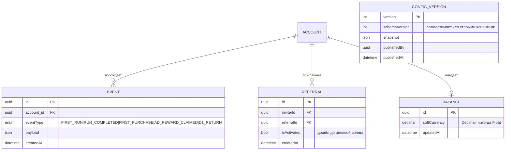
```mermaid
erDiagram
    ACCOUNT ||--o{ EVENT : "порождает"
    ACCOUNT ||--o{ REFERRAL : "приглашает"
    ACCOUNT ||--o| BALANCE : "владеет"

    EVENT {
        uuid id PK
        uuid account_id FK
        enum eventType "FIRST_RUN|RUN_COMPLETED|FIRST_PURCHASE|AD_REWARD_CLAIMED|D1_RETURN"
        json payload
        datetime createdAt
    }

    REFERRAL {
        uuid id PK
        uuid inviterId FK
        uuid referralId FK
        bool isActivated "дошёл до целевой волны"
        datetime createdAt
    }

    BALANCE {
        uuid id PK
        decimal softCurrency "Decimal, никогда Float"
        datetime updatedAt
    }

    CONFIG_VERSION {
        int version PK
        int schemaVersion "совместимость со старыми клиентами"
        json snapshot
        uuid publishedBy
        datetime publishedAt
    }
```

`CONFIG_VERSION` намеренно не связана с `ACCOUNT` внешним ключом: это
неизменяемый снапшот правил игры, а не пользовательские данные
(`19-content-admin.md` §3). `BALANCE` ждёт второго товара: пока за звёзды
продаётся один второй шанс, валюта не нужна (`34-stage3-plan.md`, Р5).
`EVENT` — вехи воронки игрока, которые знает только сервер: первый забег,
первая покупка, возврат на второй день (`13-reuse-from-vpnsibcom.md` §6).
Это не клиентская аналитика — та в `ANALYTICS_EVENT` (§1.1). На этапе 3
таблица не заведена: вехи пока выводятся запросом из `run`, `purchase` и
`account_session`, а понадобится она партнёрским начислениям.

### 1.3 Привлечение, партнёры и аналитика (проектируется)

Вынесено отдельной диаграммой намеренно: это другой домен со своим циклом
жизни, и смешивать его с игровыми сущностями в одной схеме — путь к
нечитаемой картинке.

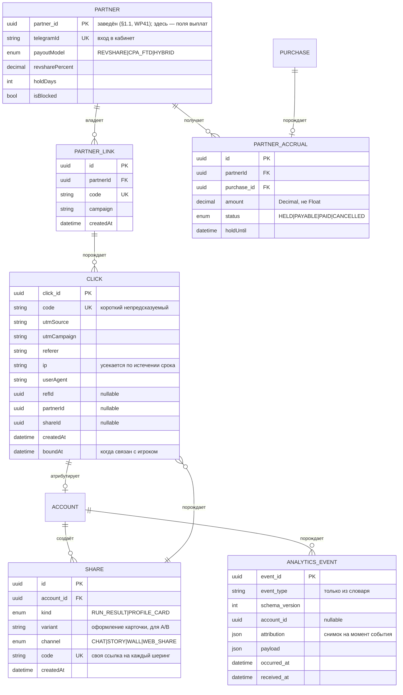
```mermaid
erDiagram
    CLICK ||--o| ACCOUNT : "атрибутирует"
    PARTNER ||--o{ PARTNER_LINK : "владеет"
    PARTNER_LINK ||--o{ CLICK : "порождает"
    PARTNER ||--o{ PARTNER_ACCRUAL : "получает"
    PURCHASE ||--o| PARTNER_ACCRUAL : "порождает"
    ACCOUNT ||--o{ SHARE : "создаёт"
    SHARE ||--o{ CLICK : "порождает"
    ACCOUNT ||--o{ ANALYTICS_EVENT : "порождает"

    CLICK {
        uuid click_id PK
        string code UK "короткий непредсказуемый"
        string utmSource
        string utmCampaign
        string referer
        string ip "усекается по истечении срока"
        string userAgent
        uuid refId "nullable"
        uuid partnerId "nullable"
        uuid shareId "nullable"
        datetime createdAt
        datetime boundAt "когда связан с игроком"
    }

    PARTNER {
        uuid partner_id PK "заведён (§1.1, WP41); здесь — поля выплат"
        string telegramId UK "вход в кабинет"
        enum payoutModel "REVSHARE|CPA_FTD|HYBRID"
        decimal revsharePercent
        int holdDays
        bool isBlocked
    }

    PARTNER_LINK {
        uuid id PK
        uuid partnerId FK
        string code UK
        string campaign
        datetime createdAt
    }

    PARTNER_ACCRUAL {
        uuid id PK
        uuid partnerId FK
        uuid purchase_id FK
        decimal amount "Decimal, не Float"
        enum status "HELD|PAYABLE|PAID|CANCELLED"
        datetime holdUntil
    }

    SHARE {
        uuid id PK
        uuid account_id FK
        enum kind "RUN_RESULT|PROFILE_CARD"
        string variant "оформление карточки, для A/B"
        enum channel "CHAT|STORY|WALL|WEB_SHARE"
        string code UK "своя ссылка на каждый шеринг"
        datetime createdAt
    }

    ANALYTICS_EVENT {
        uuid event_id PK
        string event_type "только из словаря"
        int schema_version
        uuid account_id "nullable"
        json attribution "снимок на момент события"
        json payload
        datetime occurred_at
        datetime received_at
    }
```

Три решения, которые из схемы не очевидны:

- **`CLICK` существует до игрока.** Строка создаётся в момент клика,
  когда аккаунта ещё нет; `boundAt` заполняется при первом запуске. Код
  клика (`c-<код>` в параметре запуска) уже сейчас пишется в
  `account_session.start_ref` и в касания `acquisition` (§1.1) — строка клика
  свяжется с ними по нему, задним числом тоже.
- **`ANALYTICS_EVENT.attribution` — снимок, а не ссылка.** Иначе
  перепривязка задним числом переписывает историю и отчёт за прошлый месяц
  перестаёт воспроизводиться (`22-analytics-and-metrics.md` §3.1).
- **У каждого шеринга своя ссылка.** `SHARE.code` — отдельный код на каждый
  шеринг, а не общая реферальная ссылка игрока: только так измеряется, что
  конвертит лучше (`24-attribution-and-sharing.md` §7.3).

### 1.4 Телеметрия закрытого теста (этап 2, реализовано)

Первые таблицы в проде: до авторизации, поэтому без внешнего ключа на
`USER`. Схема — `backend/api/prisma/schema.prisma`, миграции — рядом.
Подробности — `28-diagnostics.md` §5.4 и `22-analytics-and-metrics.md` §3.1.

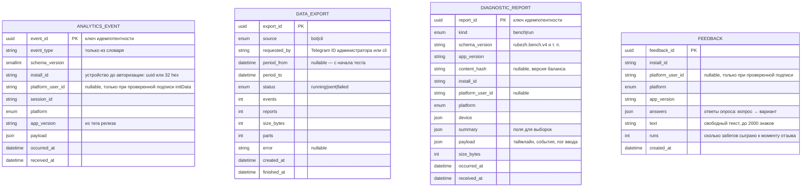
```mermaid
erDiagram
    ANALYTICS_EVENT {
        uuid event_id PK "ключ идемпотентности"
        string event_type "только из словаря"
        smallint schema_version
        string install_id "устройство до авторизации: uuid или 32 hex"
        string platform_user_id "nullable, только при проверенной подписи initData"
        string session_id
        enum platform
        string app_version "из тега релиза"
        json payload
        datetime occurred_at
        datetime received_at
    }

    DATA_EXPORT {
        uuid export_id PK
        enum source "bot|cli"
        string requested_by "Telegram ID администратора или cli"
        datetime period_from "nullable — с начала теста"
        datetime period_to
        enum status "running|sent|failed"
        int events
        int reports
        int size_bytes
        int parts
        string error "nullable"
        datetime created_at
        datetime finished_at
    }

    DIAGNOSTIC_REPORT {
        uuid report_id PK "ключ идемпотентности"
        enum kind "bench|run"
        string schema_version "rubezh.bench.v4 и т. п."
        string app_version
        string content_hash "nullable, версия баланса"
        string install_id
        string platform_user_id "nullable"
        enum platform
        json device
        json summary "поля для выборок"
        json payload "таймлайн, события, лог ввода"
        int size_bytes
        datetime occurred_at
        datetime received_at
    }

    FEEDBACK {
        uuid feedback_id PK
        string install_id
        string platform_user_id "nullable, только при проверенной подписи"
        enum platform
        string app_version
        json answers "ответы опроса: вопрос → вариант"
        string text "свободный текст, до 2000 знаков"
        int runs "сколько забегов сыграно к моменту отзыва"
        datetime created_at
    }
```

Что важно:

- **Связи с `USER` нет намеренно.** Пользователей до этапа 3 не существует;
  на этапе 3 история закрытого теста привязывается к аккаунтам по
  `platform_user_id`, а не переписывается. Колонка `user_id` и атрибуция
  появятся миграцией вместе с кодом, который их заполняет.
- **`DATA_EXPORT` — журнал доступа к данным, а не данные тестеров**: в нём
  Telegram ID администратора, который выгружал, — это аудит (`28-diagnostics.md`
  §6.1.4), по нему же считается «с последней выгрузки».
- **`FEEDBACK` — слова игрока, а не телеметрия** (`29-admin-panel.md` §5.7).
  Живёт отдельной таблицей: в события отзыв не кладётся, там остаётся только
  факт `feedback_sent`. Уходит и в чат администраторов — база нужна, чтобы
  собрать сводку и пережить недоступный Telegram.
- **Индексы** — по времени приёма (выгрузка и очистка), по установке и по
  `(event_type, received_at)` у событий, по `(app_version, kind)` у отчётов, по
  времени создания и установке у отзывов.
- **IP не хранится ни в одной из таблиц** — он нужен только лимиту частоты
  на приёме.
- Отчёты стенда этапа 1 лежали файлами в `var/bench-reports/`; в прод они
  не переносятся — это другой формат и другие условия замера.

---

## 2. Пакеты монорепо и направления зависимостей

Стрелка означает «импортирует». Красных стрелок здесь быть не может — правила
проверяются линтом и строгой раскладкой `node_modules`
(`15-engineering-standards.md` §2.2, `16-tech-stack-decisions.md` §2.2).

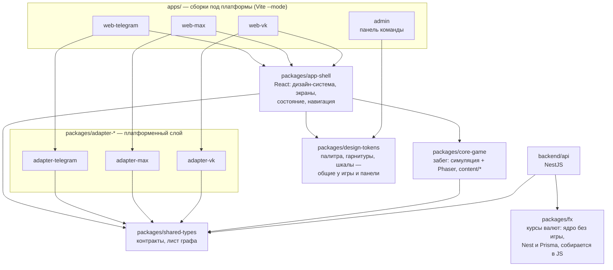
```mermaid
flowchart TD
    subgraph apps["apps/ — сборки под платформы (Vite --mode)"]
        WT["web-telegram"]
        WM["web-max"]
        WV["web-vk"]
        ADM["admin<br/>панель команды"]
    end

    subgraph adapters["packages/adapter-* — платформенный слой"]
        AT["adapter-telegram"]
        AM["adapter-max"]
        AV["adapter-vk"]
    end

    SH["packages/app-shell<br/>React: дизайн-система, экраны,<br/>состояние, навигация"]
    CG["packages/core-game<br/>забег: симуляция + Phaser, content/*"]
    ST["packages/shared-types<br/>контракты, лист графа"]
    FX["packages/fx<br/>курсы валют: ядро без игры,<br/>Nest и Prisma, собирается в JS"]
    API["backend/api<br/>NestJS"]
    DT["packages/design-tokens<br/>палитра, гарнитуры, шкалы —<br/>общие у игры и панели"]

    WT --> SH
    WT --> AT
    WM --> SH
    WM --> AM
    WV --> SH
    WV --> AV

    SH --> CG
    SH --> ST
    AT --> ST
    AM --> ST
    AV --> ST
    CG --> ST
    API --> ST
    API --> FX
    SH --> DT
    ADM --> DT
```

Стрелка из `apps/web-*` в `core-game` осталась одна и узкая: приложение берёт
оттуда отпечаток контента для сведений о сборке, а в Telegram-сборке ещё и
стенд FPS-испытаний. Забег запускает оболочка, и напрямую в движок приложение
не ходит (`27-design-system-and-app-shell.md` §2–§3).

Правила проверяются тестом по исходникам — `scripts/test/layer-boundaries.test.ts`.
Линт границ (`eslint-plugin-boundaries`) остаётся возможной заменой, но правил
пока восемь, и тест с человеческим сообщением «оболочка не знает о площадках»
полезнее настройки плагина.

Чего на схеме **нет** и не должно появиться:

- стрелки из `core-game` в любой `adapter-*` — иначе движок становится
  платформозависимым и порт на MAX превращается в переписывание;
- стрелки из `app-shell` в любой `adapter-*` или в Phaser — адаптер
  приходит объектом, Phaser — отдельным чанком;
- стрелки из `core-game` в `app-shell` — движок не знает, кто рисует меню;
- стрелки между адаптерами — общее выносится в `shared-types`;
- стрелки из `core-game` в `backend/api` — игровой цикл работает офлайн;
- любых стрелок **из** `shared-types` — это лист графа;
- любых стрелок **из** `fx` — ядро курсов станет отдельным сервисом и не
  знает ни об игре, ни о Nest, ни о Prisma. Бэкенд берёт его собранным
  (`dist`), тесты и dev-запуск — исходником.

### 2.1 Внутреннее устройство core-game

Ключевая граница внутри пакета — между симуляцией и отрисовкой. Симуляция
обязана запускаться headless: без этого невозможны ни golden-прогоны баланса,
ни воспроизведение бага по seed'у, ни серверная перепроверка забега
(`17-testing-strategy.md` §3). Проверяется тестом по исходникам, а не только
на ревью.

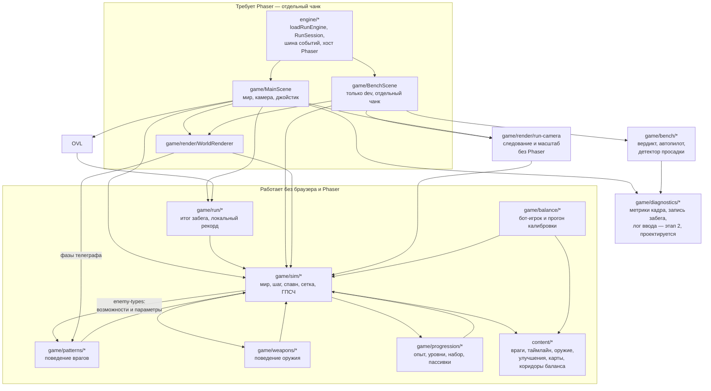
```mermaid
flowchart TD
    subgraph headless["Работает без браузера и Phaser"]
        SIM["game/sim/*<br/>мир, шаг, спавн, сетка, ГПСЧ"]
        PAT["game/patterns/*<br/>поведение врагов"]
        WPN["game/weapons/*<br/>поведение оружия"]
        PRG["game/progression/*<br/>опыт, уровни, набор, пассивки"]
        RUN["game/run/*<br/>итог забега, локальный рекорд"]
        BAL["game/balance/*<br/>бот-игрок и прогон калибровки"]
        CNT["content/*<br/>враги, таймлайн, оружие,<br/>улучшения, карты, коридоры баланса"]
    end

    subgraph rendered["Требует Phaser — отдельный чанк"]
        ENG["engine/*<br/>loadRunEngine, RunSession,<br/>шина событий, хост Phaser"]
        MS["game/MainScene<br/>мир, камера, джойстик"]
        BS["game/BenchScene<br/>только dev, отдельный чанк"]
        WR["game/render/WorldRenderer"]
    end

    RC["game/render/run-camera<br/>следование и масштаб<br/>без Phaser"]

    BM["game/bench/*<br/>вердикт, автопилот,<br/>детектор просадки"]
    DG["game/diagnostics/*<br/>метрики кадра, запись забега,<br/>лог ввода — этап 2, проектируется"]

    PAT --> SIM
    SIM -- "enemy-types:<br/>возможности и параметры" --> PAT
    WPN --> SIM
    PRG --> SIM
    SIM --> WPN
    SIM --> PRG
    SIM --> CNT
    WR -- "фазы телеграфа" --> PAT
    MS --> SIM
    MS --> WR
    MS --> DG
    MS --> RUN
    MS --> OVL
    RUN --> SIM
    OVL --> RUN
    BS --> SIM
    BS --> WR
    BS --> BM
    BS --> RC
    BM --> DG
    WR --> SIM
    MS --> RC
    RC --> SIM
    BAL --> SIM
    BAL --> CNT
    ENG --> MS
    ENG --> BS
```

Связь симуляции и паттернов двусторонняя, но без цикла модулей: шаг
симуляции вызывает поведение из реестра `game/patterns/index.ts`, а мир при
создании берёт у `game/patterns/enemy-types.ts` только возможности и
параметры паттернов — этот модуль ничего из `game/sim/*` не импортирует.
Рендер читает у паттернов номера фаз, чтобы показать телеграф; сама
симуляция о рендере по-прежнему не знает — эффекты она пишет в буфер событий
(`game/sim/events.ts`).

На этапе 2 сбор метрик кадра переезжает из `game/bench/*` в общий
`game/diagnostics/*`: им пользуются и стенд, и обычный забег, а отправка
отчётов уходит из движка в оболочку (`28-diagnostics.md` §3.1).

`game/render/run-camera` лежит в подграфе рендера по смыслу, а не по
зависимостям: Phaser он не импортирует и потому проверяется обычным тестом.
Камера **только рендер** — симуляция о масштабе не знает (`26-stage2-plan.md`,
WP4.3). Единственное, что мир берёт из параметров камеры, — радиус кольца
спавна, и берёт его от максимально возможной видимой области, одинаковой на
всех устройствах. Поэтому в камере разрешён `Math.exp`, запрещённый в
симуляции: на исход забега он не влияет.

`game/balance/*` — бот-игрок и прогон калибровки (`pnpm balance:sim`,
WP4.6). Он единственный в headless-подграфе намеренно импортирует `content/*`:
смысл прогона в том, чтобы померить текущие числа, а не поведение движка. На
него распространяются те же запреты приближённой математики — иначе таблица
калибровки меняется от запуска к запуску.

`game/run/*` считает итог забега и ведёт локальный рекорд, но Phaser и DOM не
знает: его гоняет тест статистики, а позже — серверная перепроверка забега
(§3.5 там же). Хранилище он получает портом снаружи, поэтому стрелки в
адаптеры у него нет.

`engine/*` — единственная дверь, за которой начинается Phaser: публичный
`index.ts` пакета его не импортирует, а `loadRunEngine()` подгружает этот
подграф динамически. Экраны на канве (`game/overlays/*`) вместе с WP5 удалены:
пауза, выбор улучшения и смерть — React-оверлеи оболочки, `RunResult` уходит
наружу событием шины.

Чего на схеме нет и не должно появиться:

- стрелок из `game/sim/*` и `game/patterns/*` в Phaser, DOM или `bench/*` —
  симуляция ничего не знает о том, что её рисуют и замеряют;
- стрелок из `content/*` куда бы то ни было в `game/*` — контент это данные;
- `BenchScene` в основном бандле: сцена подключается динамическим импортом,
  иначе стенд испытаний уезжает игрокам.

---

## 3. Бэкенд: модули и инфраструктура


```mermaid
flowchart LR
    subgraph clients["Клиенты"]
        TG["Telegram Mini App"]
        MAX["MAX"]
        VK["VK"]
        ADMIN["Админка<br/>геймдизайнера"]
    end

    CADDY["Caddy<br/>TLS, единственный вход"]

    subgraph api["backend/api"]
        AUTH["auth<br/>initData → JWT, роли, реализовано"]
        ATTR["attribution<br/>сессии, первое и последнее<br/>касание, реализовано"]
        RUNS["runs<br/>приём забегов, антифрод,<br/>рейтинг, реализовано"]
        PAY["payments<br/>второй шанс, товары и подписка за Stars: цена,<br/>счёт, подтверждение, продления, возвраты, выдача, реализовано"]
        SHOP["shop<br/>магазин: каталог с фиксированным<br/>составом, цены способа оплаты, акции, реализовано"]
        VIP["vip<br/>подписка площадки: журнал периодов,<br/>продление, самоцветы дня, надбавка к наградам, реализовано"]
        ADS["ads<br/>реклама: выбор сети, воронка показа,<br/>кулдаун места, реализовано ядро"]
        REF["referrals"]
        CONTENT["content<br/>версии конфигурации"]
        INGEST["ingest<br/>выключатели, Origin, лимиты,<br/>подпись запуска, реализовано"]
        EVENTS["events<br/>приём событий, реализовано"]
        DIAG["diagnostics<br/>отчёты стресс-теста, реализовано"]
        TOOLS["roles: инструменты команды<br/>режим разработчика, стресс-тест —<br/>по праву и настройке, реализовано"]
        BOT["platforms/telegram: бот<br/>вебхук или polling,<br/>маршрутизатор команд, реализовано"]
        TGADP["platforms/telegram: адаптер<br/>проверка запуска, оплата Stars,<br/>обновления оплаты, реализовано"]
        WELCOME["welcome<br/>/start с карточкой, реализовано"]
        NOTIFY["admin-notify<br/>карточки отчётов и забегов<br/>на разбор, реализовано"]
        EXPORT["export<br/>выгрузка и срок хранения, реализовано"]
        FXM["fx<br/>курсы валют вокруг packages/fx:<br/>опрос под локом, снимки, реализовано"]
        WALLET["wallet<br/>журнал, балансы, суточные<br/>потолки, реализовано"]
        PROG["progress<br/>уровень аккаунта, награды<br/>за забег, реализовано"]
        ITEMS["items<br/>снаряжение: инвентарь, операции,<br/>добыча, подписанный снимок, реализовано"]
        BOOSTS["boosts<br/>бусты: покупка до старта,<br/>возврат, сверка в итоге, реализовано"]
        ADMINAPI["admin<br/>панель: cookie-сессия, игроки,<br/>роли, курсы, отчёты, выгрузки,<br/>ссылки, флаги, настройки, реализовано"]
        LINKS["links<br/>/r/:код вне префикса API,<br/>клики, краулеры, макросы сети<br/>на клике, реализовано"]
        ADCONV["ad-conversions<br/>конверсии закупок: проход<br/>раз в минуту под локом, постбэк<br/>в сеть с повтором, реализовано"]
        FLAGS["flags<br/>фича-флаги по площадке и доле,<br/>кеш правил 30 с, реализовано"]
        SETTINGS["settings<br/>настройки без релиза: база<br/>сильнее окружения, реализовано"]
        SECRETS["secrets<br/>ключи интеграций: шифртекст<br/>в базе, панель сильнее<br/>окружения, реализовано"]
        BCAST["broadcasts<br/>рассылки: сегмент, очередь<br/>с темпом площадки, реализовано"]
        FRIENDS["friends<br/>дружба, заявки, подарки,<br/>бонус за друзей, реализовано"]
        ACCSET["account-settings<br/>настройки игрока для всех устройств:<br/>слияние по ключам, реализовано"]
        NOTIF["notifications<br/>лента уведомлений: пишут модули,<br/>чистка старше 90 дней, реализовано"]
        NOTIFBOT["notifications-bot<br/>дубль в бота по выбору игрока:<br/>очередь, потолок вида, реализовано"]
        BADGES["badges<br/>знаки меню одним ответом:<br/>счётчики соседей, реализовано"]
        HISTORY["history<br/>история имущества: чтение<br/>журналов кошелька, предметов<br/>и покупок, реализовано"]
        DAILY["daily<br/>награда дня: неделя без сброса,<br/>ступени, множитель уровня, реализовано"]
        CHANGELOG["changelog<br/>журнал обновлений по площадкам,<br/>раздача app_update пачками, реализовано"]
        PLAYERLIST["player-list<br/>список игроков для панели:<br/>фильтры, страница по индексу, реализовано"]
        WHEEL["wheel<br/>колесо: сектора от уровня,<br/>бесплатная крутка в сутки, реализовано"]
        TASKS["tasks<br/>задания и достижения: каталог в базе,<br/>прогресс от забегов, реализовано"]
        TESTNOTICE["test-notice<br/>предупреждение об открытом тесте:<br/>принятие на аккаунт, реализовано"]
    end

    FXSRC["Источники курсов<br/>ЦБ, ЕЦБ, ExchangeRate-API,<br/>CoinGecko, TON API, Binance"]

    ADSGRAMAPI["AdsGram<br/>api.adsgram.ai/confirm_conversion"]

    TGAPI["Telegram Bot API"]

    subgraph infra["Инфраструктура"]
        PG[("PostgreSQL<br/>источник истины")]
        REDIS[("Redis<br/>кеш, локи, ZSET, очереди")]
        QUEUE["BullMQ<br/>воркеры"]
    end

    CDN["CDN<br/>статика игры + снапшоты конфигурации"]

    TG --> CADDY
    MAX --> CADDY
    VK --> CADDY
    ADMIN --> CADDY

    CADDY --> AUTH
    CADDY --> RUNS
    CADDY --> PAY
    CADDY -- "/api/v1/ads" --> ADS
    CADDY --> REF
    CADDY --> CONTENT
    CADDY --> EVENTS
    CADDY --> DIAG
    CADDY -- "/api/v1/tools" --> TOOLS

    EVENTS --> INGEST
    DIAG --> INGEST
    INGEST --> REDIS
    EVENTS --> QUEUE
    DIAG --> PG
    DIAG -. кому открыт стресс-тест .-> TOOLS
    DIAG -. слушатели нового отчёта .-> NOTIFY
    RUNS -. слушатели записанного забега .-> NOTIFY
    NOTIFY --> QUEUE
    TGAPI -- вебхук --> CADDY
    CADDY --> BOT
    BOT --> WELCOME
    BOT --> EXPORT
    BOT -- обновления оплаты --> TGADP
    TGADP -- проверка и подтверждение оплаты --> PAY
    PAY -- порт оплаты --> TGADP
    AUTH -- порт проверки запуска --> TGADP
    INGEST -- порт проверки запуска --> TGADP
    TGADP -- createInvoiceLink, answerPreCheckoutQuery, refundStarPayment --> TGAPI
    PAY --> QUEUE
    WELCOME -. рекорд и место .-> RUNS
    EXPORT --> QUEUE
    FXM -- раз в минуту, под локом --> FXSRC
    FXM --> PG
    FXM --> REDIS
    FXM -. алерты курсов .-> NOTIFY
    RUNS -. слушатели записанного забега .-> PROG
    PROG --> QUEUE
    PROG -- монеты, награды за уровень --> WALLET
    WALLET --> PG
    PROG --> PG
    CADDY --> WALLET
    CADDY --> PROG
    CADDY --> ITEMS
    PROG -- добыча забега --> ITEMS
    PROG -. "удвоение: забор сессии места run_double" .-> ADS
    ITEMS -- цена операций, осколки разбора --> WALLET
    RUNS -- порт проверки снимка снаряжения --> ITEMS
    CADDY --> BOOSTS
    BOOSTS -- цена бустов, возврат --> WALLET
    RUNS -- порт сверки бустов --> BOOSTS
    BOOSTS --> PG
    ITEMS --> PG
    EXPORT --> PG
    QUEUE -- sendPhoto, sendDocument --> TGAPI

    AUTH --> PG
    AUTH --> REDIS
    AUTH -. слушатели входа .-> ATTR
    ATTR --> REDIS
    ATTR --> QUEUE
    RUNS --> PG
    RUNS --> REDIS
    PAY --> PG
    PAY -. забег, который продолжают .-> RUNS
    CADDY -- "/api/v1/shop" --> SHOP
    SHOP -- "счёт на товар" --> PAY
    PAY -. "выдача оплаченного: регистр выдачи" .-> SHOP
    SHOP -- "состав товара ключом покупки" --> WALLET
    CADDY -- "/api/v1/vip" --> VIP
    VIP -- "счёт с периодом, отмена продления" --> PAY
    PAY -. "период за оплату, продление на площадке" .-> VIP
    VIP -- "самоцветы дня ключом суток" --> WALLET
    WALLET -. "надбавка к наградам: регистр надбавок" .-> VIP
    VIP -- "vip_subscription, vip_period, vip_daily" --> PG
    RUNS -. сверка продолжений с покупками .-> PAY
    RUNS -. "второй шанс: забор сессии места second_chance" .-> ADS
    RUNS -. слушатели записанного забега .-> PAY
    ADS -- "ad_network, ad_block, ad_session" --> PG
    ADMINAPI -. "сети, блоки, воронка показов" .-> ADS
    WHEEL -. "забор сессии места wheel_spin" .-> ADS
    REF --> PG
    CONTENT --> PG
    CONTENT --> CDN

    QUEUE --> PG
    QUEUE --> REDIS

    PANEL["apps/admin<br/>панель команды,<br/>свой поддомен"] -- "/api/v1/admin, cookie" --> CADDY
    CADDY --> ADMINAPI
    CADDY -- "/r/*" --> LINKS
    LINKS --> PG
    LINKS -. "порт AppLinks: ссылка запуска" .-> TGADP
    ADMINAPI -- сессии панели --> REDIS
    ADMINAPI -. сервисы и репозитории соседей .-> AUTH
    ADMINAPI -. карточка: забеги, кошелёк .-> RUNS
    ADMINAPI -. карточка: кошелёк .-> WALLET
    ADMINAPI -. курсы, заданные курсы .-> FXM
    ADMINAPI -. отчёты, архив .-> EXPORT
    ADMINAPI -. флаги и выкат .-> FLAGS
    ADMINAPI -. "настройки, право settings.edit" .-> SETTINGS
    SETTINGS --> PG
    SETTINGS -- "канал settings:changed" --> REDIS
    NOTIFY -. адреса чатов команды .-> SETTINGS
    ADMINAPI -. "ключи, права secrets.view и secrets.edit" .-> SECRETS
    SECRETS --> PG
    SECRETS -- "канал secrets:changed" --> REDIS
    FXM -. ключ CoinGecko на каждом проходе .-> SECRETS
    ADCONV -- "ad_conversion; читает link_click, acquisition, run, purchase" --> PG
    ADCONV -- "лок ad-conversions:lock" --> REDIS
    ADCONV -. токен конверсий на каждой отправке .-> SECRETS
    ADCONV -- "confirm_conversion, таймаут 5 с" --> ADSGRAMAPI
    ADMINAPI -. "журнал и повтор конверсий ссылки" .-> ADCONV
    ADMINAPI -. рассылки .-> BCAST
    BCAST --> PG
    BCAST -- "очередь broadcasts, лимитер" --> REDIS
    BCAST -. "порт Messengers: sendMessage" .-> TGADP
    BCAST -. кнопка — ссылка кампании .-> LINKS
    FRIENDS --> PG
    FRIENDS -. подарки и бонус .-> WALLET
    FRIENDS -. "порт Messengers: сообщение о заявке" .-> TGADP
    CADDY -- "/api/v1/account/settings" --> ACCSET
    ACCSET --> PG
    CADDY -- "/api/v1/me/notifications" --> NOTIF
    NOTIF --> PG
    NOTIF -- "лок чистки" --> REDIS
    FRIENDS -. "заявка, подарок" .-> NOTIF
    ITEMS -. "редкая добыча" .-> NOTIF
    BOOSTS -. "возврат бустов" .-> NOTIF
    ADMINAPI -. "сообщение команды" .-> NOTIF
    NOTIF -. "новая строка, onCreated" .-> NOTIFBOT
    CADDY -- "/api/v1/changelog" --> CHANGELOG
    ADMINAPI -. "журнал: правка, публикация" .-> CHANGELOG
    CHANGELOG --> PG
    CHANGELOG -- "лок раздачи" --> REDIS
    CHANGELOG -. "app_update пачкой, deliverMany" .-> NOTIF
    BADGES -. "версии после «открывал»" .-> CHANGELOG
    ADMINAPI -. "список игроков" .-> PLAYERLIST
    PLAYERLIST --> PG
    CADDY -- "/api/v1/wheel" --> WHEEL
    WHEEL -- "wheel_spin, сутки по Москве" --> PG
    WHEEL -. "награда ключом крутки" .-> WALLET
    WHEEL -. "уровень аккаунта" .-> PROG
    BADGES -. "крутка ждёт" .-> WHEEL
    CADDY -- "/api/v1/tasks" --> TASKS
    TASKS -- "task_def, task_progress, task_run" --> PG
    RUNS -. "записанный забег, RunsHooks" .-> TASKS
    TASKS -. "награда ключом задания и срока" .-> WALLET
    BADGES -. "награды к выдаче" .-> TASKS
    ADMINAPI -. "каталог заданий" .-> TASKS
    TASKS -. "порт ChannelMemberships: getChatMember" .-> TGADP
    CADDY -- "/api/v1/me/test-notice" --> TESTNOTICE
    TESTNOTICE -- "test_notice" --> PG
    ADMINAPI -. "принял ли предупреждение" .-> TESTNOTICE
    NOTIFBOT -- "задания, окно вида" --> REDIS
    NOTIFBOT -- "можно ли писать: account_messaging" --> PG
    NOTIFBOT -. "выбор игрока" .-> ACCSET
    NOTIFBOT -. "порт Messengers: sendMessage" .-> TGADP
    CADDY -- "/api/v1/me/badges" --> BADGES
    BADGES -. "новые предметы" .-> ITEMS
    BADGES -. "подарки и заявки" .-> FRIENDS
    BADGES -. непрочитанное .-> NOTIF
    CADDY -- "/api/v1/me/history" --> HISTORY
    CADDY -- "/api/v1/daily" --> DAILY
    DAILY -- "daily_reward, сутки по Москве" --> PG
    DAILY -. "монеты и осколки ключом дня" .-> WALLET
    DAILY -. "уровень аккаунта" .-> PROG
    BADGES -. "награда ждёт" .-> DAILY
    HISTORY -- "wallet_entry, item_event, purchase" --> PG
    CADDY -- "/api/v1/flags" --> FLAGS
    FLAGS --> PG

    TG -.статика и конфиг.-> CDN
```

**Панель — модуль того же монолита** (`35-stage4-plan.md`, WP17): свои
контроллеры под `/api/v1/admin/*` и своя cookie-сессия в Redis, а данные —
через экспортированные сервисы и репозитории соседей: модуль панели сам в
базу не ходит (`36-parallel-work.md` §2). Клиент панели `apps/admin` ходит в
эти маршруты только на свой домен: Caddy поддомена панели отдаёт её статику и
проксирует `/api/v1/admin`, поэтому CORS нет, а cookie с `SameSite=Strict`
уходит сама. С игрой панель роднят только токены дизайна — движка, оболочки
и адаптеров в её бандле нет, это проверяет тест границ слоёв.

**Площадка — за портами** (`35-stage4-plan.md`, Р22, §3.11): модули домена —
вход, приёмник, оплата — не знают Telegram, а просят порты
`platforms/ports/`. Как проверяется подпись запуска, как выставляется счёт,
состоит ли игрок в канале и что значит ответ Bot API, знает адаптер
`platforms/telegram/`; у MAX и VK — заглушки. Бот и инструменты команды в чате администраторов порта не
требуют: это наш инструмент, а не игра.

Читается так: **Postgres — источник истины, Redis — проекция.** Приём забега
пишет его в базу одной строкой по первичному ключу и только потом — место в
рейтинг Redis: упавший Redis забег не теряет, рейтинг догонит повтор итога
или пересборка (`34-stage3-plan.md`, Р4). Запись синхронная сознательно: на
нынешнем объёме это одна вставка, а очередь перед ней — первый шаг
`14-scalability.md` §4.1, когда запись станет узким местом. Уведомления и
сводка работают после ответа игроку — слушателями записанного забега.

---

## 4. Ключевые потоки

### 4.1 Авторизация

Реализовано на этапе 3 (`34-stage3-plan.md`, WP1, WP6).

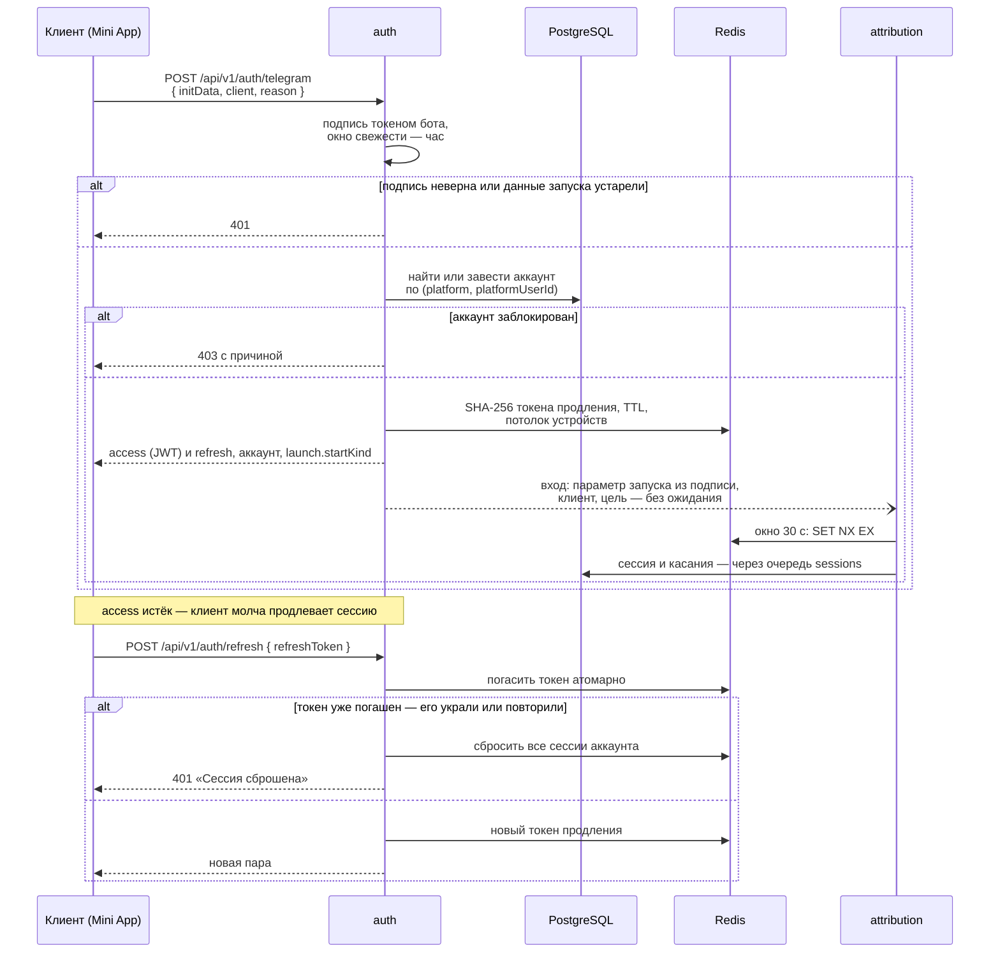
```mermaid
sequenceDiagram
    participant C as Клиент (Mini App)
    participant A as auth
    participant DB as PostgreSQL
    participant R as Redis
    participant S as attribution

    C->>A: POST /api/v1/auth/telegram<br/>{ initData, client, reason }
    A->>A: подпись токеном бота,<br/>окно свежести — час
    alt подпись неверна или данные запуска устарели
        A-->>C: 401
    else
        A->>DB: найти или завести аккаунт<br/>по (platform, platformUserId)
        alt аккаунт заблокирован
            A-->>C: 403 с причиной
        else
            A->>R: SHA-256 токена продления, TTL,<br/>потолок устройств
            A-->>C: access (JWT) и refresh, аккаунт, launch.startKind
            A--)S: вход: параметр запуска из подписи,<br/>клиент, цель — без ожидания
            S->>R: окно 30 с: SET NX EX
            S->>DB: сессия и касания — через очередь sessions
        end
    end

    Note over C,A: access истёк — клиент молча продлевает сессию
    C->>A: POST /api/v1/auth/refresh { refreshToken }
    A->>R: погасить токен атомарно
    alt токен уже погашен — его украли или повторили
        A->>R: сбросить все сессии аккаунта
        A-->>C: 401 «Сессия сброшена»
    else
        A->>R: новый токен продления
        A-->>C: новая пара
    end
```

Валидация подписи — **только на сервере**. Роли в токен не входят и
проверяются по базе на каждом запросе с правом: отзыв действует сразу, а не
через четверть часа (`34-stage3-plan.md`, Р1). Сессию и касания вход не
ждёт: упавшая запись атрибуции не отменяет вход. Сессией считается только
запуск (`reason: "launch"`), а не повторный вход посреди работы. Детали и
краевые случаи — `13-reuse-from-vpnsibcom.md` §4 и §6.

### 4.2 Сдача результата забега

Реализовано на этапе 3 (`34-stage3-plan.md`, WP4).

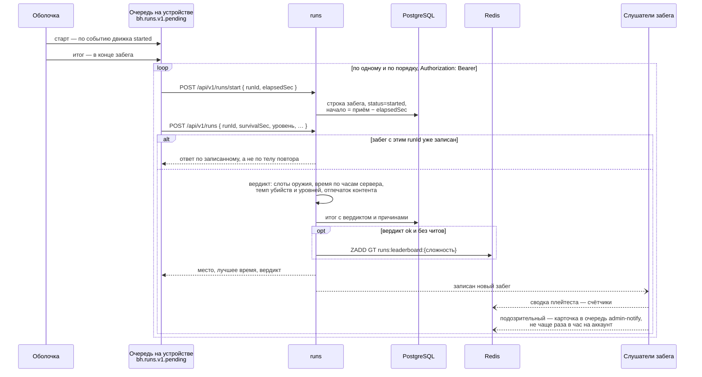
```mermaid
sequenceDiagram
    participant C as Оболочка
    participant Q as Очередь на устройстве<br/>bh.runs.v1.pending
    participant RU as runs
    participant DB as PostgreSQL
    participant R as Redis
    participant H as Слушатели забега

    C->>Q: старт — по событию движка started
    C->>Q: итог — в конце забега
    loop по одному и по порядку, Authorization: Bearer
        Q->>RU: POST /api/v1/runs/start { runId, elapsedSec }
        RU->>DB: строка забега, status=started,<br/>начало = приём − elapsedSec
        Q->>RU: POST /api/v1/runs { runId, survivalSec, уровень, … }
        alt забег с этим runId уже записан
            RU-->>Q: ответ по записанному, а не по телу повтора
        else
            RU->>RU: вердикт: слоты оружия, время по часам сервера,<br/>темп убийств и уровней, отпечаток контента
            RU->>DB: итог с вердиктом и причинами
            opt вердикт ok и без читов
                RU->>R: ZADD GT runs:leaderboard:{сложность}
            end
            RU-->>Q: место, лучшее время, вердикт
            RU--)H: записан новый забег
            H--)R: сводка плейтеста — счётчики
            H--)R: подозрительный — карточка в очередь admin-notify,<br/>не чаще раза в час на аккаунт
        end
    end
```

Три свойства, ради которых схема такая:

- **время забега проверяет сервер своими часами.** Старт уходит в начале
  забега и ставит серверное время начала; итог длиннее прошедшего получает
  отказ. Старт, пролежавший без сети дольше `RUNS_START_MAX_DELAY_SEC`, время
  не проверяет — такой забег помечается `unverified_time` (О5);
- **повтор отвечает по записанному.** Идемпотентность — по клиентскому
  `runId`, **не** по хэшу тела: два честных забега с одинаковым счётом дали
  бы одинаковый хэш (`15-engineering-standards.md` §4.1). А ответ на повтор
  строится из базы, иначе забег сдавали бы дважды: с малым временем, чтобы
  пройти проверки, и тем же ключом — с огромным;
- **игрок не ждёт ни сводки, ни чата.** Слушатели зовутся после ответа и
  только на первую запись: повтор из очереди не посчитает забег дважды и не
  пришлёт вторую карточку.

### 4.3 Награда за просмотр рекламы (этап 4, реализовано ядро)

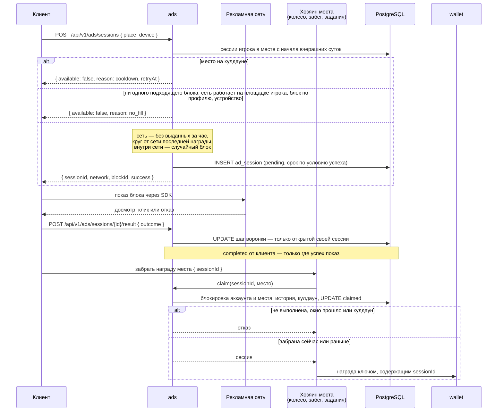
```mermaid
sequenceDiagram
    participant C as Клиент
    participant AD as ads
    participant N as Рекламная сеть
    participant O as Хозяин места<br/>(колесо, забег, задания)
    participant DB as PostgreSQL
    participant W as wallet

    C->>AD: POST /api/v1/ads/sessions { place, device }
    AD->>DB: сессии игрока в месте с начала вчерашних суток
    alt место на кулдауне
        AD-->>C: { available: false, reason: cooldown, retryAt }
    else ни одного подходящего блока: сеть работает на площадке игрока, блок по профилю, устройство
        AD-->>C: { available: false, reason: no_fill }
    else
        Note over AD: сеть — без выданных за час,<br/>круг от сети последней награды,<br/>внутри сети — случайный блок
        AD->>DB: INSERT ad_session (pending, срок по условию успеха)
        AD-->>C: { sessionId, network, blockId, success }
    end
    C->>N: показ блока через SDK
    N-->>C: досмотр, клик или отказ
    C->>AD: POST /api/v1/ads/sessions/{id}/result { outcome }
    AD->>DB: UPDATE шаг воронки — только открытой своей сессии
    Note over AD,DB: completed от клиента — только где успех показ
    C->>O: забрать награду места { sessionId }
    O->>AD: claim(sessionId, место)
    AD->>DB: блокировка аккаунта и места, история, кулдаун, UPDATE claimed
    alt не выполнена, окно прошло или кулдаун
        AD-->>O: отказ
    else забрана сейчас или раньше
        AD-->>O: сессия
        O->>W: награда ключом, содержащим sessionId
    end
```

Одна сессия — одна награда: забор и проверка кулдауна идут под одной
транзакционной блокировкой, а повтор после обрыва отдаёт ту же сессию, и
хозяин места дожимает награду тем же ключом кошелька. Клик и целевое
действие выполненной сессию сделает сервер — своим редиректом и постбэком
сети, следующей частью WP12, а не ответом SDK (`35-stage4-plan.md` §3.7,
«Доверие»).

### 4.3.1 Креатив сети с API — Taddy (этап 4, WP12, часть 9)

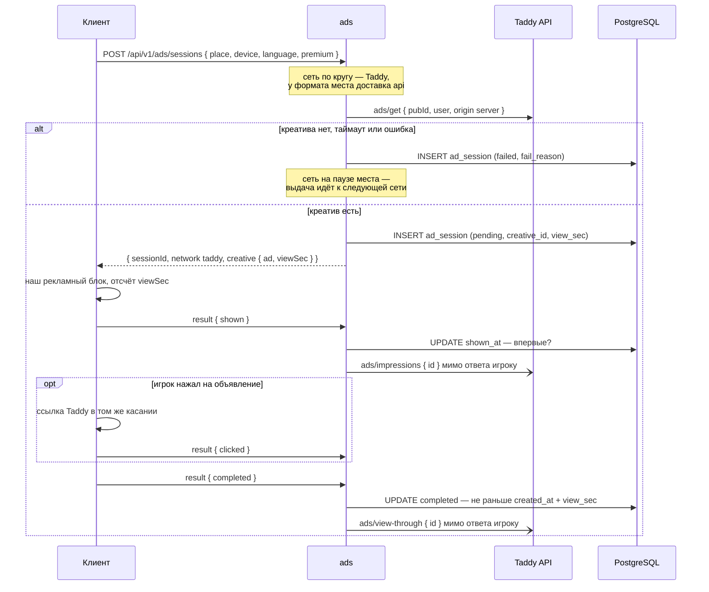
```mermaid
sequenceDiagram
    participant C as Клиент
    participant AD as ads
    participant T as Taddy API
    participant DB as PostgreSQL

    C->>AD: POST /api/v1/ads/sessions { place, device, language, premium }
    Note over AD: сеть по кругу — Taddy,<br/>у формата места доставка api
    AD->>T: ads/get { pubId, user, origin server }
    alt креатива нет, таймаут или ошибка
        AD->>DB: INSERT ad_session (failed, fail_reason)
        Note over AD: сеть на паузе места —<br/>выдача идёт к следующей сети
    else креатив есть
        AD->>DB: INSERT ad_session (pending, creative_id, view_sec)
        AD-->>C: { sessionId, network taddy, creative { ad, viewSec } }
        C->>C: наш рекламный блок, отсчёт viewSec
        C->>AD: result { shown }
        AD->>DB: UPDATE shown_at — впервые?
        AD-)T: ads/impressions { id } мимо ответа игроку
        opt игрок нажал на объявление
            C->>C: ссылка Taddy в том же касании
            C->>AD: result { clicked }
        end
        C->>AD: result { completed }
        AD->>DB: UPDATE completed — не раньше created_at + view_sec
        AD-)T: ads/view-through { id } мимо ответа игроку
    end
```

Клик Taddy считает сама — по своей ссылке в объявлении; нам он виден шагом
`clicked` в воронке. Награда — как у любой рекламы (§4.3): хозяин места
забирает выполненную сессию. Учёт аудитории — отдельно: SDK Taddy
поднимается у каждого игрока Telegram, пока у сети задан `pubId`, а `/start`
бота сервер сообщает Taddy сам (`events/start`).

### 4.3.2 Межстраничная при старте забега (этап 4, WP12, часть 10)

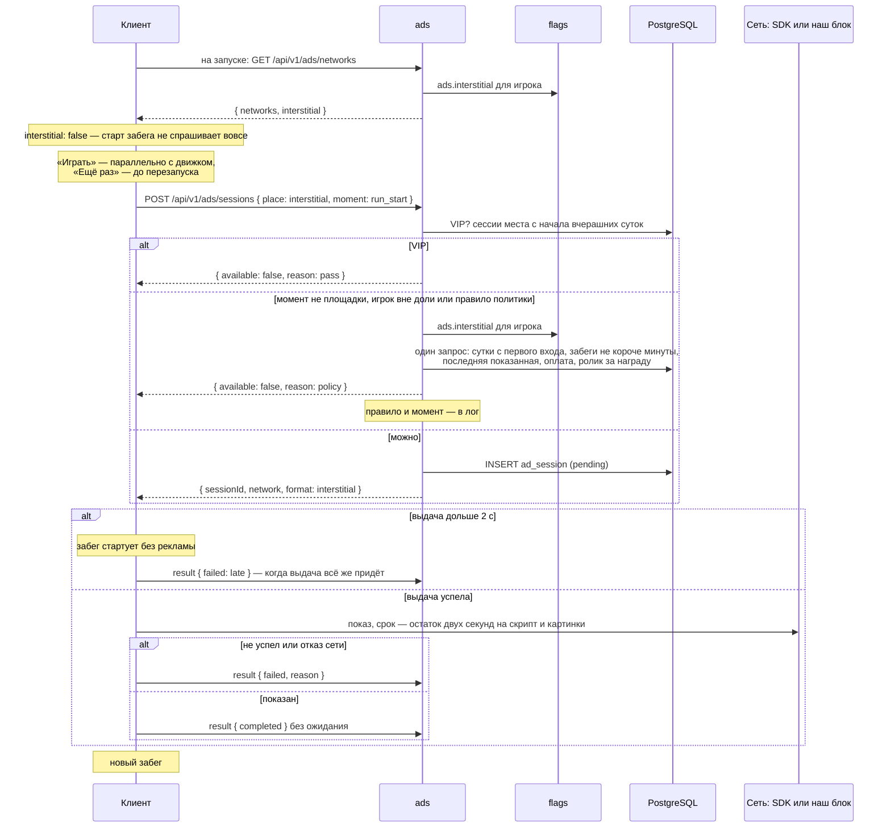
```mermaid
sequenceDiagram
    participant C as Клиент
    participant AD as ads
    participant F as flags
    participant DB as PostgreSQL
    participant N as Сеть: SDK или наш блок

    C->>AD: на запуске: GET /api/v1/ads/networks
    AD->>F: ads.interstitial для игрока
    AD-->>C: { networks, interstitial }
    Note over C: interstitial: false — старт забега не спрашивает вовсе
    Note over C: «Играть» — параллельно с движком,<br/>«Ещё раз» — до перезапуска
    C->>AD: POST /api/v1/ads/sessions { place: interstitial, moment: run_start }
    AD->>DB: VIP? сессии места с начала вчерашних суток
    alt VIP
        AD-->>C: { available: false, reason: pass }
    else момент не площадки, игрок вне доли или правило политики
        AD->>F: ads.interstitial для игрока
        AD->>DB: один запрос: сутки с первого входа, забеги не короче минуты,<br/>последняя показанная, оплата, ролик за награду
        AD-->>C: { available: false, reason: policy }
        Note over AD: правило и момент — в лог
    else можно
        AD->>DB: INSERT ad_session (pending)
        AD-->>C: { sessionId, network, format: interstitial }
    end
    alt выдача дольше 2 с
        Note over C: забег стартует без рекламы
        C->>AD: result { failed: late } — когда выдача всё же придёт
    else выдача успела
        C->>N: показ, срок — остаток двух секунд на скрипт и картинки
        alt не успел или отказ сети
            C->>AD: result { failed, reason }
        else показан
            C->>AD: result { completed } без ожидания
        end
    end
    Note over C: новый забег
```

Показывать ли — решает только сервер: клиент не знает ни покупок, ни
роликов за награду на других экранах. Две подряд не бывает: перед
следующей должен закончиться забег не короче минуты, а пауза между
показами — не меньше минуты. Числа политики — настройки панели, доля
игроков — флаг `ads.interstitial` (`35-stage4-plan.md` WP12, часть 10).

### 4.4 Публикация конфигурации из админки

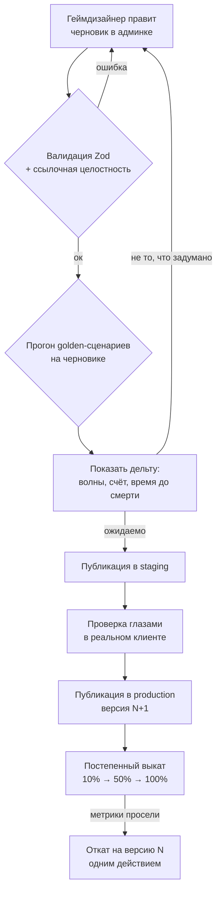
```mermaid
flowchart TD
    D["Геймдизайнер правит<br/>черновик в админке"]
    V{"Валидация Zod<br/>+ ссылочная целостность"}
    S{"Прогон golden-сценариев<br/>на черновике"}
    DELTA["Показать дельту:<br/>волны, счёт, время до смерти"]
    STG["Публикация в staging"]
    CHECK["Проверка глазами<br/>в реальном клиенте"]
    PROD["Публикация в production<br/>версия N+1"]
    ROLL["Постепенный выкат<br/>10% → 50% → 100%"]
    BACK["Откат на версию N<br/>одним действием"]

    D --> V
    V -- "ошибка" --> D
    V -- "ок" --> S
    S --> DELTA
    DELTA -- "не то, что задумано" --> D
    DELTA -- "ожидаемо" --> STG
    STG --> CHECK
    CHECK --> PROD
    PROD --> ROLL
    ROLL -- "метрики просели" --> BACK
```

Подробности и рамки — `19-content-admin.md`.

### 4.5 Путь атрибуции: от клика до игрока

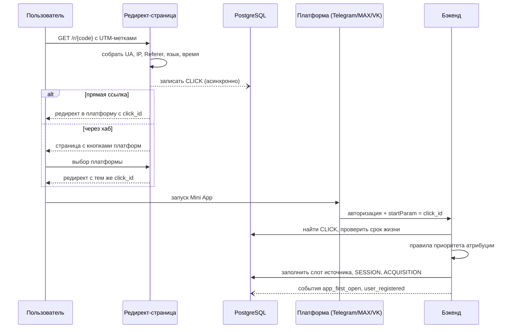
```mermaid
sequenceDiagram
    participant U as Пользователь
    participant R as Редирект-страница
    participant DB as PostgreSQL
    participant P as Платформа (Telegram/MAX/VK)
    participant API as Бэкенд

    U->>R: GET /r/{code} с UTM-метками
    R->>R: собрать UA, IP, Referer, язык, время
    R--)DB: записать CLICK (асинхронно)
    alt прямая ссылка
        R-->>U: редирект в платформу с click_id
    else через хаб
        R-->>U: страница с кнопками платформ
        U->>R: выбор платформы
        R-->>U: редирект с тем же click_id
    end
    U->>P: запуск Mini App
    P->>API: авторизация + startParam = click_id
    API->>DB: найти CLICK, проверить срок жизни
    API->>API: правила приоритета атрибуции
    API->>DB: заполнить слот источника, SESSION, ACQUISITION
    API--)DB: события app_first_open, user_registered
```

Краулер мессенджера, запрашивающий превью ссылки, кликом **не считается** —
иначе одна отправка в чат порождает фантомный клик и занижает конверсию
(`24-attribution-and-sharing.md` §3.3).

### 4.6 Аналитический конвейер

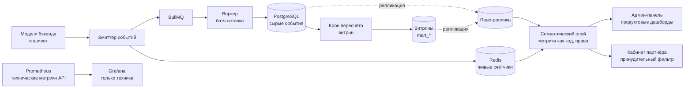
```mermaid
flowchart LR
    MOD["Модули бэкенда<br/>и клиент"]
    EMIT["Эмиттер событий"]
    Q["BullMQ"]
    RD[("Redis<br/>живые счётчики")]
    W["Воркер<br/>батч-вставка"]
    PG[("PostgreSQL<br/>сырые события")]
    ROLL["Крон пересчёта<br/>витрин"]
    MART[("Витрины<br/>mart_*")]
    REPL[("Read-реплика")]
    SEM["Семантический слой<br/>метрики как код, права"]
    ADM["Админ-панель<br/>продуктовые дашборды"]
    PC["Кабинет партнёра<br/>принудительный фильтр"]
    PROM["Prometheus<br/>технические метрики API"]
    GRAF["Grafana<br/>только техника"]

    MOD --> EMIT
    EMIT --> Q
    EMIT --> RD
    Q --> W
    W --> PG
    PG --> ROLL
    ROLL --> MART
    PG -.репликация.-> REPL
    MART -.репликация.-> REPL
    REPL --> SEM
    RD --> SEM
    SEM --> ADM
    SEM --> PC
    PROM --> GRAF
```

Существенное: **продуктовая аналитика не ходит в горячие таблицы.**
Админ-панель и кабинет партнёра читают витрины на реплике через
семантический слой, живые счётчики — из Redis; Grafana смотрит только
технические метрики Prometheus (`29-admin-panel.md` §5). Иначе открытый на стене
дашборд с автообновлением становится постоянной паразитной нагрузкой на ту
же БД, которая принимает забеги (`22-analytics-and-metrics.md` §1).

### 4.7 Забег внутри оболочки (этап 2, проектируется)

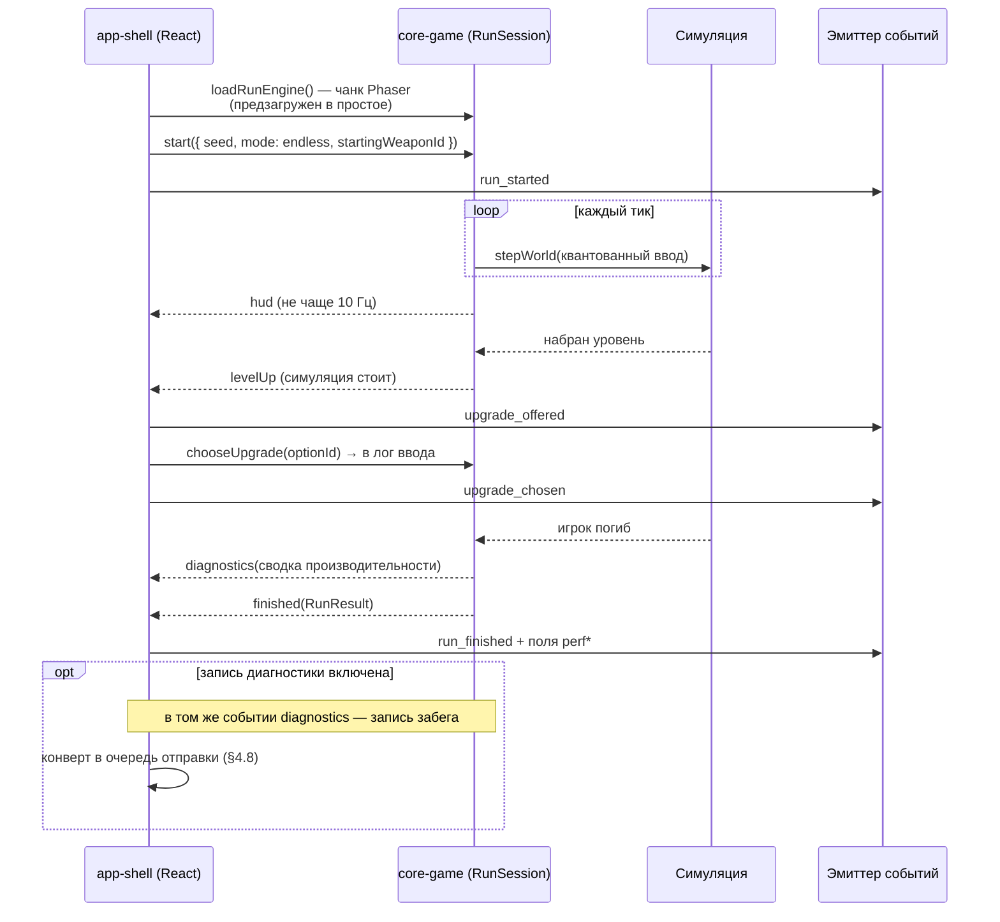
```mermaid
sequenceDiagram
    participant UI as app-shell (React)
    participant E as core-game (RunSession)
    participant S as Симуляция
    participant T as Эмиттер событий

    UI->>E: loadRunEngine() — чанк Phaser<br/>(предзагружен в простое)
    UI->>E: start({ seed, mode: endless, startingWeaponId })
    UI->>T: run_started
    loop каждый тик
        E->>S: stepWorld(квантованный ввод)
    end
    E-->>UI: hud (не чаще 10 Гц)
    S-->>E: набран уровень
    E-->>UI: levelUp (симуляция стоит)
    UI->>T: upgrade_offered
    UI->>E: chooseUpgrade(optionId) → в лог ввода
    UI->>T: upgrade_chosen
    S-->>E: игрок погиб
    E-->>UI: diagnostics(сводка производительности)
    E-->>UI: finished(RunResult)
    UI->>T: run_finished + поля perf*
    opt запись диагностики включена
        Note over E,UI: в том же событии diagnostics — запись забега
        UI->>UI: конверт в очередь отправки (§4.8)
    end
```

Движок не ходит в сеть и не знает про аналитику: он отдаёт результат, а
отправкой занимается оболочка (`27-design-system-and-app-shell.md` §3.1).

### 4.8 Доставка отчёта диагностики (этап 2, реализовано)

Очередь на устройстве — `app-shell/src/state/report-queue.ts`, приёмник —
`backend/api/src/modules/diagnostics`. Стресс-тест очередь не использует: он
шлёт отчёт сам и повторяет отправку кнопкой.

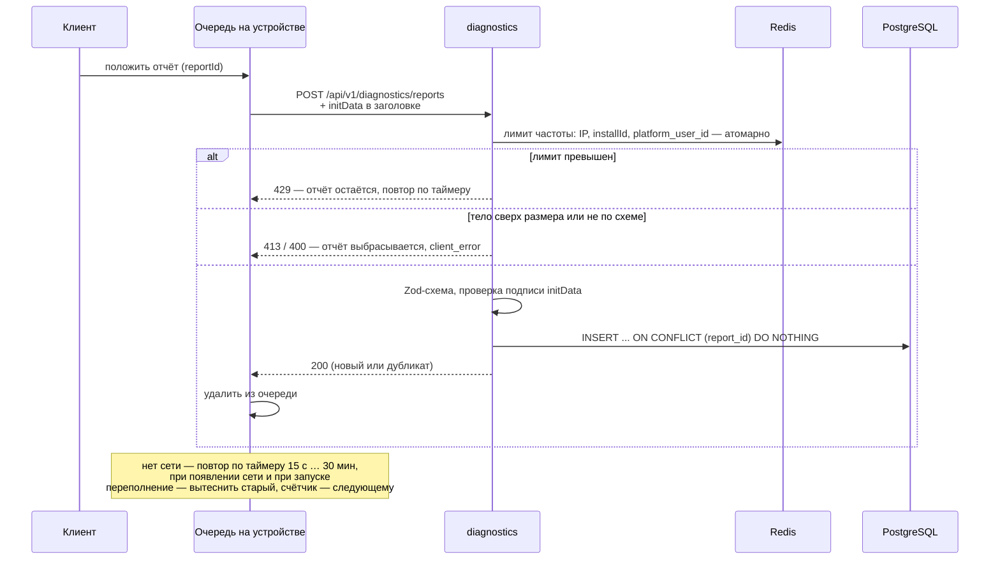
```mermaid
sequenceDiagram
    participant C as Клиент
    participant O as Очередь на устройстве
    participant D as diagnostics
    participant R as Redis
    participant DB as PostgreSQL

    C->>O: положить отчёт (reportId)
    O->>D: POST /api/v1/diagnostics/reports<br/>+ initData в заголовке
    D->>R: лимит частоты: IP, installId, platform_user_id — атомарно
    alt лимит превышен
        D-->>O: 429 — отчёт остаётся, повтор по таймеру
    else тело сверх размера или не по схеме
        D-->>O: 413 / 400 — отчёт выбрасывается, client_error
    else
        D->>D: Zod-схема, проверка подписи initData
        D->>DB: INSERT ... ON CONFLICT (report_id) DO NOTHING
        D-->>O: 200 (новый или дубликат)
        O->>O: удалить из очереди
    end
    Note over O: нет сети — повтор по таймеру 15 с … 30 мин,<br/>при появлении сети и при запуске<br/>переполнение — вытеснить старый, счётчик — следующему
```

Подпись `initData` здесь не авторизует, а только подтверждает Telegram ID
тестера; неверная подпись не отклоняет отчёт, а обнуляет ID
(`28-diagnostics.md` §5.2).

### 4.9 Выгрузка данных администратору через бота (этап 2, реализовано)

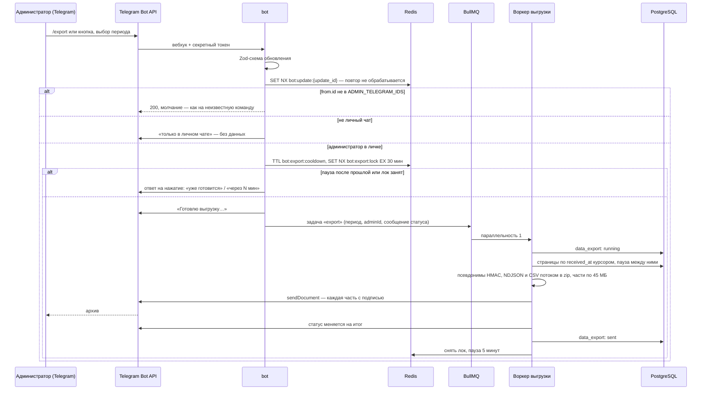
```mermaid
sequenceDiagram
    participant A as Администратор (Telegram)
    participant TG as Telegram Bot API
    participant B as bot
    participant R as Redis
    participant Q as BullMQ
    participant W as Воркер выгрузки
    participant DB as PostgreSQL

    A->>TG: /export или кнопка, выбор периода
    TG->>B: вебхук + секретный токен
    B->>B: Zod-схема обновления
    B->>R: SET NX bot:update:{update_id} — повтор не обрабатывается
    alt from.id не в ADMIN_TELEGRAM_IDS
        B-->>TG: 200, молчание — как на неизвестную команду
    else не личный чат
        B->>TG: «только в личном чате» — без данных
    else администратор в личке
        B->>R: TTL bot:export:cooldown, SET NX bot:export:lock EX 30 мин
        alt пауза после прошлой или лок занят
            B->>TG: ответ на нажатие: «уже готовится» / «через N мин»
        else
            B->>TG: «Готовлю выгрузку…»
            B->>Q: задача «export» (период, adminId, сообщение статуса)
            Q->>W: параллельность 1
            W->>DB: data_export: running
            W->>DB: страницы по received_at курсором, пауза между ними
            W->>W: псевдонимы HMAC, NDJSON и CSV потоком в zip, части по 45 МБ
            W->>TG: sendDocument — каждая часть с подписью
            TG-->>A: архив
            W->>TG: статус меняется на итог
            W->>DB: data_export: sent
            W->>R: снять лок, пауза 5 минут
        end
    end
```

Вебхук отвечает сразу, а архив собирает воркер: иначе Telegram посчитает
медленный ответ ошибкой и повторит обновление. Скрытая кнопка — не защита,
доступ проверяется на каждом обновлении (`28-diagnostics.md` §6.1).

### 4.10 Спавн в бесконечном мире (этап 2, реализовано)

Мир не кончается, поэтому у спавна нет «краёв экрана», от которых можно
отсчитывать. Вместо них — два радиуса вокруг игрока: кольцо спавна и радиус
удержания (`26-stage2-plan.md`, WP4.1–WP4.4).

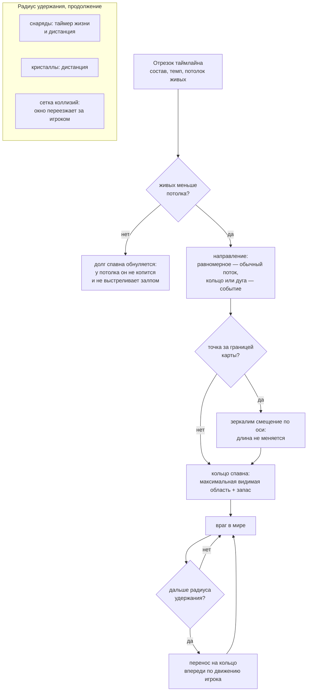
```mermaid
flowchart TD
    T["Отрезок таймлайна<br/>состав, темп, потолок живых"] --> B{"живых меньше<br/>потолка?"}
    B -- нет --> HOLD["долг спавна обнуляется:<br/>у потолка он не копится<br/>и не выстреливает залпом"]
    B -- да --> DIR["направление:<br/>равномерное — обычный поток,<br/>кольцо или дуга — событие"]
    DIR --> ARC{"точка за границей<br/>карты?"}
    ARC -- да --> MIR["зеркалим смещение по оси:<br/>длина не меняется"]
    ARC -- нет --> RING
    MIR --> RING["кольцо спавна:<br/>максимальная видимая область + запас"]
    RING --> LIVE["враг в мире"]

    LIVE --> FAR{"дальше радиуса<br/>удержания?"}
    FAR -- нет --> LIVE
    FAR -- да --> FWD["перенос на кольцо<br/>впереди по движению игрока"]
    FWD --> LIVE

    subgraph cleanup["Радиус удержания, продолжение"]
        PR["снаряды: таймер жизни<br/>и дистанция"]
        GEM["кристаллы: дистанция"]
        GRID["сетка коллизий:<br/>окно переезжает за игроком"]
    end
```

Три свойства, ради которых схема такая:

- **радиус кольца не зависит от устройства.** Он считается от максимальной
  видимой области карты — дальний масштаб на крайнем допустимом соотношении
  сторон плюс запас. Ни зум, ни поворот экрана, ни широкий монитор не
  показывают момент появления врага и не меняют спавн;
- **отставшие не копятся за спиной.** В бесконечном мире от кого угодно можно
  убежать; перенос вперёд сохраняет давление и не даёт пулу забиться теми,
  кого игрок никогда не встретит;
- **спавн никогда не попадает за границу карты.** Из кольца выбираются только
  допустимые дуги — смещение зеркалится по нарушенной оси, длина при этом не
  меняется, значит враг по-прежнему появляется за краем видимости.

### 4.11 Сохранения и лидерборд плейтеста (этап 2, заменено на этапе 3)

Временный путь закрытого теста (`26-stage2-plan.md`, Р19 и WP13) — подпись
`initData` на каждом запросе и Redis со сроком жизни — снят вместе с
переездом клиента на аккаунты (`34-stage3-plan.md`, WP4). Забеги, рейтинг и
профиль — §4.2; сводка и отчёты о запуске, оставшиеся от плейтеста, удалены
на этапе 4, а доступ к инструментам — `/api/v1/tools/access` (§4.12). Неотправленные итоги из
прежней очереди `bh.playtest.v1.pending` клиент переносит в новую при первом
запуске.

### 4.12 Ежедневная статистика в чат администраторов (этап 4, реализовано)

Сводка плейтеста — счётчики в Redis рядом с забегами и запусками — удалена
вместе с маршрутом `/api/v1/playtest/*` (`35-stage4-plan.md`, Р55): её данные
уже лежат в базе. Статистика считается агрегатами по таблицам за московские
сутки (`admin-notify/daily-stats.*`). Доступ к инструментам команды —
`GET /api/v1/tools/access` по праву `tools.dev` и настройке «Стресс-тест для
всех игроков».

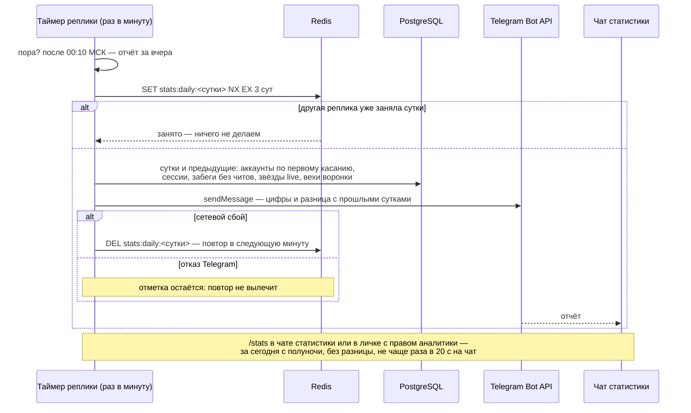
```mermaid
sequenceDiagram
    participant T as Таймер реплики (раз в минуту)
    participant R as Redis
    participant DB as PostgreSQL
    participant TG as Telegram Bot API
    participant A as Чат статистики

    T->>T: пора? после 00:10 МСК — отчёт за вчера
    T->>R: SET stats:daily:<сутки> NX EX 3 сут
    alt другая реплика уже заняла сутки
        R-->>T: занято — ничего не делаем
    else
        T->>DB: сутки и предыдущие: аккаунты по первому касанию,<br/>сессии, забеги без читов, звёзды live, вехи воронки
        T->>TG: sendMessage — цифры и разница с прошлыми сутками
        alt сетевой сбой
            T->>R: DEL stats:daily:<сутки> — повтор в следующую минуту
        else отказ Telegram
            Note over T,R: отметка остаётся: повтор не вылечит
        end
        TG-->>A: отчёт
    end
    Note over A,T: /stats в чате статистики или в личке с правом аналитики —<br/>за сегодня с полуночи, без разницы, не чаще раза в 20 с на чат
```

### 4.13 Приём событий закрытого теста (этап 2, реализовано)

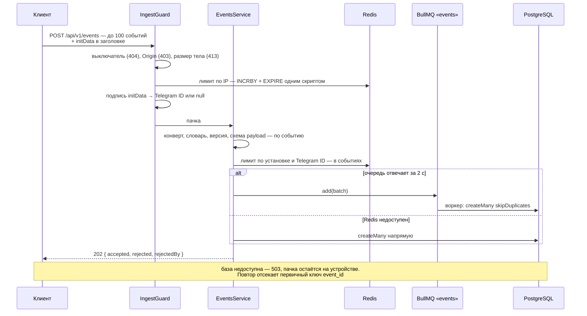
```mermaid
sequenceDiagram
    participant C as Клиент
    participant G as IngestGuard
    participant S as EventsService
    participant R as Redis
    participant Q as BullMQ «events»
    participant DB as PostgreSQL

    C->>G: POST /api/v1/events — до 100 событий<br/>+ initData в заголовке
    G->>G: выключатель (404), Origin (403), размер тела (413)
    G->>R: лимит по IP — INCRBY + EXPIRE одним скриптом
    G->>G: подпись initData → Telegram ID или null
    G->>S: пачка
    S->>S: конверт, словарь, версия, схема payload — по событию
    S->>R: лимит по установке и Telegram ID — в событиях
    alt очередь отвечает за 2 с
        S->>Q: add(batch)
        Q->>DB: воркер: createMany skipDuplicates
    else Redis недоступен
        S->>DB: createMany напрямую
    end
    S-->>C: 202 { accepted, rejected, rejectedBy }
    Note over C,DB: база недоступна — 503, пачка остаётся на устройстве.<br/>Повтор отсекает первичный ключ event_id
```

- **Redis лёг — лимит в памяти процесса** с предупреждением в лог раз в
  минуту: терять события тестеров хуже, чем на время сбоя ослабить лимит;
- **Telegram ID — только из подписи**: поле в теле события игнорируется.

### 4.14 Приветствие по /start (этап 2, реализовано)

```mermaid
sequenceDiagram
    participant U as Игрок
    participant TG as Telegram
    participant B as BotRouter
    participant S as StartCommand
    participant P as Прогресс аккаунта<br/>по Telegram ID
    participant R as Redis

    U->>TG: /start в личке
    TG->>B: вебхук или getUpdates
    B->>S: обновление
    S->>R: SET bot:start:{чат} NX EX 3 — двойное нажатие
    S->>P: рекорд, место, забеги (2 с, иначе карточка новичка)
    S->>S: язык, имя без эмодзи → ключ SHA-256
    S->>R: GET bot:card:{ключ}
    alt file_id есть
        S->>TG: sendPhoto(file_id) — без рендера и загрузки
    else нет или Telegram его забыл
        S->>S: SVG → PNG (одинаковые рендеры склеиваются)
        S->>TG: sendPhoto(PNG) + кнопка «Играть»
        TG-->>S: file_id крупнейшего размера
        S->>R: SET bot:card:{ключ} file_id EX 30 дней
    end
    TG-->>U: карточка с подписью на языке игрока
```

### 4.17 Награда за забег (этап 4, реализовано)

`35-stage4-plan.md`, WP4. Итог забега пишется синхронно, как на этапе 3, а
награда — заданием очереди: волна итогов после поста в канале не ждёт опыта и
монет.

```mermaid
sequenceDiagram
    participant C as Клиент
    participant R as runs
    participant Q as Очередь rewards
    participant P as progress
    participant W as wallet
    participant DB as Postgres

    C->>R: POST /runs — итог забега
    R->>DB: забег одной строкой, вердикт
    R-->>C: место и рекорд
    R--)Q: слушатель записанного забега — задание с ключом run_id
    Q->>P: формула награды: монеты и опыт, а забегу с читами, отклонённому или короче 30 с — ничего
    P->>DB: строка награды ON CONFLICT и прибавка опыта — одна транзакция
    P->>W: монеты run:<runId>:coins, награды за уровень level:<аккаунт>:<уровень>
    W->>DB: журнал и баланс, суточный потолок
    P->>DB: сколько легло после потолка
    C->>P: GET /progress/runs/:runId — с растущей паузой, пока не посчитано
    P-->>C: монеты, опыт, новый уровень — экран итогов и шапка
```

Повтор задания безопасен целиком: опыт держит ключ строки награды, монеты —
ключ кошелька. Упало между опытом и монетами — повтор найдёт строку и
доначислит по тому же ключу. Redis недоступен — награда считается сразу, мимо
ответа игроку.

### 4.16 Вход в бота, воронка и «можно писать» (этап 4, реализовано)

`35-stage4-plan.md`, WP2. Кто нажал `/start`, тот уже наш: аккаунт заводится
в канале площадки, до первого открытия игры.

```mermaid
sequenceDiagram
    participant U as Игрок
    participant TG as Telegram
    participant S as platforms/telegram<br/>приветствие /start
    participant A as auth
    participant H as Слушатели входа<br/>attribution, funnel, messaging
    participant DB as Postgres
    participant M as platforms/telegram<br/>обновления о разрешении

    U->>TG: t.me/<бот>?start=c-<код>
    TG->>S: /start c-<код>
    S->>A: enterChannel: имя, юзернейм, параметр
    A->>DB: аккаунт — одна вставка, аватар не затирается
    A--)H: вход с местом «канал» — без ожидания
    H->>DB: сессия и касание (очередь sessions), веха entered, «можно писать»
    S-->>U: карточка приветствия — даже если запись упала
    Note over U,DB: позже — вход в игру, забеги, оплата
    H->>DB: вехи: открыл игру, первый забег, второй, пятый, D1, D7, покупка
    U->>TG: блокирует бота
    TG->>M: my_chat_member: kicked
    M->>DB: «писать нельзя» — если событие не старше записанного
```

Вехи — дата первого раза: одна вставка с `ON CONFLICT` и `COALESCE`, и
повтор события ничего не двигает. Воронка — `count(веха)` рядом с первым
касанием: `pnpm --filter backend-api funnel:report`.

### 4.15 Покупка второго шанса за Stars (этап 3, реализовано)

```mermaid
sequenceDiagram
    participant U as Игрок
    participant C as Клиент
    participant P as payments
    participant DB as Postgres
    participant TG as Telegram
    participant B as BotRouter
    participant Q as Очередь payments

    U->>C: смерть — забег ждёт решения
    C->>P: POST /payments/continue/quote { runId, continueNo, elapsedSec }
    P->>DB: забег: чей, начат ли по часам сервера, не закончен ли
    P-->>C: priceStars — клиент только показывает
    U->>C: «Продолжить за N ⭐»
    C->>P: POST /payments/continue/invoice
    P->>DB: purchase pending — или та же, если счёт уже выставляли
    P->>TG: createInvoiceLink(XTR, payload = purchaseId)
    P-->>C: invoiceUrl
    C->>TG: openInvoice(invoiceUrl)
    TG->>B: pre_checkout_query — первой в пачке обновлений
    B->>P: чей счёт, та ли сумма, свежий ли, жив ли забег
    P->>TG: answerPreCheckoutQuery — до 10 секунд
    TG->>B: successful_payment — сообщением в личке
    B->>Q: подтверждение, jobId от id оплаты
    Q->>DB: pending → paid, telegram_charge_id UK
    C->>P: GET /payments/{id} — пока не granted
    P-->>C: granted: true
    C->>C: continueRun — продолжение выдал сервер (Р13)
```

- **Право на продолжение — по `successful_payment`, а не по ответу
  `openInvoice`** (`34-stage3-plan.md`, Р13): ответ Mini App — подсказка,
  что можно перестать ждать.
- **Подтверждение идёт через очередь**, потому что смещение опроса
  сохраняется до обработки, а вебхук отвечает сразу: упавшая запись второй
  раз не придёт. Задание в Redis повторяется, пока запись не пройдёт; Redis
  недоступен — запись сразу, не прошла и так — ошибка в лог со всеми полями
  оплаты.
- **Отказаться от денег можно только на проверке.** После
  `successful_payment` звёзды уже у нас, и дальше остаётся только возврат.
  Его сервер делает сам — через ту же очередь, с повтором: тестовая оплата
  (Р14), продолжение, которое не взяли (оплата пришла к закрытому забегу
  или забег записан без него), вторая оплата того же продолжения и оплата
  без покупки. Заказ возврата пишется в базу раньше обращения к Telegram —
  после перезапуска очередь поднимает незавершённые оттуда.

---

### 4.16 Вход в панель и действие под cookie-сессией (этап 4, реализовано)

Серверная часть панели (`35-stage4-plan.md`, WP17, часть 1). Сессия панели
— не токен игрока: cookie `HttpOnly; SameSite=Strict` только на маршруты
панели, в Redis — хэш токена и срок без продления. Права — тем же гвардом,
что у игры: гвард панели кладёт в запрос тот же `account`.

```mermaid
sequenceDiagram
    participant B as Браузер панели
    participant AD as admin
    participant RO as roles
    participant DB as PostgreSQL
    participant R as Redis

    B->>AD: POST /api/v1/admin/session/dev { devUser }
    AD->>AD: панель включена? флаг разработчика?<br/>лимит по адресу
    AD->>DB: найти или завести аккаунт
    AD->>RO: роли аккаунта — по базе, не из cookie
    alt ролей нет или аккаунт заблокирован
        AD-->>B: 403
    else
        AD->>R: SET admin:session:<sha256> EX ttl,<br/>SADD admin:sessions:<аккаунт>
        AD->>DB: аудит admin.login
        AD-->>B: Set-Cookie HttpOnly SameSite=Strict<br/>Path=/api/v1/admin, роли и права
    end

    Note over B,AD: любой запрос панели — cookie, изменяющий — ещё и X-Requested-With: rubezh-admin
    B->>AD: POST /api/v1/admin/players/:id/ban { reason }
    AD->>R: GET admin:session:<sha256>
    alt сессии нет или истекла
        AD-->>B: 401
    else
        AD->>DB: аккаунт жив, роли всё ещё есть
        AD->>RO: право players.ban
        AD->>DB: блокировка, аудит было → стало
        AD->>R: отозвать сессии игры и панели игрока
        AD-->>B: 201 { account, revokedSessions }
    end
```

Отзыв роли и блокировка действуют сразу: роли перечитываются на каждом
запросе, а сессии панели отзываются в тот же момент. Без входа — не
задан `JWT_ACCESS_SECRET` — панель отвечает 404 на всё, включая вход.

**Вход через бота** — на проде единственный (`29-admin-panel.md` §8). Выше
показан вход разработчика; через бота до выдачи cookie путь другой:

```mermaid
sequenceDiagram
    participant B as Браузер панели
    participant AD as admin
    participant R as Redis
    participant BOT as бот Telegram
    participant A as Администратор

    B->>AD: POST /api/v1/admin/session/bot
    AD->>R: HSET admin:panel-login:<запрос><br/>хэш секрета, код, браузер, сеть, EX 300
    AD-->>B: запрос, секрет, код, t.me/<бот>?start=panel-<запрос>
    B->>A: код на экране и «Открыть бота»
    A->>BOT: /start panel-<запрос> (личка)
    BOT->>AD: запрос ещё ждёт?
    BOT->>A: код, браузер, сеть — «Войти» / «Это не я»
    A->>BOT: «Войти»
    BOT->>AD: подтвердить — от Telegram ID нажавшего
    AD->>AD: аккаунт, роли, блокировка
    AD->>R: ждущий → подтверждён (Lua, один раз)
    loop раз в 2 секунды, до 5 минут
        B->>AD: POST .../bot/poll { запрос, секрет }
        AD->>R: подтверждён? — забрать и удалить (Lua)
    end
    AD->>R: SET admin:session:<sha256>
    AD-->>B: Set-Cookie сессии, роли и права
```

### 4.18 Рассылка из панели (этап 4, реализовано)

Базовые рассылки (`35-stage4-plan.md`, WP17; `29-admin-panel.md` §7). Одна
и та же функция условия считает аудиторию в панели и набирает получателей
на старте, поэтому оценка и отправка не расходятся. Темп общий на все
рассылки и реплики: лимитер очереди живёт в Redis.

```mermaid
sequenceDiagram
    participant P as Панель
    participant BC as broadcasts
    participant DB as PostgreSQL
    participant Q as Очередь (Redis)
    participant M as Порт Messengers
    participant TG as Telegram Bot API

    P->>BC: POST /admin/broadcasts/:id/start
    BC->>DB: count(сегмент): можно писать, не заблокирован
    alt аудитория больше порога и нет чужого одобрения
        BC-->>P: 403 approval_required
    else
        BC->>DB: черновик → sending, INSERT доставок ON CONFLICT DO NOTHING
        BC->>DB: аудит broadcast.start
        BC->>Q: задание-пачка
        BC-->>P: { audience }
    end

    loop пачка: темп площадки × batchSec, одна за batchSec на всю очередь
        Q->>BC: задание
        BC->>DB: рассылка всё ещё sending?
        BC->>DB: взять получателей: срок захвата, SKIP LOCKED
        BC->>M: send(игрок, текст, кнопка /r/<код>)
        M->>TG: sendMessage
        alt доставлено
            BC->>DB: sent, sent_at
        else 403 или нет чата
            BC->>DB: blocked, «можно писать» — нет
        else 429 или сбой сети
            BC->>DB: отсрочка, остаток пачки отпущен
            BC->>Q: следующая пачка через retry_after
        end
    end
    BC->>DB: очередь пуста — done
```

Пауза и отмена видны со следующей пачки — через несколько секунд. После
перезапуска идущие рассылки поднимаются сами; лишнее задание безопасно:
одну строку два задания не возьмут.

### 4.19 Выход версии: журнал обновлений и уведомление (этап 4, реализовано)

Журнал обновлений (`35-stage4-plan.md`, Р61, WP31). Публикация отвечает
панели сразу; раздачу ведёт проход под распределённым локом — таймером раз в
минуту и толчком от публикации. Курсор и поколение раздачи — в строке
`changelog_release`, поэтому перезапуск продолжает с места, а публикация
посреди прохода начинает раздачу заново, и старый проход её курсор не
перепишет.

```mermaid
sequenceDiagram
    participant P as Панель
    participant CL as changelog
    participant DB as PostgreSQL
    participant F as Раздача (под локом)
    participant N as notifications
    participant B as notifications-bot

    P->>CL: POST /admin/changelog/publish { version }
    CL->>DB: черновики версии → published_at
    CL->>DB: раздача версии: площадки строк, поколение, курсор с начала
    CL->>DB: аудит changelog.publish
    CL-->>P: { published, release }
    CL-)F: толчок

    loop пачка по 500, не больше 40 за проход
        F->>DB: аккаунты площадок после курсора: не заблокирован, заходил за 90 дней
        F->>N: deliverMany(app_update, ключ app_update:<версия>)
        N->>DB: INSERT … ON CONFLICT DO NOTHING RETURNING
        N-)B: новые строки: дубль в бота по выбору игрока
        F->>DB: курсор — только своего поколения, пачка неполная — done
    end
```

Игрок спрашивает `GET /api/v1/changelog` — строки своей площадки по версиям
из памяти реплики, открыл журнал — `POST /api/v1/changelog/seen` с самой
поздней публикацией из ответа; знак меню — версии, вышедшие после.

### 4.20 Конверсии закупленной рекламы (этап 4, реализовано)

Трекинг закупок (`35-stage4-plan.md`, Р86, WP43). Ссылка сети отдаёт адрес
с макросами, переходник сохраняет подставленное сетью на клике, а
регистрация и покупки новичка уходят в кабинет сети. Конверсии выводятся из
фактов проходом раз в минуту — ни забег, ни оплата о сети не знают.

```mermaid
sequenceDiagram
    participant AG as AdsGram
    participant U as Пользователь
    participant L as links (/r/:код)
    participant DB as PostgreSQL
    participant C as ad-conversions (под локом)
    participant S as secrets

    AG-->>U: реклама: /r/<код>?campaign=…&record=…
    U->>L: клик
    L--)DB: link_click + network_params (белый список профиля сети)
    L-->>U: запуск игры с c-<клик>
    Note over U,DB: вход: acquisition.first_start_ref = клик, аккаунт создан после клика

    loop раз в минуту
        C->>DB: дописать регистрации: первый забег от 30 с за 7 суток или первый запуск
        C->>DB: дописать покупки: live, оплачена, без возврата, отлежалась 10 минут, за 30 суток
        Note right of DB: ON CONFLICT DO NOTHING — повтор не задваивает
        C->>DB: созревшие pending, до 100
        C->>S: токен конверсий
        alt токена нет
            C->>DB: ждёт, причина no_token, проверка через 5 минут
        else нет record и campaign
            C->>DB: skipped, причина no_macros
        else
            C->>AG: confirm_conversion?token&record&goaltype (или tgid и campaignid)
            alt 2xx
                C->>DB: sent
            else 408, 429, 5xx, таймаут
                C->>DB: повтор через 1, 5, 15, 60 минут … до суток
            else отказ по сути
                C->>DB: failed — повторить можно из панели
            end
        end
        C->>DB: макросы кликов старше 31 суток → NULL
    end
```

Токен в логи не попадает: адрес постбэка пишется с `token=***`. Аккаунты
команды пишутся пропущенными (`team`) — их отправляют руками, чтобы
проверить связку с кабинетом.

---

## 5. Топология развёртывания

```mermaid
flowchart TB
    subgraph dev["Локальная разработка"]
        DV["Vite dev-серверы<br/>5173 / 5174 / 5175"]
        DA["API :4000"]
        DPG[("Postgres<br/>127.0.0.1:5432")]
        DR[("Redis<br/>127.0.0.1:6379")]
        DV --> DA
        DA --> DPG
        DA --> DR
    end

    subgraph vps["VPS 2 vCPU / 4 ГБ — только production"]
        CAD["Caddy :80 / :443<br/>единственный вход, TLS через DNS Bunny"]
        STAT["статика по версиям<br/>/srv/rubezh/web/*/current"]
        PAPI["API + воркеры BullMQ<br/>порт не публикуется"]
        PPG[("Postgres")]
        PR[("Redis")]
        FRPS["frps<br/>туннели разработчиков"]
        BAK["backup.sh раз в сутки<br/>дамп → age ключом владельца"]
        SPOOL[("очередь журнала<br/>том wal-spool")]
        PITR["контейнер backup<br/>журнал раз в минуту, база и зеркало<br/>раз в сутки → age двумя ключами"]
        WATCH["backup-watch.sh<br/>раз в 10 минут"]

        CAD --> STAT
        CAD --> PAPI
        CAD --> FRPS
        PAPI --> PPG
        PAPI --> PR
        BAK -.дамп.-> PPG
        PPG -.archive_command.-> SPOOL
        SPOOL --> PITR
        PITR -.базовая копия.-> PPG
        WATCH -.здоровье.-> PITR
    end

    S3[("Bunny Storage, S3<br/>база, журнал, зеркало репозитория<br/>14 дней")]
    GH["GitHub<br/>репозиторий"]

    TGP["tgrasp.ru<br/>прокси Bot API"]
    TG["Telegram Bot API"]
    DEVM["машина разработчика<br/>frpc"]
    PLAYER(("Игрок"))
    OWNER(("Владелец"))

    PLAYER --> CAD
    DEVM -.WebSocket.-> CAD
    PAPI -.long polling и отправка.-> TGP
    TGP --> TG
    BAK -.документ в личку бота.-> TGP
    TG -.бэкап.-> OWNER
    PITR --> S3
    GH -.git clone --mirror.-> PITR
    WATCH -.тревога в чат админов.-> TGP
    OWNER -.восстановление своим ключом.-> S3
```

Порты, смещения staging и правила публикации — `20-env-and-ports.md` §2.

**Прод с 26.09.2026** — свой VPS целиком наш, стек `infra/prod` (`09-ci-cd.md`
§10): свой Caddy в compose, статика каталогами версий, наружу — только Caddy.
Staging появится, когда сервер вырастет (`20-env-and-ports.md` §6); CDN Bunny
встанет перед статикой к публичному лончу. Из российской сети Bot API
недоступен в обе стороны, поэтому бот ходит через прокси `tgrasp.ru` и
забирает обновления long polling'ом, а не вебхуком (`20-env-and-ports.md`
§5.2). Бэкапов два, независимых: дамп владельцу в бота и бэкап на момент
времени в Bunny Storage вне сервера — включается, когда задана зона
(`20-env-and-ports.md` §5.4). Grafana и Prometheus — техническая часть, появляется на этапе 5;
продуктовая аналитика — в админ-панели (`29-admin-panel.md`).
Этапы, на которых эта топология меняется при росте нагрузки, — 
`14-scalability.md` §3.
