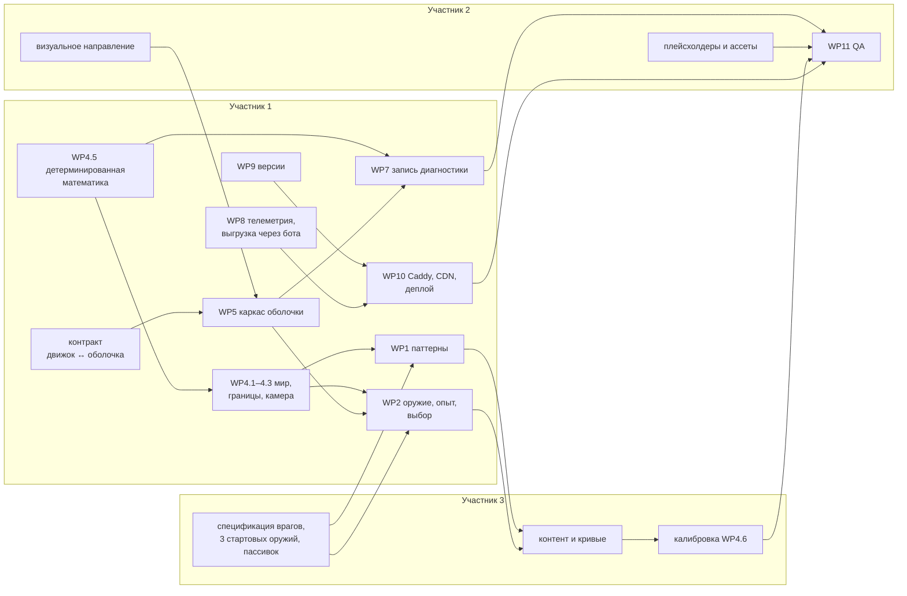

# Этап 2 — игровой цикл, оболочка приложения и закрытый тест

Подробный план этапа 2 роадмапа (`02-roadmap.md`). Роадмап отвечает на вопрос
«что входит в этап», этот документ — «как именно делаем, в каком порядке, кто
и по какому критерию считаем сделанным».

**Итог этапа — релиз в прод версии для закрытого технического теста.** Без
авторизации, без платежей, без лидербордов: тестеры открывают бота, играют
бесконечный режим, ходят по разделам приложения, а мы получаем стартовую
статистику по забегам, интерфейсу и нагрузке на устройства. Авторизация —
следующий этап (`02-roadmap.md`, этап 3).

**Задача игрока** — бегать, прокачиваться и выжить как можно дольше.
Ориентир по механике — Vampire Survivors, адаптированный под мобильный
мессенджер: короткие сессии, управление одним пальцем, любая ориентация
экрана.

**Оценка: 10–14 рабочих дней** при работе троих параллельно. Первая версия
плана давала 8–12; после принятых решений в этап вошли система оружия и
опыта, бесконечный мир с динамической камерой, любая ориентация экрана и
CDN. Работа, которую не ускорить агентом, — визуальные решения, ассеты,
ручное QA на устройствах — осталась той же. Оценка пересматривается на
контрольной точке M1 (§5).

Смежные документы этапа:

- `27-design-system-and-app-shell.md` — дизайн-система, архитектура
  React-оболочки, карта экранов, fullscreen и ориентации;
- `28-diagnostics.md` — режим диагностики, тесты производительности в
  приложении, запись и повтор забега, приёмник отчётов;
- `29-admin-panel.md` — админ-панель; на этапе 2 её нет, но выгрузка данных
  закрытого теста проектируется с оглядкой на неё.

---

## 1. Скоуп

### 1.1 Входит

| # | Что | Пакет работ |
|---|---|---|
| 1 | 5–7 типов врагов с разными паттернами движения | WP1 |
| 2 | Постоянная атака персонажа; вид атаки задаётся стартовым оружием и улучшениями, взятыми в забеге | WP2 |
| 3 | Опыт и уровни в забеге; выбор улучшения при наборе уровня | WP2 |
| 4 | Экран смерти со статистикой забега | WP3 |
| 5 | Бесконечный мир с необязательными границами карты, спавн за видимой областью, динамическая камера | WP4 |
| 6 | Базовый баланс: кривая сложности и кривая опыта | WP4 |
| 7 | Бесконечный режим на одной карте — единственный режим на старте | WP4 |
| 8 | Дизайн-система и первый UI приложения: адаптивный под любую ориентацию, с выбором полноэкранного или обычного режима; все разделы — визуальные заглушки | WP5 |
| 9 | Включаемый режим диагностики с кнопкой запуска тестов | WP6 |
| 10 | Включаемая запись диагностики забега | WP7 |
| — | Телеметрия закрытого теста и выгрузка данных для анализа — кнопкой в боте, только администратору | WP8 |
| — | Версия при мердже по типу изменений, указанному в PR | WP9 |
| — | Прод на существующем Caddy, поддомены, CDN | WP10 |
| — | Ручное QA на устройствах, включая **iOS** (долг этапа 1) | WP11 |

### 1.2 Сознательно не входит

| Что | Куда | Почему |
|---|---|---|
| Авторизация, JWT, профиль на сервере | Этап 3 | Закрытый тест — без авторизации |
| Платежи Stars, континью | Этап 3 | Нечего продавать до проверки геймплея. На экране смерти — заглушка «Второй шанс» (`07-monetization-and-ads.md` §8) |
| Лидерборды, шеринг, рефералка, реклама | Этап 4 | Требуют авторизации |
| Кампания | После лонча | На старте только бесконечный режим (`10-progression-and-ladder.md` §3) |
| Мета-прогрессия, забег-валюта | Этапы 4–5 | Разделы есть в UI, но только заглушками — включая награду дня, колесо удачи, задания и достижения (`05-game-design.md` §3) |
| Вторая и следующие карты | Сильно позже | Решение Р8: сейчас важны механики и работа приложения в целом |
| Эволюции оружия, перебросить / пропустить / исключить предложение | После данных закрытого теста | Движок не должен закрывать эту возможность, но строить её до данных о базовой прокачке — угадывание |
| Админ-панель | Этап 4 | `29-admin-panel.md` §9 |
| Grafana и дашборды | Этап 5 (Grafana — только техническая) | Решение Р11: выгрузка и разбор ИИ-агентом |
| Английская локализация | Этап 4 | Строки сразу через ключи i18n, набор — только `ru` (`01-tech-stack.md` §7) |
| Sentry / GlitchTip | Этап 5 | Для закрытого теста хватает события `client_error` в своём конвейере |
| Звук и музыка | По готовности ассетов | Переключатели в настройках есть; нет ассетов — заглушка |

---

## 2. Решения

### 2.1 Принятые

| # | Вопрос | Решение |
|---|---|---|
| Р1 | Стек оболочки | **React 19 + Vite, Tailwind CSS 4, Zustand** (`27-design-system-and-app-shell.md` §1) |
| Р2 | Что вызывает выбор улучшения | **Набор уровня за опыт.** Ориентир — Vampire Survivors, адаптированный под нас (WP2) |
| Р3 | Мир и камера | **Бесконечный мир**; границы по ширине и/или высоте — особенность конкретной карты. Враги спавнятся на расстоянии от персонажа за видимой областью и никогда за границей карты. **Динамическая камера**: стоит — ближе, идёт — дальше, переход плавный (WP4) |
| Р4 | Частота отрисовки | **60 FPS для всех устройств** (`16-tech-stack-decisions.md` §9.1) |
| Р5 | Ориентация | **Любая**, без блокировки; интерфейс полностью адаптивен под обе (`27-design-system-and-app-shell.md` §5) |
| Р6 | Идентификация тестера | **`installId` + Telegram ID** с проверкой подписи `initData`, без сессий (`28-diagnostics.md` §5.2) |
| Р7 | Версионирование | **Тип изменения объявляется в PR меткой**, версия вычисляется при мердже в `main`, позже и в `dev` (`09-ci-cd.md` §8.1) |
| Р8 | Карты | **Одна карта**; остальные — сильно позже |
| Р9 | Бэкенд до первого прода | **Сразу на целевом стеке**: NestJS 11, Fastify, Prisma 7, Zod 4. **Точные версии везде** — бэкенд, клиент, корень монорепо, базовые Docker-образы, actions (WP8, WP10) |
| Р10 | Раздача статики | **CDN с первого релиза**; origin — VPS с уже работающим инстансом Caddy; отдельные поддомены (WP10) |
| Р11 | Аналитика закрытого теста | **Без Grafana.** Выгрузка собранных данных и разбор ИИ-агентом; выгрузка приходит администратору в Telegram по кнопке в боте (WP8) |
| Р12 | Стартовое оружие | **3 оружия с выбором перед забегом**, последний выбор запоминается |
| Р13 | Слоты и потолки прокачки | **3 оружия; пассивки по категориям: атака — 2 слота, защита — 1, подвижность — 1.** Пересмотрено после первых плейтестов: при 4 + 4 общих слотах к десятой минуте игрок собирал почти всё, и выбирать становилось нечего; категории превращают выбор в «чем жертвую». У Vampire Survivors 6 + 6, но на экране телефона 12 иконок в HUD и 12 вариантов в пуле делают выбор нечитаемым |
| Р14 | Видимая область при любой ориентации | **Нормализация по площади** с ограничением соотношения сторон: портрет и ландшафт видят одинаковый объём мира разной формы |
| Р15 | Режим экрана по умолчанию | **Полноэкранный на телефонах и планшетах, обычный в Telegram Desktop**; игрок меняет в настройках |
| Р16 | Существующий Caddy | **Работает в Docker.** Наши сервисы подключаются к его внешней Docker-сети, порты API наружу не публикуются (WP10) |
| Р17 | CDN | **Bunny.net.** Доступность с мобильных операторов в РФ и из-за рубежа проверяется до приглашения тестеров — это критерий приёмки WP10, план Б остаётся |
| Р18 | Уровни сложности | **Три: «Лёгкая», «Нормальная», «Сложная»**, выбор перед забегом вместе с оружием, по умолчанию «Нормальная». Добавлено после первых плейтестов: откалиброванный ботом баланс людям показался слишком лёгким. «Лёгкая» — этот баланс без поправок, остальные умножают здоровье и урон врагов, темп спавна и потолок живых (`content/difficulty.ts`). Рекорд, итог забега и лидерборд — по каждой сложности отдельно |
| Р19 | Бэкенд первого плейтеста | **Машина разработчика через туннель**: клиент ходит в API по относительному `/api`, dev-сервер Vite проксирует его на локальный бэкенд, сохранения и лидерборд — в Redis. Прод-инфраструктура WP10 для плейтеста не нужна; данные плейтеста не переносятся |

### 2.2 Открытые

Открытых решений, блокирующих старт, нет. Новые вопросы по ходу этапа
добавляются сюда, а не решаются молча в PR (`06-team-and-workflow.md` §1.1).

---

## 3. Пакеты работ

Формат каждого пакета: цель, задачи, владелец, зависимости, критерий приёмки,
тесты, аналитика. Раздел «Аналитика» — обязательный (`CLAUDE.md`,
«Аналитика — сквозное требование»).

### WP1. Враги и паттерны движения

**Цель:** 5–7 типов врагов, которые требуют от игрока разной реакции, а не
отличаются числами.

**Предложение геймдизайнеру** (утверждается в `05-game-design.md` §4 до начала
кода — это его документ, план только предлагает):

| Тип | Паттерн | Статус | Чем отличается для игрока |
|---|---|---|---|
| Рой | `swarm` | есть | Много слабых, заставляют искать позицию |
| Танк | `chase` | есть | Медленный с инерцией, наказывает стояние на месте |
| Стрелок | `kite_and_shoot` | есть | Держит дистанцию, ломает тактику «стой и бей» |
| Рывок | `dash` | новый | Сближается, **телеграфирует** 0.5–0.8 с, делает рывок по прямой — учит уклоняться вбок |
| Кружащий | `orbit` | новый | Ходит кольцом вокруг игрока, сужая радиус, — отрезает пути отхода |
| Подрывник | `exploder` | новый | Подбегает, мигает, взрывается по площади с задержкой — урон зоной, а не касанием |
| Делящийся | `splitter` | новый | При смерти распадается на 2–3 роевых — наказывает урон без позиции |

Мини-босс — **не отдельный паттерн, а модификатор в таймлайне спавна**
(`elite`: множители HP, размера, урона и опыта к любому типу). Это данные,
геймдизайнер ставит его сам.

**Задачи** (участник 1, кроме отмеченных):

- [ ] Спецификация четырёх новых паттернов: что делает, как телеграфирует,
      какие параметры хочет крутить (участник 3). Реализация сделана по
      предложению из таблицы выше с параметрами, вынесенными в контент, —
      спецификация правит числа и умолчания, а не код
- [x] Возможности паттерна — данными, а не проверкой имени: таблица
      `PATTERN_TRAITS` (`contactDamage`, радиус) в
      `game/patterns/enemy-types.ts`
      (`15-engineering-standards.md` §1, принцип 4)
- [x] Параметры паттернов, которые крутит геймдизайнер, — необязательные
      `params` в `EnemyDef`, свои у каждого паттерна (TypeScript не пропустит
      чужой параметр), умолчания в движке, проверка — одним валидатором в
      тесте контента и при создании мира
- [ ] Ценность опыта врага — поле `EnemyDef`. **Перенесено в WP2**: без
      системы опыта поле никто не читает, а неиспользуемые данные в контенте
      — обещание, которое никто не проверяет
- [x] Реализация `dash`, `orbit`, `exploder`, `splitter` в `game/patterns/`,
      каждый паттерн — своим файлом
- [x] Состояние паттерна (фаза, таймер фазы, зафиксированное направление,
      радиус кольца) — в SoA-пулах (`sim/pools.ts`), без объектов на врага
- [x] `splitter` спавнит через общий `spawnEnemy` с учётом ёмкости пула;
      при исчерпании пула детерминированно не спавнит
- [ ] Паттерны не выводят врагов за границы карты — **в WP4.2**, вместе с
      самими границами
- [x] Эффект взрыва — событие симуляции в кольцевом буфере (`sim/events.ts`),
      рендер рисует его сам
- [x] Визуал врагов и телеграфов: плейсхолдеры разной формы и цвета,
      мигание рывка и фитиля с разным ритмом (`render/shapes.ts`). Финальные
      ассеты — участник 2
- [x] Типы в `content/enemies.ts` и первые волны с ними — стартовые числа до
      спецификации; дальше правит участник 3 скиллом `add-content`
- [x] Из WP4.5 — минимум, без которого новые паттерны пришлось бы
      переписывать: `Math.hypot` заменён на `Math.sqrt` во всей симуляции и
      запрещён тестом чистоты, новые паттерны написаны без тригонометрии.
      Тригонометрия спавнера остаётся до WP4.5

**Зависимости:** WP4.1 (бесконечный мир меняет сетку и координаты), WP4.5
(детерминированная математика). Паттерны зависят только от позиции игрока и
собственного состояния, поэтому WP1 сделан раньше мира без переделки в WP4.1.

**Критерий приёмки:** каждый тип визуально и поведенчески отличим без
подписи; геймдизайнер меняет скорость, HP, опыт и параметры паттерна без
правки `game/*`.

**Тесты** (`17-testing-strategy.md` §3): поведенческие тесты паттернов в
`enemy-patterns.test.ts`; `sim-purity.test.ts` проверяет, что каждый файл
паттерна попал под проверку; тест контента на границы и принадлежность
параметров; `determinism.test.ts` и `perf-budget.test.ts` на смешанной
популяции со всеми паттернами.

**Аналитика:** `run_finished.payload.killsByEnemy`,
`run_finished.payload.deathCause` — какой враг чаще всего убивает. Счётчики
уже собирает симуляция (`stats.killsByType`, `stats.deathCauseType`, владелец
вражеского снаряда); в событие они попадут вместе с `run_finished` (WP3, WP8).

### WP2. Оружие, опыт и улучшения

**Цель:** персонаж атакует постоянно; то, **как** он атакует, определяют
стартовое оружие и улучшения, собранные за забег. Забег — это
последовательность маленьких решений «что взять на этом уровне».

Сейчас атака одна и зашита в `step.ts` (`playerAutoAttack`: снаряд в
ближайшего врага), а `UpgradeDef` — имя, описание и `maxStacks` без эффекта.

#### Модель

| Понятие | Что это | Где живёт |
|---|---|---|
| **Оружие** | Поведение атаки + таблица уровней с числами (урон, перезарядка, количество снарядов, пробивание, область, длительность, скорость) | Поведение — код `game/weapons/*`; оружие и уровни — данные `content/weapons.ts` |
| **Пассивное улучшение** | Модификатор характеристики на уровнях: урон, перезарядка, область, скорость снарядов, длительность, количество снарядов, скорость движения, макс. HP, регенерация, радиус подбора, броня | Данные `content/upgrades.ts`, применение — код |
| **Опыт** | Кристаллы, которые оставляют враги; подбираются в радиусе притяжения | Ценность — `enemies.ts`; кривая опыта на уровень — `upgrades.ts` |
| **Слоты** | Сколько оружий и пассивок одновременно (Р13) | Данные |

Поведения оружия на MVP — предложение, итог решает геймдизайнер:

| Поведение | Как атакует | Похоже на |
|---|---|---|
| `projectile_nearest` | Снаряд в ближайшего врага — текущая атака | Волшебная палочка |
| `projectile_facing` | Снаряды в направлении движения | Нож |
| `orbit` | Предметы вращаются вокруг игрока | Библия |
| `aura` | Постоянная зона урона вокруг | Чеснок |
| `area_strike` | Удар по площади в точке рядом с врагом | Молния |

**Правило поведения оружия то же, что у паттерна врага:** новое поведение —
код участника 1, новое оружие на существующем поведении и все числа —
данные геймдизайнера (`01-tech-stack.md` §9).

#### Выбор при наборе уровня

- Уровень набран — симуляция останавливается, игрок выбирает **одно из трёх**:
  новое оружие (если есть свободный слот), следующий уровень имеющегося
  оружия, новая пассивка, следующий уровень пассивки.
- Всё собрано и прокачано до потолка — вместо выбора лечение (золота на
  этапе 2 нет).
- Несколько уровней подряд — очередь выборов, по одному экрану на уровень.
- Предложения — через seeded-генератор мира, с весами из контента; никогда
  не предлагается недоступное.
- **Выбор — часть лога ввода**: `(tick, optionId)`. Иначе забег не
  воспроизводится, а golden-прогоны и повтор забега из диагностики теряют
  смысл (`28-diagnostics.md` §3.4).
- Пауза детерминированная: мир не делает шагов, накопитель времени рендера
  сбрасывается — после выбора нет «догоняющих» шагов.
- Защита от случайного тапа: первые 300–400 мс после появления экрана
  нажатия не принимаются — палец в этот момент ещё на джойстике.

**Задачи:**

- [ ] Спецификация трёх стартовых оружий, пула оружий и пассивок под слоты
      4 + 4, кривой опыта (участник 3). Реализовано по предложению из таблиц
      выше со стартовыми числами — спецификация правит данные, не код
- [x] Модель `WeaponDef`, пассивок и эффектов в `shared-types`
- [x] Перевод текущей атаки в оружие `projectile_nearest`: первый уровень
      `spark` повторяет прежние числа (урон 6, перезарядка 0.28, скорость
      снаряда 520), поведение не изменилось. Golden-эталонов пока нет —
      сравнивать не с чем, они появятся с калибровкой (WP4.6)
- [x] Поведения оружия в `game/weapons/*`: снаряд в ближайшего, снаряды по
      направлению, обереги на кольце, аура, удар по площади
- [x] Пул кристаллов опыта — SoA, как враги и снаряды; радиус притяжения;
      слияние при переполнении пула, суммарный опыт не теряется
- [x] Кривая опыта, очередь уровней, генерация предложений, применение
      выбора; пока игрок выбирает, мир не делает шагов
- [ ] Экран выбора — React-оверлей над остановленной канвой
      (`27-design-system-and-app-shell.md` §3). **В WP5**: сейчас в сцене
      временный экран на канве (цифры 1–3 или тап по трети экрана), чтобы
      забег был играбельным целиком
- [ ] Экран выбора стартового оружия перед забегом, последний выбор
      запоминается. **В WP5**: движок уже принимает `startingWeaponId`
- [x] Тексты оружий и улучшений — ключами i18n; словарь подключается вместе
      с оболочкой (WP5)
- [ ] Иконки оружий и пассивок: плейсхолдеры, затем ассеты (участник 2)
- [x] Прокачка выключается конфигурацией: стенд испытаний меряет постоянную
      нагрузку, а не растущую силу игрока

**Зависимости:** WP5 (карточки и оверлей); контракт «движок ↔ оболочка»
(`27-design-system-and-app-shell.md` §3.1).

**Критерий приёмки:** два забега с разным стартовым оружием и разными
выборами ощущаются по-разному; рестарт с тем же seed и тем же логом ввода
даёт тот же результат.

**Тесты:** уровни не превышают потолок, слоты не переполняются; модификатор
`mul` не уходит в ноль и в отрицательные значения; предложения не содержат
недоступного; слияние кристаллов сохраняет суммарный опыт; кривая опыта
монотонна; одинаковый seed — одинаковые предложения; тест контента: каждое
`behavior` реализовано; golden-сценарии «билд на урон» и «билд на
выживание» с зафиксированными выборами.

**Аналитика:** `run_started.payload.startingWeapon`; `upgrade_offered` (уровень
и все варианты) и `upgrade_chosen`. Без событий предложений частота выбора не
считается: «взяли 5 раз» ничего не значит, пока неизвестно, сколько раз
предлагали.

### WP3. Экран смерти и статистика забега

**Цель:** игрок понимает, почему умер и что было в забеге, и в один тап
начинает следующий.

**Главный показатель — время выживания** (Р2: задача игрока — выжить как
можно дольше). Он же станет метрикой лидерборда бесконечного режима на
этапе 4.

Статистика (расширение `RunStats`, участник 1):

- время выживания, достигнутый уровень, собранный опыт;
- убито всего и по типам врагов;
- **урон по каждому оружию** — главный вход геймдизайнера для баланса оружий;
- полученный урон и причина смерти;
- оружие и пассивки с уровнями;
- пройденное расстояние — в бесконечном мире это показатель стиля игры;
- пиковое число врагов на экране;
- локальный лучший результат и отметка «новый рекорд».

**Задачи:**

- [x] Сбор статистики в симуляции — счётчиками в `World`, без аллокаций в кадре.
      Итог собирается один раз в конце забега — `buildRunResult`, тип
      `RunResult` в `shared-types`
- [ ] Экран смерти (React): итоги, оружие с уроном, кнопки «Ещё раз» и «В меню»;
      «Поделиться» — видимая заглушка «скоро». **В WP5**: сейчас временный
      экран на канве (`game/overlays/*`) с теми же данными и кнопками, чтобы
      забег можно было закончить и начать заново
- [x] «Ещё раз» не перезагружает Phaser: новая сцена в загруженном движке,
      новый seed, то же стартовое оружие
- [x] В режиме диагностики на экране смерти виден seed и `runId`. Включается
      временно параметром `?diag=1`; постоянный переключатель — в настройках
      оболочки (`28-diagnostics.md` §2.1, WP5–WP6)
- [x] Локальный рекорд — в хранилище устройства
      (`27-design-system-and-app-shell.md` §7). Порт `KeyValueStorage` в
      `shared-types`, реализация поверх `localStorage` — в Telegram-адаптере;
      MAX и VK получат её вместе с самими адаптерами
- [x] Экран паузы: продолжить, звук и вибрация, сдаться с подтверждением.
      Автопауза при сворачивании. Звук и вибрация — заглушка с ответом:
      настроек до оболочки нет (WP5)

**Критерий приёмки:** от смерти до старта нового забега — один тап и меньше
секунды на бюджетном Android.

**Тесты:** статистика на golden-сценарии совпадает с эталоном; сумма урона
по оружиям равна общему нанесённому урону; сдача забега даёт
`run_abandoned`, а не `run_finished`.

**Аналитика:** `run_finished` (статистика + сводка производительности,
`28-diagnostics.md` §3.2), `run_abandoned`, `run_paused`. Движок отдаёт
`RunResult` и причину паузы обратными вызовами `onRunEnd` / `onRunPaused`;
отправка — за оболочкой (WP5, WP8), движок о сети не знает.

### WP4. Мир, камера, спавн и кривая сложности

**Цель:** мир без конца, в котором сложность растёт, новичок в среднем
доживает до целевого коридора, а пассивный игрок гарантированно умирает.

#### WP4.1 Бесконечный мир (участник 1)

Сейчас мир равен размеру канвы, игрок зажат в его границах, а сетка
коллизий построена под этот размер.

- [x] Координаты без границ. Позиции в пулах — **`Float64Array`**: за
      десятиминутный забег игрок уходит на сотню тысяч единиц от старта, и
      точность `Float32` там падает до сотых единицы и дальше растёт. Цена —
      килобайты памяти пулов
- [x] Сетка коллизий вокруг игрока, а не под размер мира: хеш-сетка или
      сетка, перестраиваемая относительно позиции игрока
- [x] Враги дальше радиуса удержания не копятся позади: переносятся на
      кольцо спавна **впереди** по направлению движения. Давление
      сохраняется, пул не забивается потерянными врагами. Детерминированно
- [x] Снаряды и кристаллы вне радиуса — по времени жизни и дистанции
- [x] Фон — повторяющаяся текстура, движется с камерой (рендер)

#### WP4.2 Границы карты — особенность карты

- [x] Карта — данные в `content/maps.ts` (новый файл контента, одна карта):
      необязательные `bounds` — по ширине, по высоте, обе или ни одной
- [x] Игрок и враги не выходят за границы, снаряды на границе гибнут
- [x] **Спавн никогда за границей**: из кольца спавна выбираются только
      допустимые дуги; если коридор уже видимой области — спавн вдоль
      открытой оси за краем видимости
- [x] С границами или без — решает геймдизайнер для единственной карты

#### WP4.3 Динамическая камера

- [x] Камера следует за игроком со сглаживанием, без жёсткой привязки
- [x] **Масштаб от движения**: стоит — ближе, идёт — дальше. Переход
      плавный — экспоненциальное сглаживание с постоянной времени, — с
      задержкой перед приближением: короткая остановка при уклонении не должна
      дёргать камеру
- [x] Параметры (ближний и дальний масштаб, время перехода, задержка) — в
      данных карты, крутит геймдизайнер
- [x] Видимая область нормализуется по площади с ограничением соотношения
      сторон (Р14) и не зависит от размера экрана устройства
- [x] **Камера — только рендер.** Симуляция о масштабе не знает, детерминизм
      не затронут
- [x] **Спавн считается от максимальной видимой области** — дальний масштаб,
      крайнее допустимое соотношение сторон, плюс запас. Ни зум, ни поворот
      экрана, ни широкий монитор не показывают момент появления врага, и спавн
      одинаков на всех устройствах

#### WP4.4 Директор спавна и кривая сложности

Не «волны с паузами», а **непрерывный спавн по таймлайну**, как в Vampire
Survivors:

- [x] Таймлайн из отрезков (по умолчанию — минута): состав врагов, темп
      спавна, потолок живых
- [x] Элиты и мини-боссы в заданные минуты; события таймлайна — «окружение
      кольцом», «рой с одной стороны»
- [x] Первые N минут — вручную в `waves.ts`; дальше — генерация по
      параметрам `ENDLESS_CURVE` в том же файле:
  - бюджет угрозы растёт по формуле, у врага в `enemies.ts` — стоимость угрозы;
  - пул типов расширяется со временем;
  - **комбинации паттернов**, а не наращивание одного типа
    (`05-game-design.md` §4);
  - **потолок живых врагов** из контента: после него рост идёт через HP и
    урон. Запас этапа 1 измерен на примитивах — реальные спрайты его съедят
    (`25-week1-fps-trials.md` §6.5)
- [x] Кривые опыта и сложности калибруются вместе: темп прокачки обязан
      успевать за угрозой, иначе после десятой минуты забег решает
      не выбор, а арифметика
- [x] В аналитике «волна» — это отрезок таймлайна (`wave_reached`): термин
      остаётся, смысл уточнён

#### WP4.5 Детерминизм между JS-движками

Требование, которого не было на этапе 1, а без него не работает повтор
забега тестера (`28-diagnostics.md` §3.4).

`Math.sin`, `Math.cos`, `Math.atan2`, `Math.hypot`, `Math.exp`, `Math.pow` по
спецификации ECMAScript **приближённые**: V8 (Android, Telegram Desktop) и
JavaScriptCore (iOS) вправе давать разные последние биты. Забег с iPhone,
повторённый на машине разработчика, разойдётся — и расхождение будет
выглядеть как дефект игры. `Math.sqrt` и арифметика — точные по IEEE 754.

- [x] В `game/sim/*`, `game/patterns/*`, `game/weapons/*`: `Math.hypot` →
      `Math.sqrt(dx * dx + dy * dy)`; тригонометрия — через свои
      детерминированные функции (таблицы или порт fdlibm). Сейчас `hypot`
      используется в `step.ts` и паттернах, `cos`/`sin` — в спавнере
- [x] `sim-purity.test.ts` запрещает эти функции в симуляции так же, как
      `Math.random` и `Date.now`
- [x] Тест: эталонный забег, снятый на Android, повторяется в CI на Node
      (V8) и совпадает; прогон того же эталона на iOS — пункт ручного QA
- [x] Рендер и камера (`Math.exp` в сглаживании) — вне требования: на
      исход забега они не влияют

#### WP4.6 Калибровка (участник 3 при поддержке участника 1)

- [x] Целевые коридоры фиксируются **до** калибровки: медиана выживания
      новичка, доля смертей до 60 секунд, время между уровнями в начале
      забега, минута, до которой доживает бот среднего уровня. Ориентир —
      6–10 минут забега (`05-game-design.md` §1)
- [x] Бот-игрок на основе автопилота стенда (`game/bench/autopilot.ts`): уровни
      «пассивный» и «уклоняющийся», выбор улучшений по простой стратегии
- [x] `pnpm balance:sim`: N seed × сценарии × стартовые оружия →
      распределение времени выживания и уровня. Таблицу читает геймдизайнер
- [ ] Ручной плейтест — зона геймдизайнера (`06-team-and-workflow.md` §1)

#### WP4.7 Где реализация разошлась с планом

Решения, принятые по ходу; каждое — предмет отдельного взгляда на ревью.

- **Кристаллы опыта гибнут по дистанции, но не по таймеру.** План говорил
  «по времени жизни и дистанции». Пул кристаллов и так с потолком и слиянием
  (WP2), поэтому таймер не защищал бы память, а добавлял невидимое правило
  «подбирай быстрее», которого геймдизайнер не просил. Снаряды гибнут и по
  таймеру, и по дистанции — там таймер был изначально.
- **Элиты и мини-боссы — данные, а не механика движка.** В `enemies.ts`
  появился флаг `elite`: он увеличивает хитбокс и осветляет цвет, чтобы элита
  не выглядела как обычный враг. Приходят они только событиями таймлайна и в
  обычную смесь не попадают — это проверяется тестом контента.
- **Стоимость угрозы задана руками у всех врагов.** Формула-умолчание
  (`defaultThreat`) осталась для новых врагов, но честно считает «во что враг
  обходится игроку» и не знает, что рой обязан приходить десятками.
- **Целевые коридоры заданы для ботов** и ждут подтверждения геймдизайнера
  (`content/balance-targets.ts`). Живой ориентир 6–10 минут проверяется
  ручным плейтестом, а не тестом в CI: бот не выбирает билд и не читает поле.
- **Стенд испытаний получил ту же камеру и тот же радиус спавна.** Раньше
  кольцо считалось от диагонали канвы, то есть зависело от размера окна;
  теперь — от карты. Замеры устройств стали сравнимы по объёму мира, но с
  замерами этапа 1 напрямую не сходятся (`25-week1-fps-trials.md` §6.5).

**Найдено калибровкой** (вход для геймдизайнера, не блокирует WP4): из трёх
стартовых оружий бот доводит до цели только `spark`. `knife`
(`projectile_facing`) берёт второй уровень к 90-й секунде, `wardstone`
(`orbit`, один оберег на первом уровне) в половине забегов не берёт второго
уровня вовсе. Числа оружия — зона геймдизайнера (WP2), здесь зафиксирован
только факт из `pnpm balance:sim`; правка стартовых оружий в этот пакет работ
не входит.

**Критерий приёмки:** свойства баланса выполняются в CI; геймдизайнер
подтверждает ощущение на ручном плейтесте; кривые настраиваются правкой
только контента.

**Тесты** (`17-testing-strategy.md` §3.2–§3.3): бюджет угрозы не убывает;
пассивный бот умирает до минуты X; уклоняющийся бот доживает до коридора;
потолок живых не превышается; спавн ни разу не попадает за границу карты и в
видимую область на тысячах seed; генерация таймлайна детерминирована;
golden-сценарии обновлены.

**Аналитика:** `wave_reached` на каждом отрезке таймлайна;
`run_finished.payload.contentHash` — без версии баланса эффект правки не
отделить (`22-analytics-and-metrics.md` §5.3).

### WP5. Дизайн-система и оболочка приложения

Полное описание — `27-design-system-and-app-shell.md`.

**Задачи:**

- [x] Пакет `packages/app-shell`: React-оболочка, дизайн-система, экраны,
      состояние; правила импортов — линтом границ или тестом по исходникам
      (участник 1)
- [x] Контракт «движок ↔ оболочка» и ленивая загрузка Phaser (участник 1)
- [x] Платформенные возможности интерфейса в `PlatformAdapter`: кнопка
      «назад», кнопка настроек, вход и выход из fullscreen, отступы безопасной
      зоны, свайпы, подтверждение закрытия, активность приложения, хранилище.
      Реализация в `adapter-telegram`, no-op в заглушках MAX/VK (участник 1)
- [x] **Выбор режима экрана**: настройка «Полноэкранный режим», применяется
      при запуске и при переключении; где клиент fullscreen не поддерживает —
      переключатель неактивен с пояснением; умолчание — полноэкранный на
      телефонах и планшетах, обычный в Telegram Desktop (Р15)
- [x] **Любая ориентация**: портретная и ландшафтная раскладки всех экранов,
      в том числе ландшафт на телефоне с высотой около 360 CSS px
      (`27-design-system-and-app-shell.md` §5.3)
- [x] Визуальное направление этапа 2: тёмная тема высокой контрастности,
      янтарный акцент, объёмные кнопки и карточки, шрифты Rubik и Inter,
      анимации интерфейса, экраны загрузки приложения и забега
      (`27-design-system-and-app-shell.md` §4). Стиль иконок и ассетов **под
      сеттинг** остаётся за участником 2 по направлению участника 3 и не
      блокирует: смена направления — правка `tokens.css` и `tokens.ts`
- [x] Токены и базовые компоненты (участник 1 + 2)
- [x] Навигация: стек экранов, панель разделов, кнопка «назад» Telegram
- [x] Экраны по карте (`27-design-system-and-app-shell.md` §6): рабочие —
      загрузка, главная, выбор оружия, забег, пауза, выбор улучшения, смерть,
      настройки, диагностика; заглушки — остальные разделы
- [x] Экран «открыто вне Telegram» — внятный, а не белый
- [x] HUD: HP, таймер, уровень и полоса опыта, слоты оружия и пассивок; пауза
- [x] Плавающий виртуальный джойстик — появляется под пальцем
- [x] Витрина компонентов в режиме диагностики
- [x] Бюджет бандла объявлен и проверяется в CI (`09-ci-cd.md` §2, шаг 7)

**Зависимости:** визуальное направление блокирует финальный вид, но не
каркас — каркас собирается на токенах-плейсхолдерах.

#### WP5.1 Где реализация разошлась с планом

- **Бюджет первой загрузки казался несходящимся с §3.4 — оказалось, ошибка
  замера.** Документ закладывал 150 КБ gzip из оценки React в ~60 КБ, а
  сборка показывала 175 КБ, и бюджет временно подняли до 190. Причина нашлась
  позже: клиент собирался в режиме development из-за `NODE_ENV` в общем
  `.env`. Production-сборка — 119 КБ, бюджет вернулся к 150, оценка React
  верна (`27-design-system-and-app-shell.md` §3.4).
- **Отступы безопасной зоны складываются** — системная зона плюс зона кнопок
  площадки. Документ оставлял выбор «складывать или брать большую» за
  проверкой на устройствах (§5.1). Выбрано консервативное сложение и вынесено
  в одну функцию `sumInsets`: решение по итогам QA меняется в одном месте.
- **Экраны на канве удалены.** Пауза, выбор улучшения и смерть переехали в
  React; в движке остались только мир, камера и джойстик. Вместе с ними из
  `core-game` ушёл публичный `createGame` — его место занял контракт
  `loadRunEngine` / `RunSession` из §3.1.
- **Палитра мира забега осталась в движке.** Токены игры (`hp`, `xp`,
  `elite`, `weapon`, `passive`) читает оболочка, а цвета врагов и эффектов
  по-прежнему живут в `core-game`: направление зависимостей запрещает движку
  импортировать оболочку (§2). Сведение обеих палитр — вместе с ассетами.
- **В dev-сборке экран «откройте в Telegram» пропускается**: вся команда
  правит интерфейс в обычном браузере, а возможности площадки в этот момент
  отдаёт браузерная реализация адаптера. В прод-сборке ветка вырезается
  минификатором.

**Критерий приёмки:** матрица из `27-design-system-and-app-shell.md` §5.4
пройдена вручную в обеих ориентациях и обоих режимах экрана; ни один
элемент не уходит под вырез камеры и под кнопки Telegram; все разделы
открываются, заглушки помечены «в разработке».

**Тесты:** стек экранов; расчёт отступов безопасной зоны; синхронизация
`tokens.css` и `tokens.ts`; чтение настроек из хранилища; контрактные тесты
новых методов адаптера (`17-testing-strategy.md` §5).

**Аналитика:** `screen_viewed` с признаком заглушки — замер интереса к
будущим разделам; `settings_changed` (в том числе режим экрана);
`run_started.payload` — ориентация и режим экрана; `load_time`.

### WP6. Режим диагностики и тесты производительности

Полное описание — `28-diagnostics.md` §2.

- [ ] Переключатель «Режим диагностики» в «Настройки → Для тестировщиков»
- [ ] При включённом режиме — кнопка «Тесты производительности»: `ramp`,
      `stress`, `fixed 100` из интерфейса
- [ ] Стенд переходит со сборочного флага `VITE_BENCH_ENABLED` на включение
      в рантайме; код стенда остаётся отдельным чанком
- [ ] Стенд переносится на бесконечный мир и новую сетку — иначе он мерит
      движок, которого в игре уже нет
- [ ] Оверлей FPS по отдельному переключателю
- [ ] «Сведения об устройстве» для баг-репорта
- [ ] Отчёты стенда — в прод-приёмник (WP8)

**Критерий приёмки:** тестер без инструкции от программиста включает
диагностику, запускает `ramp`, и отчёт появляется в прод-БД.

**Тесты:** тесты стенда проходят; стенд не попадает в основной чанк
(проверка манифеста сборки).

**Аналитика:** `diagnostics_mode_changed`, `bench_finished`.

### WP7. Запись диагностики забега

Полное описание — `28-diagnostics.md` §3–§4.

- [ ] Сбор метрик кадра из `game/bench/*` — в общий `game/diagnostics/*`
- [ ] Сводка производительности в `run_finished` у всех
- [ ] Переключатель «Записывать диагностику забегов»: таймлайн, события,
      сведения об устройстве, лог ввода
- [ ] Квантование ввода джойстика до попадания в симуляцию, кодирование лога,
      `pnpm replay <reportId>`
- [ ] Очередь отправки на устройстве
- [ ] Бюджеты накладных расходов и размера отчёта (`28-diagnostics.md` §3.5)

**Зависимости:** WP4.5 — без неё повтор забегов с iOS невозможен.

**Критерий приёмки:** запись на бюджетном Android не выходит за бюджет;
отчёт доходит; повтор по отчёту даёт тот же исход.

**Тесты:** лог ввода кодируется и декодируется без потерь; повтор совпадает с
исходным забегом; очередь не дублирует и не теряет отчёт; агрегатор метрик —
на синтетических кадрах.

### WP8. Телеметрия и выгрузка данных (бэкенд)

Каркас аналитики стоял на этапе 3; **минимальная часть переезжает сюда** —
без записи событий закрытый тест не даёт статистики.

**Задачи** (участник 1, скилл `new-backend-module`):

- [ ] Р9: NestJS 11, Fastify, Prisma 7, Zod 4 до первых прод-таблиц
- [ ] Р9: **точные версии** во всех `package.json` монорепо (сейчас `^` в
      корне, в бэкенде и у Phaser), `save-exact=true` в `.npmrc`, чтобы новые
      зависимости сразу ставились точными; одна версия Node в `.nvmrc`,
      Dockerfile и CI
- [ ] Конверт события по `22-analytics-and-metrics.md` §3.1 с `install_id` и
      `platform_user_id`
- [ ] Новые события — сначала в словарь и Zod-схему в `shared-types`, потом
      в код (словарь дополнен в этом PR)
- [ ] Модуль `events`: `POST /api/v1/events` — пачка, ответ `202`, запись
      через BullMQ батчем, идемпотентно по `event_id`
- [ ] Модуль `diagnostics` вместо `bench-reports`: отчёты в Postgres
- [ ] Клиентский эмиттер: буфер, пачки по таймеру и при сворачивании,
      очередь при обрыве сети
- [ ] Защита приёмников: атомарный лимит частоты в Redis, лимит размера,
      проверка `Origin`, выключатель, `404` в выключенном состоянии
- [ ] `client_error`: `window.onerror`, `unhandledrejection`, `ErrorBoundary`
      оболочки, ошибки Phaser
- [ ] **Выгрузка для анализа** (Р11) — один сервис сборки архива за период:
  - `manifest.json` — период, версии сборок, число строк, версии схем,
    **снимок словаря событий и схем `payload`**: без него агент гадает, что
    значит поле;
  - `events.ndjson`, `diagnostic_reports.ndjson`;
  - `runs.csv` — плоская таблица `run_finished` для быстрого взгляда;
  - `platform_user_id` в выгрузке **псевдонимизирован** HMAC-SHA256 с
    секретным ключом окружения (`28-diagnostics.md` §7): выгрузка уходит в
    Telegram и во внешний сервис ИИ, а Telegram ID — персональные данные
- [ ] **Доставка выгрузки через бота** — основной путь
      (`28-diagnostics.md` §6.1): администратор нажимает кнопку в боте,
      выбирает период и получает архив документом в личный чат. Кнопка и
      команда видны только администраторам, Telegram ID которых заданы в
      окружении; проверка — на сервере на каждое обновление от Telegram
- [ ] Модуль `bot`: вебхук Telegram с секретным токеном, разбор обновлений
      Zod-схемой, `/start` с кнопкой запуска игры для всех, меню выгрузки для
      администраторов
- [ ] `pnpm closed-test:export` внутри контейнера API — запасной путь тем же
      сервисом, если бот недоступен
- [ ] Срок хранения: сырые события и отчёты — 90 дней
- [ ] ER-диаграмма в `21-diagrams.md` §1.4 — в том же PR, что миграция

**Критерий приёмки:** события с устройства тестера в прод-БД в течение
минуты; повтор пачки не удваивает строки; при недоступном Redis игра не
замечает проблем; администратор получает выгрузку за сутки staging-данных
в Telegram за пару минут, не заходя на сервер, и агент разбирает её без
дополнительных пояснений.

**Тесты** (Testcontainers): повтор пачки — одна запись; параллельные запросы
не пробивают лимит; тело сверх лимита — `413`; подделанная подпись
`initData` — событие без `platform_user_id`; выключенный приёмник — `404`;
выгрузка не содержит сырых Telegram ID. Бот (`28-diagnostics.md` §6.1.5):
не администратор не получает выгрузку и не узнаёт о её существовании;
администратор в групповом чате получает отказ; двойное нажатие даёт одну
задачу; архив больше лимита Telegram делится на части; вебхук без секретного
токена отклоняется.

**Аналитика:** метрики самого конвейера — принято, отброшено, длина очереди,
задержка записи (`15-engineering-standards.md` §6.3).

### WP9. Версии по типу изменений в PR

Полное описание — `09-ci-cd.md` §8.1.

- [ ] Метки `release: major`, `release: minor`, `release: patch`,
      `release: none`; шаблон PR с разделом «Тип релиза»
- [ ] `pr-checks.yml`: заголовок PR по правилам коммитов; ровно одна метка
      релиза; метка не ниже того, что следует из типа в заголовке;
      подстановка метки по заголовку, если автор не поставил
- [ ] Скрипт вычисления версии с тестами на Vitest: последний стабильный тег +
      максимальная метка среди PR, влитых после него
- [ ] Джоб релиза после гейта на `push` в `main`: версия → сборка → тег →
      GitHub Release с заметками, сгруппированными по меткам → деплой staging
- [ ] Squash-merge как единственный способ слияния PR в `main`
- [ ] Начальный тег `v0.1.0` на текущем `main` — разово
- [ ] Версия в бандле, событиях, отчётах, на экране настроек

**Критерий приёмки:** PR с меткой `release: minor` после мерджа порождает
минорный тег и релиз с заметками; PR с `release: none` тега не порождает;
`feat` с меткой `release: patch` не проходит проверку.

### WP10. Инфраструктура и релиз закрытого теста

**Задачи** (участник 1):

- [ ] Подготовка VPS по `20-env-and-ports.md` §5.2 — с учётом того, что на
      сервере уже работает Caddy с чужими сайтами
- [ ] Dockerfile бэкенда: многоэтапная сборка, базовый образ с точной версией
      и дайджестом, `prisma migrate deploy` в entrypoint, `chmod +x` внутри
      Dockerfile
- [ ] Прод- и staging-compose: API, воркер, Postgres, Redis; порты БД и Redis
      не публикуются; **своего Caddy в compose нет**
- [ ] **Подключение к существующему Caddy в Docker** (Р16):
  - наши сервисы подключаются к **внешней Docker-сети** Caddy; порты API и
    статики на хост не публикуются вовсе — Caddy обращается к ним по имени
    сервиса;
  - наш конфиг — отдельный файл сайтов `infra/caddy/rubezh.caddy`. Разовая
    настройка существующего инстанса: каталог с файлами сайтов монтируется в
    контейнер Caddy и подключается в общий конфиг через `import`;
  - перед перезагрузкой — `caddy validate` внутри контейнера, затем
    `caddy reload`: инстанс обслуживает не только нас, и сломанный фрагмент
    не должен уронить чужие сайты;
  - в конфиге Caddy — только маршрутизация на наши сервисы: заголовки кеша
    задаёт наш origin (ниже), и правила живут в нашем репозитории
- [ ] **Origin статики — свой лёгкий контейнер** с файловым сервером в нашем
      compose, за общим Caddy: каталог на версию + переключение символьной
      ссылки — атомарный выкат и мгновенный откат, без монтирования наших
      файлов в чужой контейнер Caddy
- [ ] Поддомены: клиент и API для production и staging раздельно; имена
      фиксируются в `20-env-and-ports.md`
- [ ] Маршрут вебхука бота на API через Caddy; регистрация вебхука
      (`setWebhook` с секретным токеном) — идемпотентным шагом деплоя
- [ ] **Bunny.net** (Р10, Р17) перед поддоменами клиента, origin — наш
      контейнер статики за Caddy:
  - Pull Zone со своим именем хоста и TLS от Bunny;
  - кеш по `09-ci-cd.md` §5: `index.html` не кешируется на краю, ассеты с
    хэшем — бессрочно; заголовки задаёт origin, правила края их не
    переопределяют;
  - после деплоя — сброс кеша `index.html` через API Bunny. Ключ API — только
    в секретах CI, на сервере его нет;
  - клиент и API на разных поддоменах → CORS с явным списком
    `ALLOWED_ORIGINS` и CSP с адресом CDN;
  - **доступность проверяется до приглашения тестеров**: мобильный интернет
    минимум двух операторов в РФ и доступ из-за рубежа;
  - **план Б**: если Bunny недоступен у части тестеров — переключение CNAME
    клиента на origin. Сертификат на origin для имени клиента выпускается
    заранее через DNS-проверку, иначе переключение ждёт выпуска сертификата
- [ ] `deploy-staging.yml` — после джоба релиза; `deploy-production.yml` —
      вручную по тегу, с подтверждением окружения
- [ ] Артефакт клиента прикладывается к GitHub Release
- [ ] Actions — по SHA (`09-ci-cd.md` §12)
- [ ] Два бота: staging (команда) и закрытый тест. Main Mini App,
      в описании — предупреждение о сборе технических данных и их
      автоматическом анализе
- [ ] Ротация docker-логов, healthcheck, ежедневный дамп Postgres
- [ ] Алерты об ошибках API в Telegram-тред — желательно, не блокирует

**Критерий приёмки:** откат прода на предыдущий тег проверен руками до
приглашения тестеров; клиент открывается через CDN с мобильного интернета
как минимум двух операторов в РФ и из-за рубежа.

### WP11. Ручное QA

**Владелец:** участник 2. Чек-лист `17-testing-strategy.md` §8 плюс:

- [ ] **iOS** — долг этапа 1. Нет своего устройства — тестер с iPhone и
      запись диагностики, включённая у него по умолчанию
- [ ] Прогон стенда на реальном контенте
- [ ] Матрица размеров, ориентаций и режимов экрана
      (`27-design-system-and-app-shell.md` §5.4)
- [ ] Переключение режима экрана из настроек; отказ клиента от fullscreen;
      поворот во время забега и во время выбора улучшения
- [ ] Свайп вниз по джойстику не сворачивает приложение
- [ ] Сворачивание во время забега и во время выбора улучшения
- [ ] Обрыв сети в конце забега: событие и отчёт дошли после восстановления
- [ ] Повтор забега, снятого на iPhone, на машине разработчика (WP4.5)
- [ ] Открытие ссылки вне Telegram
- [ ] Загрузка через CDN с мобильного интернета

### WP12. Документация

- [ ] Сквозная замена «неделя N» на «этап N» в остальных документах и
      комментариях кода — отдельным PR
- [ ] `05-game-design.md` — прокачка по опыту, оружие, бесконечный мир,
      камера, утверждённые враги (участник 3)
- [ ] `17-testing-strategy.md` §3 — сценарии с оружием и выборами, бот-игрок,
      повтор забега, детерминизм между движками
- [ ] `25-week1-fps-trials.md` §2 — стенд из режима диагностики
- [ ] `20-env-and-ports.md` — поддомены, порты под существующий Caddy,
      группа «Диагностика и телеметрия» (`28-diagnostics.md` §7)
- [ ] `CLAUDE.md` — схемы `WeaponDef` и карты простым языком, как для
      врагов и волн, иначе агент геймдизайнера их не заполнит
- [ ] `21-diagrams.md` — ER-диаграмма реализованных таблиц после миграции

### WP13. Доработки по итогам первого плейтеста

**Цель:** закрыть то, что тестеры заметили в первую же неделю, и сделать
второй плейтест интереснее — с рекордами по сложностям и общей таблицей.
Пакет появился после плана этапа, поэтому решения по нему — Р13 (пересмотр),
Р18 и Р19 в §2.1. **Владелец:** участник 1.

**Задачи:**

- [x] **Продолжение прерванного забега.** Снимок мира на устройстве раз в
      15 секунд забега, на паузе, на выборе улучшения и при уходе с экрана;
      в лобби — «Продолжить» и «Новый забег» с подтверждением. Продолженный
      забег стартует на паузе «Забег сохранён». Снимок другой версии контента
      или формата молча удаляется (`27-design-system-and-app-shell.md` §7)
- [x] **Настройки с паузы не перезапускают забег:** экран забега остаётся
      смонтированным под настройками
- [x] **Слоты по категориям** (Р13): оружие — 3, атака — 2, защита — 1,
      подвижность — 1; занятость видна над выбором улучшения
- [x] **Три сложности** (Р18): множители здоровья и урона врагов, темпа
      спавна и потолка живых; рекорд, итог забега и рейтинг — по каждой
      отдельно. Лучший забег на главной — на выбранной сложности
- [x] **Магнит и динамит** с врагов: магнит стягивает все кристаллы, динамит
      выкашивает рядовых в радиусе, элите снимает долю здоровья, но не убивает
- [x] **Здоровье числом** в HUD
- [x] **Шапка разделов:** аватар и имя, валюты-заглушки, общее меню; значки
      вкладок — витрина магазина, нагрудник арсенала. Ореол знака на главной
      не обрезается, колесо удачи не даёт горизонтальной прокрутки
- [x] **Заглушка арсенала:** персонаж, шесть слотов снаряжения с редкостью
- [x] **Друзья:** приглашение в Mini App без награды и без привязки —
      после вайпа данных приглашать заново
- [x] **Сохранения и лидерборд на бэкенде** (Р19): модуль `playtest` —
      игрок по подписи `initData`, данные в Redis со сроком жизни, итоги
      забегов через очередь на устройстве, рейтинг по сложностям, профиль
      с последними забегами, место на экране смерти. Антифрода нет
      сознательно: данные теста стираются (`21-diagrams.md` §4.11)
- [x] **Гайдбук:** основы, враги с мини-сценами поведения, оружие, навыки;
      числа и формы — из контента и `render/looks.ts`, а не копией
- [x] **Выбор улучшения без прокрутки** на 360×640 и в ландшафте телефона
      (`27-design-system-and-app-shell.md` §5.3)

**Критерий приёмки:** свёрнутый посреди забега и закрытый Telegram
возвращает игрока в тот же забег; забег, сыгранный без сети, появляется в
рейтинге после следующего запуска и не удваивается повтором; на 360×640
третья карточка выбора видна без прокрутки.

**Тесты:** снимок и восстановление мира дают тот же забег, что без перерыва
(`core-game/test/run-snapshot.test.ts`); очередь сохранения и повтор после сбоя
движка (`app-shell/test/run-save.test.ts`); подпись `initData`, доступ к
эндпоинтам, сервис и хранилище плейтеста — в памяти и на живом Redis по
`PLAYTEST_TEST_REDIS_URL` (`backend/api/test/playtest*.test.ts`,
`redis-playtest.store.test.ts`); клиент API и очередь итогов
(`app-shell/test/playtest.test.ts`); полнота гайдбука по контенту
(`app-shell/test/guide.test.ts`); сложности и подборы — тесты контента и
golden-прогон.

**Аналитика:** `run_resumed`, `share_offered`/`share_completed` для
приглашения, `playtest_run_synced`; сложность — в `run_started`,
`run_finished`, `run_abandoned` (`22-analytics-and-metrics.md` §3.3).

**Сознательно не входит:** деплой бэкенда плейтеста — он живёт на машине
разработчика за туннелем до WP10; рейтинг друзей; перепроверка забегов
сервером.

---

## 4. Порядок и параллельность

Три потока с первого дня: участник 1 — детерминированная математика и мир,
участник 3 — спецификации оружия и врагов, участник 2 — визуальное
направление. **Мир идёт первым**: паттерны, оружие и спавн пишутся поверх
координат и сетки, и переписывать их после смены мира — двойная работа.

Узкое место — участник 1: движок, оболочка, бэкенд, инфраструктура. Поэтому
WP9 и WP10 не откладываются на конец: инфраструктура, поднятая в последний
день, — это релиз без проверенного отката.

---

## 5. Контрольные точки

| Точка | Что готово | Проверка |
|---|---|---|
| **M1. Играбельный цикл** | Бесконечный мир, камера, оружие, опыт и выбор улучшений, 5–7 врагов, смерть — пока на отладочном UI | Геймдизайнер играет полный забег сам. Пересмотр оценки этапа |
| **M2. Оболочка** | Навигация, все экраны, забег внутри оболочки, обе ориентации, переключение режима экрана | Матрица размеров на двух Android и Telegram Desktop; стенд внутри оболочки |
| **M3. Staging** | Версии, телеметрия, выгрузка через бота, диагностика, автодеплой staging, CDN | Команда играет на staging-боте сутки; выгрузка за эти сутки получена в боте и разобрана агентом |
| **M4. Релиз закрытого теста** | Прод из тега, бот закрытого теста, чек-лист §6 | Приглашение первых тестеров |

Синк всей команды — на каждой точке (`06-team-and-workflow.md` §5).

---

## 6. Чек-лист релиза закрытого теста

- [ ] Гейт CI зелёный на теге релиза
- [ ] Версия на экране настроек совпадает с тегом
- [ ] Прод развёрнут из тега, откат на предыдущий тег проверен
- [ ] Порты Postgres и Redis не доступны снаружи — проверено с внешней машины
- [ ] Чужие сайты на общем Caddy работают после нашего деплоя
- [ ] CDN: клиент открывается с мобильного интернета в РФ и из-за рубежа;
      `index.html` не кешируется надолго, ассеты с хэшем — бессрочно;
      план Б проверен
- [ ] CSP и CORS проверены на реальных поддоменах
- [ ] Приёмники событий и отчётов включены, лимиты частоты работают
- [ ] Дамп Postgres снимается, из дампа один раз восстановились
- [ ] Бот закрытого теста открывает приложение на Android, iOS и Telegram
      Desktop; переключение режима экрана работает там, где поддерживается
- [ ] Стенд в режиме диагностики отправляет отчёт в прод
- [ ] Запись диагностики забега доходит, повтор по отчёту работает
- [ ] Выгрузка приходит администратору в бота закрытого теста и не содержит
      сырых Telegram ID; у не-администратора кнопки и команды нет, прямой
      вызов команды ничего не отдаёт; запасной путь через контейнер работает
- [ ] Чек-лист QA WP11 пройден
- [ ] Тестеры предупреждены о сборе технических данных и их автоматическом
      анализе — в описании бота и на первом экране
- [ ] Канал обратной связи для тестеров создан, ссылка есть в настройках

---

## 7. Что должен дать закрытый тест

Закрытый тест — замер с заранее заданными вопросами. Пороги решений
фиксируются **до** приглашения тестеров, по той же логике, что критерий
go/no-go этапа 1 (`25-week1-fps-trials.md` §4).

**Как разбираем:** периодическая выгрузка кнопкой в боте (WP8) → разбор
ИИ-агентом по таблице ниже → выводы и принятые решения записываются
разделом «Итоги закрытого теста» в конец этого документа, так же как
результаты этапа 1 в `25-week1-fps-trials.md` §6. Разборы, которые пришлось
повторять, — первые кандидаты в готовые дашборды админ-панели
(`29-admin-panel.md` §5.6).

| Вопрос | Метрика | Источник | Черновой порог решения |
|---|---|---|---|
| Держит ли реальный контент FPS | p95 времени кадра и доля кадров > 33 мс по модели устройства | `run_finished`, отчёты диагностики | p95 > 20 мс в > 20% забегов на бюджетном Android — оптимизация до этапа 3 |
| Где кривая сложности режет | распределение минуты смерти | `wave_reached`, `run_finished` | обрыв доходимости > 40% на одном отрезке — правка кривой |
| Попадает ли забег в 6–10 минут | медиана и квартили времени выживания | `run_finished` | медиана вне 4–12 минут — правка кривых |
| Успевает ли прокачка за угрозой | время между уровнями по ходу забега; уровень к минуте смерти | `upgrade_offered`, `run_finished` | первый уровень позже 30 с или провал темпа после 5-й минуты — правка кривой опыта |
| Какие улучшения мёртвые | частота выбора = выбран / предложен | `upgrade_offered`, `upgrade_chosen` | < 10% при частом предложении — переделка |
| Сбалансированы ли стартовые оружия | доля выбора и медиана выживания по стартовому оружию; урон по оружиям | `run_started`, `run_finished` | разрыв медиан > 30% — правка оружия |
| Понятно ли управление | доля забегов короче 60 с; второй забег в сессии | `run_finished`, `run_started` | > 30% ранних смертей — разбор обучения |
| Как держат телефон | доля забегов в ландшафте; переключения режима экрана | `run_started`, `settings_changed` | вход для приоритетов вёрстки |
| Интерес к будущим разделам | заходы в заглушки на тестера | `screen_viewed` | приоритизация этапов 4–5 |
| Скорость загрузки | время до главной и до первого кадра забега, p50/p95 | `load_time` | p95 до главной > 5 с на мобильном интернете — работа с бандлом и CDN |
| Мешают ли прерывания | доля забегов со сворачиванием, брошенные забеги | `run_paused`, `run_abandoned` | вход для решения о длине забега |
| Стабильность | ошибки на тестера по версии и устройству | `client_error` | повторяющаяся ошибка — блокер этапа 3 |
| iOS | всё выше в разрезе платформы клиента | все источники | отдельная строка в итогах |

Черновые пороги подтверждает команда на точке M3.

---

## 8. Риски

| Риск | Последствие | Что делаем |
|---|---|---|
| Участник 1 — узкое место | Этап растягивается | WP9–WP10 параллельно с игровым циклом; визуальная часть оболочки — участнику 2 |
| Система оружия и опыта разрастается до «как в Vampire Survivors целиком» | Сдвиг M1 | Эволюции, переброс и исключение — после теста (§1.2); 5 поведений оружия — потолок этапа |
| Кристаллы опыта становятся третьей осью нагрузки | Потеря запаса FPS в поздних минутах | Слияние кристаллов и потолок на экране с первого дня; стенд с поздним забегом |
| Расхождение Math-функций между V8 и JavaScriptCore | Повтор забегов с iOS не работает, баги не воспроизводятся | WP4.5 до паттернов и оружия, запрет в тесте чистоты |
| Спавн виден при каком-то сочетании экрана и масштаба | Враги появляются на глазах, ощущение дешёвой игры | Спавн от максимальной видимой области; тест на тысячах seed; пункт QA в ландшафте |
| React-оболочка отнимает кадры у забега | Потеря запаса этапа 1 | Правила `27-design-system-and-app-shell.md` §3.3; стенд внутри оболочки на M2 |
| Fullscreen и отступы различаются по клиентам | Кнопки под вырезом камеры или кнопками Telegram | Отступы только через токены безопасной зоны; матрица QA; fallback при отказе |
| Bunny.net недоступен у части аудитории | Тестер видит белый экран и уходит | Проверка с мобильных операторов до приглашения тестеров (Р17); план Б с переключением на origin |
| Общий Caddy с чужими сайтами | Наш деплой роняет чужие сайты или наоборот | `caddy validate` перед перезагрузкой; наш конфиг — отдельным файлом |
| iOS так и не проверен | Треть аудитории на неизвестном поведении | Тестеры с iPhone в приоритете, запись диагностики у них включена по умолчанию |
| Спам в приёмники без авторизации | Мусор в статистике | Проверка подписи `initData`, лимиты частоты, выключатель |
| Выравнивание бэкенда (Р9) съедает время | Сдвиг M3 | Первым в WP8, пока модулей два |
| Автоверсионирование с `GITHUB_TOKEN` не запускает деплой по тегу | Staging молча не обновляется | Деплой — джобом в том же прогоне (`09-ci-cd.md` §8.1) |
| Выгрузка во внешний сервис ИИ содержит персональные данные | Нарушение приватности тестеров | Псевдонимизация Telegram ID, IP не хранится вовсе, тестеры предупреждены |
| Выгрузка уходит не тому человеку | Данные тестеров у постороннего | Проверка Telegram ID на сервере на каждое обновление, только личный чат с администратором, секретный токен вебхука, аудит каждой выгрузки в логах (`28-diagnostics.md` §6.1) |
